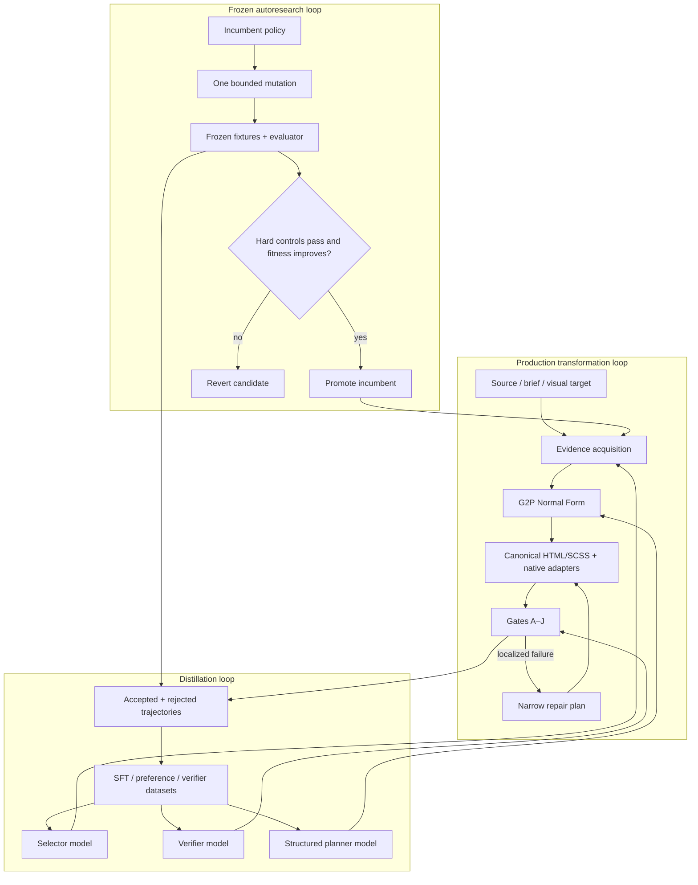

# Gen2Prod

Gen2Prod turns uncertain website artifacts into semantic, BEM-structured, token-governed production code—and runs a frozen Karpathy-style research loop to improve its own transformation policy without weakening the evaluator.

## TL;DR

**The problem:** AI-generated pages can look plausible while hiding div soup, utility-class drift, raw design values, broken behavior, weak accessibility, and no reproducible way to decide whether a cleanup actually improved anything.

**The solution:** Gen2Prod recovers a typed canonical normal form, emits canonical HTML/SCSS plus native React, Vue, Svelte, Astro, WordPress, and Bricks bundles, captures browser truth, enforces hard gates, repairs locally, benchmarks policy changes on synthetic and held-out fixtures, and distills accepted/rejected trajectories into smaller selector, verifier, and planner models.

| Capability | Concrete result |
| --- | --- |
| Measured compiler | Source, rendered DOM, accessibility tree, computed styles, boxes, screenshots, intent, components, and tokens reconcile into G2P-NF |
| Hard constraints | Build, BEM, token, inline-style, accessibility, SEO, security, and mode-specific visual failures cannot be outweighed by a soft score |
| Styling contract | Clean output is nested SCSS with class-only BEM selectors, no utilities or element styling, and 100% direct registered-token coverage |
| Native adapters | One accepted G2P-NF build fans out to React/JSX, Vue, Svelte, Astro, WordPress, and Bricks; every target is natively built/rendered and browser-diffed against canonical HTML |
| Existing-project adapters | Lossless framework/CMS source graphs, hash-guarded minimal patches, copied-sandbox native builds and image diffs, explicit destination apply, and exact rollback |
| Reproducibility | Content hashes, manifests, source authority, versioned schemas, replay events, and idempotence checks make every decision attributable |
| Synthetic curriculum | Ten archetypes plus imported model-generator families produce strategy, page briefs, varied content, rendered mockups, gold code, marked/unmarked dirty inputs, image diffs, dynamic states, lineage, controls, and held-out splits |
| Strict image-only loop | Live captures or generated mockups become hash-bound visual targets; local OCR/segmentation proposes semantic BEM builds, dirty/target/candidate image diffs score them, and source leakage is forbidden |
| Autoresearch | One bounded mutation per experiment; frozen evaluator; separate policy/pass/verifier tracks; synthetic and project-isolated naturalistic non-regression; sealed holdout promotion |
| Distillation | Exports group-isolated supervised, preference, and verifier JSONL; quarantines contradictory labels; trains reloadable selector/verifier/planner models |
| Local-first operation | The entire loop runs with deterministic local planners; an external structured-model provider is optional |

## Quick example

```bash
pnpm install

# Verify the runtime and installed Chrome.
bun run cli -- doctor

# Compile the configured Automatic.css release into governed local artifacts.
bun run cli -- acss prepare

# Generate the frozen synthetic curriculum.
bun run cli -- synth prepare --force

# Prove the current policy against every split.
bun run cli -- evaluate --split all

# Audit whether benchmark coverage supports activating learned thresholds.
bun run cli -- calibrate

# Measure which evidence modalities actually change fitness.
bun run cli -- evaluate --split validation --ablation

# Run autonomous keep/revert experiments.
bun run cli -- research --track policy --budget 5

# Turn accepted and rejected traces into smaller models.
bun run cli -- distill --target all

# Convert a messy static page with real browser evidence.
bun run cli -- run fixtures/generated/hero-cta/fixture.corrupted.html \
  --css fixtures/generated/hero-cta/corrupted.css \
  --tokens fixtures/generated/hero-cta/fixture.gold.tokens.json \
  --adapters react,vue,svelte,astro,wordpress,bricks \
  --mode legacy-conversion --profile refactor

# Improve adapter componentization/metadata/interaction policy and promote only after sealed replay.
bun run cli -- adapter research --fixtures fixtures/generated/manifest.json --budget 3 --fresh

# Generate from strategy/content constraints instead.
bun run cli -- run examples/project.brief.json \
  --mode greenfield --profile redesign

# Or reconstruct from pixels alone, with non-visual authority left unresolved.
bun run cli -- image capture https://example.com \
  --target example-home --capture-policy visual-probe-sequence
bun run cli -- image run \
  .gen2prod/image-only/live/example-home/image-target.json \
  --output .gen2prod/image-only/builds/example-home
```

Add `--json` to any result-producing command for the stable automation envelope. Primary data goes to stdout; diagnostics and required human actions go to stderr.

## Design principles

1. **AI proposes meaning; code applies it.** Model-assisted work emits schema-validated plans. Parsing, patching, Sass emission, measurement, gates, and reporting remain deterministic.
2. **The evaluator is harder to change than the policy.** Research candidates cannot edit fixture generation, gold artifacts, gates, or the frozen evaluator. Mutation controls prove that known defects still fail.
3. **Hard gates dominate utility.** A token-coverage gain cannot compensate for a broken link, inaccessible control, unsafe script, or visual regression in a locked refactor.
4. **Acquire only decision-changing evidence.** Source and browser facts come first. Full screenshots, section crops, cross-page inventory, or extra model candidates are paid for only when uncertainty warrants them.
5. **Repair locally and preserve authority.** A missing authoritative URL, asset, content decision, or design token becomes an exact review action—not an invented answer or a broad rewrite.

The exact clean-output rules are documented in [the styling contract](docs/styling-contract.md). They are executable Gate B/C requirements, not formatting guidance.

## Operating modes

| Mode | Use it for | Visual authority |
| --- | --- | --- |
| `greenfield` | Strategy/content brief to production HTML/SCSS | Generated contracts or an approved visual target |
| `legacy-conversion` | Tailwind/inline/div-soup conversion | Browser-computed baseline; strict in `refactor` profile |
| `intentional-redesign` | Approved UX/design change | Redesign brief and locked regions |
| `optimization-only` | Token, consistency, accessibility, or performance work | No unexpected movement |

Profiles are `refactor`, `migration`, `redesign`, `mockup-convergence`, and `optimization`. A run records exactly one mode/profile and cannot silently transition.

## Installation

Gen2Prod is currently source-distributed; no remote installer or package registry release is claimed.

### pnpm and Bun

```bash
git clone <your-repository-url> Gen2Prod
cd Gen2Prod
pnpm install --frozen-lockfile
bun run build
./dist/cli.js doctor
```

### Bun only

```bash
bun install --frozen-lockfile
bun src/cli.ts doctor
```

### Development checkout

```bash
pnpm install
bun run check
bun test
bun run acceptance
bun run build
```

Requirements are Bun 1.2 or later and Chrome/Chromium for browser evidence. The current environment is detected with `gen2prod doctor`. Set `GEN2PROD_BROWSER` if auto-discovery cannot find the executable.

## Command reference

Global flags:

```text
--config <path>       Project YAML configuration
--workspace <path>    Override the artifact workspace
--acss <path>         Override the Automatic.css plugin ZIP/directory
--json                Stable machine-readable envelope
--no-input            Disable interactive input (commands are noninteractive today)
--verbose             Reserved diagnostic detail switch
--help                Command-specific help
--version             CLI version
```

| Command | Purpose | Example |
| --- | --- | --- |
| `init [directory]` | Write config and export versioned JSON Schemas | `gen2prod init ./site` |
| `acss prepare` | Compile the configured ACSS release into a DTCG registry, class catalog, defaults, and hash-bound provenance | `gen2prod acss prepare automatic.css-4.zip` |
| `synth prepare` | Build gold/corrupt fixtures, lineage, splits, and controls | `gen2prod synth prepare --seed 1337 --count 2` |
| `synth import` | Add exact, partial, or non-1:1 dirty/clean examples with generator-family provenance | `gen2prod synth import canonical.json messy.html --css messy.css --family codex-v1 --alignment exact` |
| `image import/capture` | Hash an image mockup or acquire strict still/scroll/state frames from a live page | `gen2prod image import mockup.png --target home-v1 --output .gen2prod/image-only/imports/home-v1` |
| `image analyze/build/evaluate/run` | Infer a bounded semantic strategy, emit BEM HTML/SCSS, and score the browser render without source leakage | `gen2prod image run image-target.json --output .gen2prod/image-only/builds/home-v1` |
| `image synth-prepare/synth-evaluate/research` | Build dirty/gold image curricula and run project-isolated one-change recursive improvement | `gen2prod image research --budget 10` |
| `evaluate` | Score a policy with the frozen evaluator | `gen2prod evaluate --split holdout` |
| `evaluate --ablation` | Run controlled evidence configurations A through F | `gen2prod evaluate --split validation --ablation` |
| `calibrate` | Deduplicate correlated evaluations, audit benchmark coverage, and withhold unsafe threshold activation | `gen2prod calibrate --output .gen2prod/calibration/report.json` |
| `run <input>` | Execute any production mode | `gen2prod run page.html --css app.css --tokens tokens.json` |
| `adapter emit/evaluate/research` | Emit native framework/CMS bundles, benchmark them, and promote one-change policy improvements after sealed replay | `gen2prod adapter research --budget 3 --fresh` |
| `project inspect/plan/run/apply/rollback` | Integrate canonical output into an existing dynamic project through a reversible sandbox-first lifecycle | `gen2prod project inspect ./site` |
| `validate <target>` | Run Gates A–J on emitted files | `gen2prod validate .gen2prod/runs/<run-id>` |
| `research` | Run policy/pass/verifier keep-revert experiments with optional natural-project constraints and sealed holdout promotion | `gen2prod research --track pass --budget 8 --naturalistic .gen2prod/corpus/naturalistic/manifest.json` |
| `distill` | Export datasets and train selected models | `gen2prod distill --target verifier` |
| `report [run]` | Print the latest or selected transformation report | `gen2prod report` |
| `doctor` | Check config, browser, runtime, providers, and pass registry | `gen2prod --json doctor` |

Use `gen2prod <command> --help` for every option. The detailed I/O and exit-code contract is in [docs/cli-contract.md](docs/cli-contract.md).

## Configuration

```yaml
schemaVersion: "0.1.0"
mode: legacy-conversion
profile: refactor
workspace: .gen2prod

designSystem:
  provider: automaticcss
  source: automatic.css-4.0.0.zip # or "auto"
  mode: full

capture:
  viewports: [360, 768, 1280, 1440]
  themes: [light]
  states: [default, focus-visible]
  browserExecutable: auto

policy:
  file: src/research/policy.ts

research:
  budget: 12
  split: validation
  hiddenHoldoutEvery: 5

validation:
  wcag: WCAG2AA
  provisionalThresholds: true
  maxVisualPixelRatio: 0.01
  minBemCoverage: 0.95
  minTokenCoverage: 0.95

adapters:
  targets: [react, vue, svelte, astro, wordpress, bricks]
  visualValidation: true
  captureViewport: 1280

projectAdapters:
  artifacts: .gen2prod/projects
  includeInstall: false
  previewEnvironmentKeys: []
  sandbox: copy-audit
```

Precedence is command flags, `GEN2PROD_*` environment variables, project configuration, then built-in defaults. After research accepts an incumbent policy, `run` and `evaluate` automatically prefer `.gen2prod/research/incumbent-policy.json`; adapter emission similarly prefers `.gen2prod/adapters/research/incumbent-policy.json`. An explicit `--policy` always wins.

Automatic.css is the default runtime design-system authority. `acss prepare` safely reads the plugin ZIP or directory, records version/license/source hashes, compiles the shipped Sass, and writes `.gen2prod/acss/acss.registry.json`, `acss.catalog.json`, `acss.defaults.css`, and `acss.provenance.json`. The plugin source is not copied into the repository. Token authority is, from highest to lowest: an approved `--tokens` registry, project-compiled CSS variables, then version-scoped ACSS release defaults. The release class catalog is used to recognize dirty ACSS utilities, but clean output remains conceptual BEM and emits only referenced token definitions plus their dependency closure.

Image-only builds use the same release. Observed colors and typography are mapped to ACSS runtime variables in `acss-image-bindings.json` as `image-derived-unreviewed` project-override proposals. This preserves measurable pixel convergence without pretending a still image proves brand semantics; approval or correction remains a required action.

Environment variables are listed in [.env.example](.env.example). The optional HTTP planner endpoint must return structured candidates; local deterministic planners remain the default.

The existing-project workflow, portable request artifact, state fixtures, image-diff evidence, safety boundary, CMS staging requirements, and rollback commands are documented in [framework/CMS source adapters](docs/project-source-adapters.md).

## Architecture



Important on-disk artifacts:

```text
.gen2prod/
  runs/<run-id>/
    manifest.json
    plan.json
    replay.jsonl
    idempotence/result.json
    validation.json
    repairs.json
    output/page.{html,scss,css}
    capture/{baseline,candidate}/
    reports/
  research/
    incumbent-{policy,pass,verifier}.json
    results.tsv
    trajectories.jsonl
    experiments/<experiment-id>/
  distilled/
    datasets/{supervised,preferences,verifier}.jsonl
    {selector,verifier,planner}.model.json
  image-only/
    live/<target>/image-{target,analysis,state-analysis,content-strategy}.json
    builds/<target>/{page.html,page.scss,evaluation/,required-actions.json}
    research/{incumbent-policy.json,<research-id>/image-trajectories.jsonl}
    synthetic-evaluation/{summary.json,image-trajectories.jsonl}
  adapters/
    research/{incumbent-policy.json,research-summary.json,trajectories.jsonl}
    evaluations/
```

The normative designs are [docs/Gen2Prod_plan_v2_3_4_revised.md](docs/Gen2Prod_plan_v2_3_4_revised.md) and [docs/karpathyloop.md](docs/karpathyloop.md). [docs/implementation-matrix.md](docs/implementation-matrix.md) maps each layer to executable evidence. [docs/framework-adapters.md](docs/framework-adapters.md) defines native output, validation, and promotion contracts. [docs/image-only-loop.md](docs/image-only-loop.md) defines the strict screenshot path and its authority boundary. [docs/dataset-intake.md](docs/dataset-intake.md) defines how to contribute exact, partial, and non-1:1 real examples.

Research evaluations, adapter experiments, and production runs feed trajectory ledgers. They contribute accepted/rejected policy trials, real-run observations, exact replay labels, hard-gate labels, and measured evaluator-mutation recall. `distill --adapter` blends framework-adapter trajectories with the main, naturalistic, and image ledgers. Distillation deduplicates them by evidence, isolates project/fixture groups across train and holdout, and quarantines any identical evidence/action/output group with conflicting keep/revert labels. Naturalistic output can be added without rewriting the procedural generator:

```bash
gen2prod synth import canonical-spec.json model-page.html \
  --css model-page.css --family generator-model-version \
  --split holdout --fixture-id stable-family-case
```

Optional `--dirty-image`, `--clean-image`, `--clean-html`, `--clean-css`, `--strategy`, and `--change-manifest` inputs preserve observed project evidence. `--alignment exact` makes compatible clean screenshots a hard image-diff target. A `partial` pair becomes region-scoped image-diff fitness when its change manifest contains reviewed pixel or fractional `regionMasks`; named-only partial pairs and `non-1-to-1` pairs remain preference/planner supervision instead of incorrectly demanding global pixel identity.

## How Gen2Prod compares

| Capability | Gen2Prod | One-shot AI rewrite | Linter only | Screenshot-to-code tool |
| --- | --- | --- | --- | --- |
| Typed semantic/component/BEM/token IR | Full | Usually absent | Partial findings | Usually absent |
| Deterministic source emission | Yes | Model-dependent | No emission | Model-dependent |
| Browser-computed baseline | Yes | Rare | Sometimes | Target pixels only |
| Hard accessibility/behavior/security gates | Yes | Prompt-dependent | Tool-specific | Usually secondary |
| Exact corruption lineage | Synthetic curriculum | No | No | No |
| Policy keep/revert research | Frozen and automatic | No | No | No |
| Cost-aware evidence routing | Explicit policy | Ad hoc | N/A | Vision-first |
| Distilled selector/verifier/planner | Yes | No | No | Sometimes proprietary |

Use Gen2Prod when correctness, replayability, design-system governance, or repeatable improvement matters. A one-shot rewrite remains faster for disposable prototypes whose behavior and production contracts do not matter.

## Testing and acceptance

```bash
bun run check       # Strict TypeScript
bun test            # Unit + browser-backed integration tests
bun run acceptance  # Frozen generation/evaluation/research/distillation proof
bun run build       # Standalone Bun bundle
bun run verify      # Everything above
```

Acceptance requires every marked and lineage-free unmarked fixture to reach zero hard-gate, semantic, BEM, token-accounting, and idempotence error; every candidate must improve on its dirty browser render and remain below the pixel threshold; and every static and rendered-image mutation must be caught. The frozen fingerprint covers evaluator logic, gates, compiler passes, strategy/mockup artifacts, marked/unmarked inputs, gold and dirty screenshots, actual diff PNGs, traces, lineage, and observed-pair evidence. Thresholds still report provisional calibration until the suite spans representative real projects, frameworks, browsers, and generator-model families.

## Troubleshooting

### “No Chrome/Chromium executable found”

```bash
export GEN2PROD_BROWSER=/absolute/path/to/google-chrome
bun run cli -- doctor
```

### “Automatic.css is missing” or no runtime variables are found

Place the licensed plugin ZIP in the project and configure `designSystem.source`, pass `--acss`, or provide an authoritative ACSS/DTCG adapter registry. `doctor` reports the resolved release and artifact counts.

```bash
gen2prod acss prepare /path/to/automatic.css.zip
gen2prod run page.html --css app.css --tokens acss.registry.json
```

### A refactor fails Gate J even though source code looks correct

Gate J measures the stabilized browser render, not source similarity. Inspect `reports/design-delta-explorer.json` and the paired captures before changing thresholds.

### Research rejects every candidate

That can be correct: the incumbent may already dominate the proposed mutations. Read `.gen2prod/research/results.tsv`; candidates are reverted on any hard-control regression, equal fitness, or worse lexicographic outcome.

### `validate` reports token values as unaccounted

Standalone `validate` does not reconstruct a missing exception ledger. Prefer validating the original run directory or supply the token registry during `run` so accounting provenance remains attached.

### Generated fixtures already exist

Synthetic preparation refuses accidental overwrite.

```bash
gen2prod synth prepare --force
```

## Limitations

- Canonical static HTML/SCSS and native React, Vue, Svelte, Astro, WordPress, and Bricks output are production-gated. Directly ingesting and source-preservingly patching an existing dynamic framework/CMS codebase remains bounded; current adapters serialize accepted G2P-NF rather than reconstructing unobserved application branches or mutating a destination repository.
- The shipped production planner is deterministic and fixture-proven. The structured HTTP provider contract and naturalistic-import path are available, but selecting an external model, credentials, prompts, and cost ceiling remains a project-owner decision.
- Automatic accessibility checks do not establish full WCAG conformance. Screen-reader usability, alternative-text quality, reading-order nuance, and cognitive clarity remain human review tasks.
- Lab performance evidence does not replace field Core Web Vitals data. Real sites must connect segmented RUM before claiming field outcomes.
- Visual convergence searches small token-valued patches. It deliberately stops when a remaining gap needs a new asset, content decision, component variant, or design-system change.
- Image-only reconstruction is a bounded semantic hypothesis generator, not proof of copy, routes, behavior, responsive intent, token identity, asset meaning, accessibility conformance, or deploy readiness. Multi-viewport/state images and human authority remain necessary.
- Fixture thresholds are explicitly provisional. The seed suite proves mechanics and mutation sensitivity, not population-level statistical calibration.

See [docs/external-actions.md](docs/external-actions.md) for the exact approvals and production evidence a real project owner must supply.

## FAQ

### What is G2P-NF?

Gen2Prod Normal Form is the typed latent state containing semantic DOM, component ownership, BEM graph, style intent, token bindings, and interaction contracts. Final code is serialized from it rather than generated directly from prose.

### Does the research loop edit its own evaluator?

No. Preparation, gold fixtures, gate definitions, and evaluation hashes are frozen during experiments. Policy, pass, and verifier tracks are isolated, and mutation controls must retain 100% recall.

### Is a screenshot treated as semantic truth?

No. An approved screenshot controls declared pixels/regions only. Content, URLs, behavior, responsive rules, semantics, and token names require source, design metadata, or human authority.

### Can it run without an API key?

Yes. All shipped tests, fixture generation, compilation, validation, research, and distillation run locally. An external model is optional.

### What happens when human authority is missing?

The run records a precise `requiredActions` entry and continues all unrelated work. It never invents a destination URL, legal/privacy decision, brand asset, token authority, or subjective approval.

### Why are both accepted and rejected trajectories retained?

Accepted trials provide structured planning examples; accepted/rejected pairs teach preferences; gate labels train the verifier. A reverted experiment is useful data, not wasted compute.

## About contributions

> *About Contributions:* Please don't take this the wrong way, but I do not accept outside contributions for any of my projects. I simply don't have the mental bandwidth to review anything, and it's my name on the thing, so I'm responsible for any problems it causes; thus, the risk-reward is highly asymmetric from my perspective. I'd also have to worry about other "stakeholders," which seems unwise for tools I mostly make for myself for free. Feel free to submit issues, and even PRs if you want to illustrate a proposed fix, but know I won't merge them directly. Instead, I'll have Claude or Codex review submissions via `gh` and independently decide whether and how to address them. Bug reports in particular are welcome. Sorry if this offends, but I want to avoid wasted time and hurt feelings. I understand this isn't in sync with the prevailing open-source ethos that seeks community contributions, but it's the only way I can move at this velocity and keep my sanity.

## License

No license has been declared in this repository. Do not assume redistribution rights until the owner adds one.
