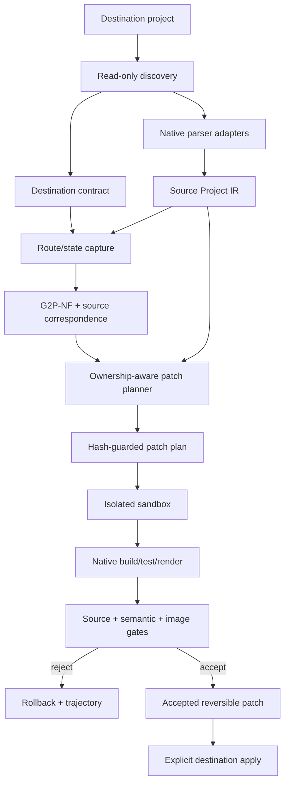

# Framework/CMS source-ingestion and project-patching implementation plan

Status: Proposed implementation plan  
Date: 2026-07-20  
Scope owner: Gen2Prod project-adapter layer  
Related contracts: [Gen2Prod plan](Gen2Prod_plan_v2_3_4_revised.md), [Karpathy loop](karpathyloop.md), [native output adapters](framework-adapters.md), [styling contract](styling-contract.md), [implementation matrix](implementation-matrix.md)

## Implementation progress, decisions, and lessons

This is a living execution ledger. A checked task means executable code and proportionate tests exist; prose or a schema placeholder alone is not sufficient.

### Progress log

| Date | Slice | Result | Evidence |
| --- | --- | --- | --- |
| 2026-07-20 | P0.1 and P0.2 contract foundation | Added strict project artifact/authority vocabulary, destination/source/ownership/patch/validation schemas, high-risk reversible pass definitions, public schema exports, and negative safety tests | `bun run check`; project schema and schema-export tests pass |
| 2026-07-20 | P1.1 read-only discovery | Added safe-root and symlink rejection, ignored-directory inventory, deterministic source fingerprinting, exact profile/version/lockfile/route/script discovery, explicit profile override, ambiguity failures, and required-action reporting | Repeated discovery is hash-stable; React/Vite, ambiguity, and symlink tests pass |
| 2026-07-20 | P0.4 parser fidelity and P1.2 Source Project IR | Added native TSX/Vue/Svelte/Astro parsers, structural WordPress block and Bricks export readers, exact source anchors, text/comment ordering, immutable dynamic regions, assets/styles/modules/routes, graph-integrity checks, normalized offset-independent identity, a versioned capability matrix, and exact-location dogfood fixtures | Typecheck plus React/Vue/Svelte/Astro/WordPress/Bricks parser tests pass; unsupported or invalid locations fail closed |
| 2026-07-20 | P1.4 hash-guarded text edits | Added full preflight, authority/symlink containment, operation DAG and overlap checks, exact AST-bound unique rebasing, descending in-memory edits, owned-file collision refusal, atomic staged writes, exact snapshot rollback, and second-apply refusal | BOM/CRLF/final-newline, untouched-byte, stale span, ambiguous rebase, overlap, graph tamper, path authority, symlink escape, postimage, collision, apply, rollback, and idempotence tests pass |
| 2026-07-20 | P1.5 imports and owned files | Added native TypeScript import analysis, equivalent alias/type-only detection, symbol collision refusal, directive/import-boundary insertion without printing, proven-unused minimal removal, generated-directory confinement, and owned-file operations | CRLF/directive/import formatting, partial request, collision, unused-proof, generated path, patch apply, and rollback tests pass |
| 2026-07-20 | P1.6 ownership and three-way safety | Added strict sidecar entries with base/current/proposed hashes, source symbol/node/fingerprint/BEM ownership, unique-move rebasing, semantic/duplicate conflict classification, and workspace persistence outside runtime output | Stable, offset-moved, semantically changed, duplicate-anchor, sidecar round-trip, and no-runtime-marker tests pass |
| 2026-07-20 | P1.7 safe runner and copied sandbox (filesystem hardening still open) | Added exact command authorization, shell-free spawn, filtered env, deadlines, bounded/redacted logs, lockfile guards, copied dependencies only when requested, source fingerprint monitoring, retained command/runtime evidence, and sandbox-only patch/build dogfood | Runner/env/redaction/timeout/lock-drift and source-untouched sandbox build tests pass; production acceptance remains false until a pinned container/OS sandbox can prohibit arbitrary absolute-path writes |
| 2026-07-20 | P1.8 declarative state capture | Extended stabilized browser evidence with hash-verified network fixtures, route navigation, safe/authorized action separation, post-action rendered source, per-fixture viewport/theme capture, environment/input equivalence hashes, and explicit branch/interaction coverage actions | Mocked route, safe details interaction, screenshot/DOM coverage, fixture equivalence, and unsafe-click refusal dogfood tests pass |
| 2026-07-20 | P1.9 source/render correspondence | Added a strict correspondence artifact and confidence-scored matching across states using tags, text, attributes, class roles, accessible names, source/render ancestry, and layout visibility; repeated instances aggregate to one template node and low-confidence mappings cannot authorize destructive edits | Repeated React list and unique high-confidence mapping tests pass; sandbox-only DOM IDs are removed from serialized rendered source |
| 2026-07-20 | P1.10 shared ACSS-tokenized SCSS | Added PostCSS/SCSS import/rule inventory, source+render selector reachability, owner-rule replacement/creation, side-effect style imports, proven-dead removal, registered ACSS/project variable checks, Sass compilation, and class-only BEM/nesting/utility gates | Unrendered branch retention, rendered-only retention, dead-rule removal, untouched import/rules, owner replacement, token coverage, compilation, and forbidden-selector tests pass |
| 2026-07-20 | P2 React strangler vertical slice | Added static enumeration/class-role analysis for ternary/logical/template/array/`clsx` forms and a correspondence-gated planner that emits an owned semantic shell, coalesced native imports, canonical ACSS-token SCSS, exact preserved dynamic islands, collision actions, and an empty second plan | Dirty React/Vite dogfood preserves `map`, key, handler, and data expressions byte-for-byte; removes root utilities; sandbox native build passes; second plan is empty |
| 2026-07-20 | P2.1/P2.2 and P3 Next source graph | Added inherited tsconfig/JSX/alias resolution, Next route/layout/special-file discovery, React props/hooks/refs/imported-component inventory, async data/metadata/server-action evidence, server/client classification, and Next-safe global style placement | Dynamic-route layout-chain tests pass; Next dogfood preserves metadata/fetch/server boundaries, emits no accidental `use client`, and does not duplicate the root global-style import |
| 2026-07-20 | P1.3 exact native adapter interface | Expanded the registry to exact profiles with read-only discovery, strict Source Project parsing, route projection, planner dispatch, native sandbox validation, and consumed/ignored evidence reporting | Profile/target mismatch fails closed; route projection and evidence accounting tests pass; profiles without a mutation planner return a typed blocking zero-operation plan |

### Additional implementation decisions

| ID | Decision | Rationale | Consequence |
| --- | --- | --- | --- |
| D21 | New public project-adapter schemas use strict objects even though older repository schemas are permissive | Project mutation contracts must reject misspelled or smuggled authority fields | Unknown keys fail at the boundary; backward compatibility remains limited to older schema families |
| D22 | Offline CMS contracts do not carry a fake native build command | WordPress/Bricks export validation is an internal structural operation until a real staging runtime is authorized | Framework contracts require `commands.build`; offline CMS contracts may omit it and remain runtime-unaccepted until staging evidence exists |
| D23 | Parser capability claims describe demonstrated safety, not intended future support | A readable export is not automatically safe to rewrite | WordPress and Bricks remain `read`/`preserve` until their versioned patchers and round-trip controls exist; unreliable Astro spans become blocking unresolved evidence |
| D24 | Preserve text and comments as first-class ordered Source Project IR nodes | Element-only trees lose whitespace, mixed content, and source comments even when their parent span survives | Framework parsers retain exact text/comment spans; dynamic and opaque regions remain immutable by default |
| D25 | A copied working directory plus post-run source hashing is an audited sandbox, not a hardened filesystem boundary | This host has Docker but no pinned Gen2Prod runtime image, and unprivileged mount namespaces are disabled | Local dogfood may run and detect source-project changes; promotion/accepted reports must require a digest-pinned network-disabled container backend before claiming escaped-output prevention |

### Lessons learned

| ID | Lesson | Action |
| --- | --- | --- |
| L01 | Rejecting shell punctuation is insufficient: an executable field containing whitespace and quoted arguments still represents a shell-shaped command | `CommandSpec.executable` now rejects whitespace, quotes, and shell metacharacters; arguments must be separate array entries |
| L02 | Framework dependency signals overlap by construction (`next` includes React, Nuxt includes Vue, SvelteKit includes Svelte) | Detection collapses known parent/child profiles before ambiguity checks and requires an explicit profile for genuinely conflicting stacks |
| L03 | Vue's transformed template AST rewrites `v-if`/`v-for` structure and changes the offset coordinate system | Source ingestion uses the raw `compiler-sfc` descriptor AST; compilation remains a later native-validation concern |
| L04 | Astro compiler locations can extend beyond the original source for nested expressions in the currently pinned compiler | Such constructs are recorded as blocking unresolved regions; no guessed offset or regex fallback is allowed |
| L05 | React JSX nested inside a callback still has a JSX container ancestor beyond the function boundary | Root detection walks to the source file, preventing callback children from appearing twice in the project graph |
| L06 | `Bun.file().text()` removes a UTF-8 BOM while native compiler offsets and raw file hashes use the original byte-bearing source | All source adapters and patch preflights use a BOM-preserving byte read followed by UTF-8 decode; the edit-engine fixture locks BOM, CRLF, and final-newline preservation |
| L07 | Absence from source is not selector-death evidence, and absence from a default render is not enough either | A legacy rule is removable only when complete source-class analysis and declared rendered-state evidence both miss it; incomplete dynamic class bindings make reachability unknown |
| L08 | Component and style imports commonly share the same zero-width module anchor | React planning coalesces them into one ordered import operation so overlap preflight remains strict and imports are neither duplicated nor applied against different preimages |

## 1. Outcome

Implement the remaining boundary between Gen2Prod's accepted canonical output and an existing dynamic React/JSX, Vue, Svelte, Astro, WordPress, or Bricks project.

The finished system must be able to:

1. inspect an existing project without modifying it;
2. discover its framework, versions, routes, layouts, build commands, style entrypoints, aliases, metadata conventions, and CMS revision information;
3. parse its source into a lossless Source Project IR that distinguishes static markup from immutable dynamic expressions and control flow;
4. render declared routes and states to connect source evidence to G2P-NF and visual evidence;
5. plan the smallest authority-safe source patch that introduces clean semantic markup and shared ACSS-tokenized, nested BEM SCSS;
6. apply the patch only inside an isolated sandbox first;
7. native-typecheck, build, test, render, semantically compare, and image-diff every declared state;
8. prove that unowned source and dynamic behavior were preserved;
9. produce a reversible, hash-guarded patch and exact replay record;
10. apply an accepted patch to the destination only through a separate explicit operation;
11. improve patch policy through one-change research with frozen evaluators, project-isolated splits, mutation controls, sealed holdout, and exact replay;
12. continue useful work when destination authority is missing by emitting precise `requiredActions` rather than inventing project semantics.

This plan closes **framework/CMS source ingestion and destination patching**. It does not replace the existing framework output emitters. The output emitters remain the clean reference implementation and provide canonical target components for project integration.

## 2. Definition of the boundary

Today:

```text
static HTML/CSS, strategy, or image evidence
→ G2P-NF
→ canonical HTML/SCSS/CSS
→ clean React/Vue/Svelte/Astro/WordPress/Bricks output bundle
```

This plan adds:

```text
existing dynamic project
→ project discovery
→ lossless Source Project IR
→ rendered route/state evidence
→ G2P-NF correspondence
→ ownership-aware project patch plan
→ sandboxed destination project
→ native build/state/image/semantic/source-preservation validation
→ reversible accepted patch
```

The hard part is not generating framework syntax. That already works. The hard part is preserving information that a static render does not contain:

- expressions and data access;
- branches and repetitions;
- component props, slots, children, snippets, and render callbacks;
- server/client and hydration boundaries;
- loaders, actions, handlers, stores, refs, and framework directives;
- route, layout, metadata, asset, and import conventions;
- existing tests and build tooling;
- CMS IDs, parentage, versions, revisions, and sanitization constraints;
- formatting, comments, and unrelated user edits.

## 3. Non-negotiable implementation principles

1. **G2P-NF remains canonical.** Do not create a framework-specific semantic or style truth parallel to G2P-NF.
2. **Dynamic source is authority, not expendable syntax.** Expressions, handlers, branches, repetitions, keys, loaders, actions, stores, and data access are immutable by default.
3. **Use native parsers and source spans.** Never patch JSX/SFC/Svelte/Astro with regular-expression rewriting.
4. **Use minimal text edits, not whole-file printers.** Unchanged bytes, comments, formatting, line endings, and import order must survive wherever possible.
5. **Sandbox first.** Planning and validation may never mutate the destination project. Applying an accepted patch is a separate explicit command.
6. **Hash every precondition.** A changed target span, file, lockfile, framework version, CMS revision, or contract invalidates the affected operation.
7. **Prefer a strangler migration.** Generate clean owned components around preserved dynamic islands, then shrink those islands only when evidence supports it.
8. **No runtime ownership markers.** Store ownership in sidecar artifacts and AST fingerprints; do not ship `data-g2p-*` solely for compiler bookkeeping.
9. **Shared styling remains shared.** No CSS-in-JS, scoped-style rewrites, style props, utility classes, inline visual styles, or CMS style settings.
10. **ACSS/project variables remain value authority.** Project adapters may not create a framework-specific token system.
11. **Do not infer behavior from pixels.** Source bindings and authorized state fixtures decide behavior. Images decide declared pixels only.
12. **Hard gates dominate.** Pixel improvement cannot excuse source loss, behavior changes, invalid native builds, accessibility regressions, or styling-contract failures.
13. **CMS writes are revisioned and staged.** Offline exports come first. Direct database mutation is prohibited.
14. **Independent work continues when blocked.** Conflicted or unauthorized operations are skipped and recorded; unaffected discovery, planning, evaluation, and research continue.
15. **A second pass must be empty.** Project patching is not complete until exact idempotence is demonstrated.

## 4. Decision record

| ID | Decision | Rationale | Consequence |
| --- | --- | --- | --- |
| D01 | Add a Source Project IR above G2P-NF rather than extending `PlannedNode` with framework syntax | G2P-NF should remain framework-neutral and deterministic | Project syntax and dynamic control flow stay isolated from canonical emission |
| D02 | Preserve expressions as typed, hash-bound holes | Reconstructing expressions from rendered HTML loses behavior | Markup around a hole may change; the expression text may not change without explicit authority |
| D03 | Apply descending source-span edits | This preserves untouched file bytes and avoids full-printer churn | Parsers provide analysis; a shared edit engine performs mutation |
| D04 | Permit unique AST-fingerprint rebasing, but prohibit fuzzy text matching | Exact source offsets can move after unrelated edits; fuzzy matching can silently patch the wrong code | Rebase succeeds only when one structurally identical anchor exists and all semantic hashes match |
| D05 | Keep ownership in `.gen2prod/projects/<project-id>/ownership.json` | Runtime attributes/comments pollute production code and can affect behavior | Ownership survives through normalized AST fingerprints and preimage hashes |
| D06 | Default to generated owned components plus minimal integration edits | Replacing an entire route creates excessive blast radius | Initial patches are understandable, reversible, and incrementally refinable |
| D07 | Treat existing dynamic subtrees as slots/children/render fragments first | It avoids inventing prop/state semantics | Research can later improve the boundary without compromising the initial conversion |
| D08 | Store build commands as argument arrays, never shell strings | Shell interpolation expands authority and creates injection risk | The process runner executes allowlisted binaries with explicit cwd/env |
| D09 | Do not install dependencies automatically during inspection | Read-only discovery should not mutate the project or contact the network | Sandbox validation may run a frozen install only when the destination contract authorizes it |
| D10 | Reuse the destination lockfile and fail on lockfile drift | Dependency resolution changes invalidate build evidence | Framework/compiler version evidence remains replayable |
| D11 | Add a project-validation report instead of inventing Gate K | Gates A–J are already the stable production contract | Project-specific invariants are mirrored into the relevant existing gates and retained in a richer report |
| D12 | Require route/state fixtures for claims about dynamic behavior | A default render does not exercise conditional states | Missing states reduce coverage and create a required action; they cannot be silently treated as passing |
| D13 | Start with React/TSX, then reuse infrastructure for Vue/Svelte/Astro | TypeScript is already installed and React provides the broadest source-pattern test bed | React MVP must not embed assumptions that block template-language adapters |
| D14 | Implement CMS from exports before staged remote mutation | Exports are hashable, replayable, and recoverable | WordPress/Bricks staging drivers are later milestones with revision locks and rollback |
| D15 | Scope initial strict styling gates to converted route surfaces and all generated files | Unrelated legacy/admin code may remain outside an incremental route conversion | The report must distinguish owned hard failures from project-wide residual debt |
| D16 | Remove old CSS only after whole-project reachability proves it dead | Source selectors can affect unrendered branches | Initial success may retain proven-harmless dead CSS; markup on converted surfaces may not retain utility styling |
| D17 | Use existing native output adapters as structural oracles, not text templates | Output bundles are already clean and validated but do not know destination conventions | Project planners compare semantics/components while integration profiles decide file placement/imports |
| D18 | Make destination apply separate from sandbox acceptance | Validation success is not authority to mutate a user project | `project apply` requires an accepted plan and current precondition hashes |
| D19 | Use project-family splits for research | Pages from one starter/template are correlated | All derivatives of a starter, repository, or CMS export remain in one split |
| D20 | Keep live CMS publishing outside automatic promotion | Publishing affects external state and may be irreversible | Gen2Prod can prepare, stage, validate, and report; production promotion remains an explicit authorized action |

## 5. Target architecture



### 5.1 Proposed source layout

```text
src/project-adapters/
  contract.ts
  discovery.ts
  registry.ts
  ir.ts
  ownership.ts
  correspondence.ts
  plan.ts
  pipeline.ts
  sandbox.ts
  apply.ts
  validate.ts
  state-fixtures.ts
  process.ts
  styles.ts
  types.ts
  rewrite/
    anchors.ts
    text-edits.ts
    imports.ts
    files.ts
  react/
    discover.ts
    parse.ts
    classes.ts
    project.ts
    plan.ts
    profiles/
      react-vite.ts
      next-app.ts
  vue/
  svelte/
  astro/
  wordpress/
  bricks/
  research/
    policy.ts
    mutate.ts
    evaluate.ts
    loop.ts
```

Tests and fixtures:

```text
tests/unit/project-adapters/
tests/integration/project-adapters/
fixtures/projects/
  react-vite/
  next-app/
  vue-vite/
  sveltekit/
  astro/
  wordpress/
  bricks/
```

### 5.2 Reuse versus new implementation

| Existing subsystem | Reuse | Required extension |
| --- | --- | --- |
| `src/compiler/*` and G2P-NF | Continue producing semantic/component/BEM/token/style/interaction truth from rendered/static evidence | Add correspondence to Source Project IR; do not put framework expressions into canonical nodes |
| `src/adapters/*` | Use clean native components, metadata, interactions, SCSS, and manifests as structural oracles | Add project integration planners that place or adapt those components without rewriting dynamic source |
| `src/evidence/*` | Reuse stabilized browser capture, state evidence, screenshots, accessibility/DOM/style/box facts | Add destination preview-server lifecycle and route/state fixture coverage |
| `src/validation/*` | Reuse Gates A–J, source/DOM metrics, BEM/token analyzers, accessibility, visual diff, and mutation patterns | Add source-preservation, patch-scope, native-project, rollback, and idempotence assertions |
| `src/core/artifact-store.ts` and replay | Reuse content addressing, manifests, pass events, rollback references, and provenance | Register project artifacts and source authority |
| `src/runtime/passes.ts` | Reuse pass registry and gate scheduling | Add high-risk reversible project passes |
| `src/adapters/research.ts` and distillation | Reuse frozen one-change keep/revert, sealed holdout, replay, trajectories, and isolation rules | Add project-patch policy/fitness and project-family grouping |
| `src/cli.ts` | Reuse config loading, JSON envelopes, errors, doctor, and workspace conventions | Add `project` command tree and explicit destination apply |

### 5.3 Parser and rewrite technology choices

| Surface | Parser/analyzer | Mutation method | Dependency decision |
| --- | --- | --- | --- |
| JavaScript/TypeScript/JSX/TSX | TypeScript compiler API | Exact source-span edits from AST positions | Already installed; avoid a second JS AST until a measured gap requires it |
| Vue SFC | `@vue/compiler-sfc` plus explicit template compiler APIs | Template/script/style span edits | Compiler is installed; promote transitive template packages to direct pinned dependencies if imported directly |
| Svelte/SvelteKit | `svelte/compiler` AST | Exact node/block spans | Already installed; pin fixture compiler major with project profile evidence |
| Astro | `@astrojs/compiler` parse/transform/location APIs | Exact frontmatter/template spans | Already installed; complete a location-fidelity spike before implementation; no regex fallback |
| SCSS/CSS | PostCSS plus `postcss-scss` | Owner-rule span edits and new owned file writes | Already installed and shared with current styling validation |
| WordPress blocks | WordPress block serialization parser or a compatible vendored contract | Block/export operations plus exact opaque inner-content preservation | Add as a direct pinned dependency only after export round-trip fixtures prove suitability |
| Bricks | Versioned Zod schemas over export JSON | ID-aware JSON operations with opaque unknown-field preservation | No generic parser dependency; schema support is explicitly version-gated |

Dependency rules:

- parser/compiler dependencies used in production must be direct dependencies, lockfile-pinned, and recorded in manifests;
- destination framework packages are not silently upgraded to match Gen2Prod's validator versions;
- validators must distinguish “Gen2Prod can parse this source version” from “the sandbox native project builds with its own version”;
- a parser lacking reliable node locations blocks source mutation for that syntax; it may still support read-only inventory;
- formatting tools may run only if already declared and authorized by the destination contract, and their changed spans become part of the patch rather than invisible cleanup.

## 6. Core contracts

### 6.1 Destination contract

Add `ProjectContractSchema` with these concerns:

```ts
type ProjectContract = {
  schemaVersion: "0.1.0";
  projectId: string;
  rootHash: string;
  framework: {
    target: "react" | "vue" | "svelte" | "astro" | "wordpress" | "bricks";
    profile: string;
    version: string;
    router?: string;
    rendering: ("ssr" | "ssg" | "csr" | "islands")[];
  };
  packageManager?: {
    name: "bun" | "pnpm" | "npm" | "yarn";
    lockfile: string;
    lockfileHash: string;
  };
  commands: {
    install?: CommandSpec;
    typecheck?: CommandSpec;
    test?: CommandSpec;
    build: CommandSpec;
    preview: CommandSpec;
  };
  integration: {
    routeEntries: RouteEntry[];
    rootLayouts: string[];
    metadataMode: string;
    styleEntrypoints: string[];
    generatedDirectory: string;
    aliases: Record<string, string>;
  };
  authority: {
    allowedPaths: string[];
    deniedPaths: string[];
    preserveExpressions: true;
    preserveHandlers: true;
    preserveDataAccess: true;
    permitFrozenInstall: boolean;
    permittedEnvironmentKeys: string[];
  };
  states: StateFixture[];
  cms?: CmsDestinationContract;
};
```

`CommandSpec` must be `{ executable, args, cwd, envKeys, timeoutMs }`; it must not accept a shell command string.

### 6.2 Source Project IR

Add a recursive `SourceProjectSchema` containing:

- project files and their byte hashes;
- modules, imports, exports, symbols, components, routes, and layouts;
- framework/compiler versions;
- markup tree with source anchors;
- expression, conditional, repetition, slot, directive, and opaque nodes;
- class-binding grammar and all enumerated variants;
- style sources and selector reachability;
- handler/action/store/ref bindings;
- metadata and asset bindings;
- authority and confidence for every proposed ownership boundary.

Required node variants:

```ts
type ProjectMarkupNode =
  | StaticMarkupNode
  | ExpressionHole
  | ConditionalRegion
  | RepetitionRegion
  | SlotRegion
  | FrameworkDirective
  | OpaqueRegion;
```

Every non-static node stores:

- exact source text and SHA-256;
- source file, start/end offsets, line/column, and normalized AST fingerprint;
- referenced symbols and binding kinds;
- rendered-state observations;
- whether the region may move, be wrapped, or be split;
- explicit rewrite authority, defaulting to `preserve-verbatim`.

### 6.3 Ownership map

The sidecar ownership artifact maps stable G2P component/block IDs to destination source:

```ts
type OwnershipEntry = {
  ownerId: string;
  bemBlock: string;
  file: string;
  symbol?: string;
  astFingerprint: string;
  preimageHash: string;
  generated: boolean;
  dynamicRegions: string[];
  styleRuleFingerprints: string[];
};
```

Ownership must be reconstructible after harmless offset movement. It must become unresolved when multiple equivalent anchors exist.

### 6.4 Patch plan

Add `ProjectPatchPlanSchema` and a discriminated operation union:

- `write-owned-file`;
- `replace-node-span`;
- `insert-import`;
- `remove-proven-unused-import`;
- `replace-class-binding`;
- `move-preserved-binding`;
- `replace-owned-style-rule`;
- `insert-style-import`;
- `remove-proven-dead-style-rule`;
- `update-framework-metadata`;
- `update-cms-node`;
- `update-cms-template`.

Every operation includes:

- operation ID and dependency IDs;
- target file and allowed-path proof;
- file and target-span preimage hashes;
- AST fingerprint and expected node kind;
- before/after source;
- authorities consumed;
- preserved dynamic-region hashes;
- predicted blast radius;
- inverse operation or snapshot reference;
- expected postimage hash;
- validation obligations;
- `blocking` versus `independently-skippable` semantics.

### 6.5 Project validation report

Add `ProjectValidationReportSchema` with:

- discovery/contract validity;
- patch-precondition and patch-scope results;
- untouched-file and untouched-span byte preservation;
- dynamic-region/handler/data-binding preservation;
- native typecheck/build/test results;
- route/state coverage;
- semantic, content, URL, form, interaction, accessibility, BEM, token, and selector metrics;
- baseline/candidate/target visual metrics per route/state/viewport;
- generated-source bytes and source churn;
- rollback verification;
- exact second-plan idempotence;
- hard failures, warnings, required actions, and accepted status.

### 6.6 Acceptance profiles and visual objectives

Project patching must retain the existing mode/profile distinction:

| Profile | Baseline authority | Visual objective | Source objective |
| --- | --- | --- | --- |
| `refactor` | Existing destination route/state render | Candidate must preserve locked baseline pixels within the strict threshold; exact fixtures require zero diff | Preserve content, behavior, data, routes, and dynamic code while cleaning semantics/styles |
| `migration` | Existing destination plus approved framework migration contract | Preserve declared behavior/content and remain within migration-calibrated visual bounds | Framework/integration changes are authorized only by the migration contract |
| `redesign` | Approved visual target plus source authority for content/behavior | Improve candidate-to-target while preventing locked-region regression | Preserve source-authoritative behavior/content not explicitly changed by the redesign |
| `mockup-convergence` | Approved image regions/viewports/states | Optimize discrete target loss after every hard source gate passes | Pixels cannot authorize dynamic source changes |
| `optimization` | Existing destination | No unexpected visual/behavior movement | Limit edits to the declared optimization scope |

For every captured condition, retain:

- baseline screenshot when the destination exists;
- approved target screenshot when supplied;
- candidate screenshot;
- baseline-to-candidate diff;
- candidate-to-target diff when applicable;
- locked/ignored masks and authority;
- route, state, viewport, theme, font, environment, and fixture-data hashes.

## 7. CLI contract

Proposed commands:

```bash
# Read-only; writes evidence only under the Gen2Prod workspace.
gen2prod project inspect <project-root> [--profile auto|PROFILE] [--output PATH]

# Capture states, construct G2P-NF correspondence, and emit a patch plan.
gen2prod project plan <project-root> \
  --contract <project-contract.json> \
  --route / \
  [--canonical-run RUN] [--image-target TARGET]

# Apply only to a generated sandbox, validate, and emit an accepted/rejected patch.
gen2prod project sandbox <patch-plan.json> [--output PATH]

# Re-run validation against an existing sandbox.
gen2prod project validate <sandbox-or-report>

# Explicitly apply a previously accepted patch to the current destination preimage.
gen2prod project apply <accepted-patch.json> --project <project-root>

# Run frozen one-change project-adapter research.
gen2prod project research --fixtures fixtures/projects/manifest.json --budget N
```

Safety behavior:

- `inspect`, `plan`, `sandbox`, `validate`, and `research` never modify the destination project.
- `apply` refuses any changed precondition and does not attempt a fuzzy merge.
- `apply --partial` is not supported. Independently skippable operations are resolved during sandbox planning, not during destination application.
- all commands support `--json` and noninteractive operation;
- destination writes and rollback are reported explicitly;
- CMS production publication is not an `apply` behavior in the initial implementation.

## 8. Task plan

### Phase P0 — Freeze contracts and evaluator boundaries

#### P0.1 Add artifact and authority vocabulary

Dependencies: none.

Tasks:

- [x] Add artifact types: `project-contract`, `source-project-ir`, `dynamic-region-map`, `project-ownership-map`, `project-patch-plan`, `project-patch`, `project-sandbox`, and `project-validation-report`.
- [x] Add authority concerns: `framework-source`, `destination-build-contract`, `runtime-state-fixtures`, `destination-path-ownership`, `cms-export`, and `cms-revision`.
- [x] Add pass definitions for discovery, source parsing, state capture, correspondence, patch planning, sandbox application, project validation, rollback, idempotence, and explicit apply.
- [x] Mark destination mutation passes high risk, reversible, and site blast radius.
- [x] Extend schema export tests.

Decision/rationale comments:

- Keep the existing A–J gate identifiers stable.
- Project-specific preservation results live in `project-validation-report` and are mirrored into A, B, C, D, E, H, I, and J as applicable.
- `source-input` is insufficient because it does not distinguish a file from a project graph or record editable ownership.

Acceptance criteria:

- Every new schema rejects unknown keys and unsafe defaults.
- A pass cannot declare destination files editable without `destination-path-ownership` authority.
- Schema export contains every new public contract.
- Existing manifests and tests remain backward compatible.

#### P0.2 Implement destination-contract schema and discovery result

Dependencies: P0.1.

Tasks:

- [x] Implement `ProjectContractSchema`, `CommandSpecSchema`, route entry, state fixture, package-manager, integration, and CMS contract schemas.
- [x] Separate discovered facts, inferred defaults, explicit overrides, and unresolved fields.
- [x] Add contract hashing and versioning.
- [x] Define strict merge precedence: explicit CLI/contract → project artifacts → framework defaults → unresolved.
- [x] Export JSON Schema.

Acceptance criteria:

- Shell strings, `..` traversal, broad root writes, unresolved environment expansion, and unbounded timeouts fail validation.
- Unknown framework profiles remain explicit instead of falling back to a similar framework.
- A contract can be fully round-tripped through JSON without losing provenance.

#### P0.3 Freeze project evaluator inputs

Dependencies: P0.1–P0.2.

Tasks:

- [ ] Define evaluator source files and corpus files included in `evaluatorHash` and `corpusFingerprint`.
- [ ] Include framework/compiler/lockfile versions and capture environment in fingerprints.
- [ ] Define mutation-control registry before research begins.
- [ ] Define search, validation, and sealed-holdout partition rules by project family.

Acceptance criteria:

- Modifying parser, patcher, preservation validator, visual evaluator, fixture gold, or state definitions changes the appropriate fingerprint.
- A research candidate cannot edit any frozen input.

#### P0.4 Verify parser location fidelity

Dependencies: P0.1–P0.2.

Tasks:

- [x] Build read-only parser spikes for TSX, Vue template/script, Svelte template/script, Astro frontmatter/template, WordPress block export, and Bricks JSON.
- [x] Record support for exact offsets, comments/trivia, mixed text ordering, expression boundaries, control-flow blocks, imports, styles, and parse-error recovery.
- [x] Build an explicit syntax capability matrix with `read`, `preserve`, `rewrite`, or `unsupported` per construct.
- [x] Promote any transitive compiler API used by Gen2Prod to a direct pinned dependency.
- [x] Refuse mutation support for constructs without exact location and round-trip evidence.

Decision/rationale comments:

- This spike prevents the common failure where a parser is excellent for compilation but does not expose stable source locations for a lossless rewriter.
- A framework may enter read-only discovery before it enters mutation support.

Acceptance criteria:

- Every claimed rewrite-capable construct has an exact-source extraction test.
- Parsing and extracting all preserved spans, without edits, reproduces the original source bytes.
- The capability matrix is versioned and included in framework-profile manifests.

### Phase P1 — Shared project infrastructure

#### P1.1 Read-only project discovery

Dependencies: P0.2.

Tasks:

- [x] Resolve and validate the project root without following escaping symlinks.
- [x] Inventory package manifests, lockfiles, framework configs, TS configs, aliases, source roots, route roots, style entrypoints, and scripts.
- [x] Detect React/Vite, Next App Router, Vue/Vite, Nuxt boundary, SvelteKit, Astro, WordPress export/theme, and Bricks export profiles.
- [x] Record exact dependency versions from lockfile/package metadata.
- [x] Identify candidate build/typecheck/test/preview commands without executing them.
- [x] Detect generated/vendor/cache/secret directories and add them to denied paths.
- [x] Produce required actions for ambiguity while continuing safe inventory work.

Acceptance criteria:

- Discovery performs no project writes, package installation, build, network request, or CMS call.
- Symlink and path-traversal fixtures cannot escape the project root.
- Multiple conflicting framework signals produce an unresolved profile, not an arbitrary choice.
- Repeated discovery on identical bytes yields the same contract hash.

#### P1.2 Source Project IR schemas and common graph

Dependencies: P0.1.

Tasks:

- [x] Implement common module, component, route, markup, binding, style, asset, and metadata graph schemas.
- [x] Implement dynamic node variants and preservation permissions.
- [x] Store exact source text, offsets, syntax kind, symbol references, and fingerprints.
- [x] Add recursive graph integrity validation and unique IDs.
- [x] Add normalized hashing that ignores offsets but not semantics.

Acceptance criteria:

- Mixed text/child order is lossless.
- Expressions containing braces, template literals, comments, JSX fragments, and nested branches round-trip byte-identically.
- Duplicate or dangling dynamic-region references fail validation.
- Offset-only changes preserve normalized identity; semantic changes do not.

#### P1.3 Native parser adapter interface

Dependencies: P1.2.

Interface responsibilities:

```ts
interface ProjectSourceAdapter {
  discover(root: string): Promise<DiscoveryEvidence>;
  parse(contract: ProjectContract): Promise<SourceProject>;
  projectRoute(source: SourceProject, route: RouteEntry): ProjectedRoute;
  planIntegration(context: ProjectPlanningContext): Promise<ProjectPatchPlan>;
  validateNative(context: ProjectValidationContext): Promise<NativeProjectResult>;
}
```

Tasks:

- [x] Implement registry and exact profile selection.
- [x] Require adapters to report consumed and ignored evidence.
- [x] Require parser version and source hash in every parse result.
- [x] Prohibit adapter-specific direct file writes.

Acceptance criteria:

- An unregistered profile fails closed.
- Every adapter output validates through the shared Source Project IR.
- Adapter code cannot bypass the shared patch/apply engine.

#### P1.4 Hash-guarded text-edit engine

Dependencies: P1.2.

Tasks:

- [x] Validate root, allowlist, file preimage, span preimage, node kind, and AST fingerprint.
- [x] Detect overlapping/conflicting operations before applying any operation.
- [x] Sort same-file operations from highest to lowest offset.
- [x] Preserve BOM, newline convention, final newline, and untouched bytes.
- [x] Support new owned files with collision refusal.
- [x] Produce postimage hashes and inverse operations.
- [x] Implement unique-anchor rebasing with a full audit record.
- [x] Refuse fuzzy matching and ambiguous anchors.

Acceptance criteria:

- Property tests prove edits outside target spans are byte-identical.
- Overlap, stale preimage, path escape, symlink escape, collision, ambiguous rebase, and postimage mismatch all fail before destination mutation.
- Applying inverse operations restores exact original file hashes.
- Applying the same accepted plan twice refuses or produces no changes, never duplicates imports/components/styles.

#### P1.5 Import and owned-file rewrite helpers

Dependencies: P1.3–P1.4.

Tasks:

- [x] Detect equivalent imports, aliases, type-only imports, default/named collisions, and local naming conflicts.
- [x] Insert imports at native module boundaries without reprinting unrelated imports.
- [x] Create profile-specific owned component paths beneath the contract's generated directory.
- [x] Track generated file ownership and refuse overwrite of unowned files.
- [x] Remove an import only when native symbol analysis proves it unused after the planned edits.

Acceptance criteria:

- Existing import formatting and comments remain unchanged.
- Duplicate imports and name collisions are prevented.
- No operation can overwrite a same-named user file.

#### P1.6 Ownership sidecar and three-way safety

Dependencies: P1.2, P1.4.

Tasks:

- [x] Implement ownership artifact generation and lookup.
- [x] Match ownership by file, symbol, normalized AST fingerprint, BEM block, and preimage hash.
- [x] Record base, current, and proposed hashes for targeted regions.
- [x] Distinguish harmless offset drift from semantic conflicts.
- [x] Emit localized conflict actions while keeping unrelated plan work available.

Acceptance criteria:

- No runtime-only ownership attribute or marker is emitted.
- A unique moved node can be safely rebased.
- A changed expression, duplicate candidate, or changed owned component produces a conflict requiring replanning.

#### P1.7 Safe process runner and sandbox

Dependencies: P0.2, P1.4.

Tasks:

- [x] Create isolated sandbox directories with explicit source and output roots.
- [x] Copy/hardlink project inputs without writing the source project; materialize mutable files before edits.
- [x] Execute argument-array commands without a shell.
- [x] Filter environment variables to contract-approved keys.
- [x] Enforce per-command and total deadlines; capture stdout/stderr and exit codes.
- [x] Support existing dependencies or an explicitly authorized frozen install.
- [x] Verify lockfile hash before and after all commands.
- [x] Record tool/runtime versions and sandbox hashes.
- [x] Always retain validation artifacts; clean ephemeral processes reliably.

Acceptance criteria:

- Inspection and planning never execute project code.
- Sandbox commands cannot change the source project.
- Lockfile drift, unauthorized environment access, command mismatch, timeout, or escaped output fails validation.
- Build logs redact configured secret values.

#### P1.8 State-fixture and route-capture contract

Dependencies: P0.2, P1.7.

Tasks:

- [x] Define state setup as declarative navigation, viewport, theme, fixture data, safe clicks/keys, and expected assertions.
- [x] Reuse stabilized capture controls for fonts, clock, randomness, animation, caret, lazy media, and browser environment.
- [x] Capture default plus every declared conditional/interactive state.
- [x] Record state coverage against discovered branches and interaction contracts.
- [x] Separate safe nonactivating probes from authorized side-effecting actions.

Acceptance criteria:

- A claimed branch or interaction with no state evidence is reported as uncovered.
- Missing data/network fixtures cannot be silently treated as successful preservation.
- Equivalent baseline/candidate states use identical capture settings and fixture inputs.

#### P1.9 Source-to-rendered correspondence

Dependencies: P1.2, P1.8.

Tasks:

- [x] Match static source nodes to rendered DOM across states using tag, text, accessible role/name, attributes, class roles, component ancestry, and layout.
- [x] Record one-to-one, repeated-template, wrapper, conditional, slot, and unresolved mappings.
- [x] Keep runtime instrumentation optional and sandbox-only; strip it before validation output.
- [x] Aggregate repeated template instances without confusing instances with source nodes.
- [x] Feed confidence and unresolved ambiguity into patch planning.

Acceptance criteria:

- Repeated lists map multiple DOM instances to one template node without unstable positional identity.
- Conditional states map to their source branches.
- Low-confidence or conflicting mappings cannot authorize destructive edits.

#### P1.10 Shared SCSS integration and reachability

Dependencies: P1.4, existing styling analyzers.

Tasks:

- [x] Parse destination SCSS/CSS with PostCSS/SCSS and inventory imports/layers.
- [x] Select or create one shared generated SCSS entrypoint per destination contract.
- [x] Insert/replace BEM owner rules using existing canonical SCSS.
- [x] Import compiled/runtime ACSS variables without emitting ACSS utilities.
- [x] Analyze selector/class reachability across all project source and declared states.
- [x] Delete old rules only when source and render reachability both prove them dead.
- [x] Record project-wide residual styling debt separately from owned-surface hard gates.

Acceptance criteria:

- Generated SCSS passes the existing nested, class-only BEM analyzer.
- Generated CSS preserves registered-token coverage and contains no utility/element/inline styling.
- Unrelated style rules remain byte-identical.
- A selector used only in an unrendered branch is not incorrectly deleted.

### Phase P2 — React/TSX minimum viable project patcher

#### P2.1 React/Vite and generic TSX discovery

Dependencies: P1.1, P1.3.

Tasks:

- [x] Resolve tsconfig inheritance, JSX mode, aliases, entrypoints, route library signals, style imports, and build scripts.
- [x] Inventory React component symbols and render roots.
- [x] Distinguish generic React/Vite from Next and other React metaframeworks.

Acceptance criteria:

- Discovery produces deterministic contracts for frozen Vite fixtures.
- Unsupported metaframework signals do not route into the generic profile.

#### P2.2 TypeScript/JSX lossless parser

Dependencies: P1.2–P1.3.

Tasks:

- [x] Parse `.jsx`/`.tsx` with the TypeScript compiler API.
- [x] Extract components, props, JSX trees, fragments, expressions, spreads, conditionals, maps, event bindings, refs, keys, and imports.
- [x] Preserve exact expression and comment spans.
- [x] Resolve local symbols and classify imported/opaque components.
- [x] Represent unsupported syntax as opaque rather than dropping it.

Acceptance criteria:

- Parser fixtures cover nested ternaries, logical conditions, `map`, fragments, spreads, template literals, optional chaining, callbacks, hooks, and imported children.
- Serializing preserved spans yields exact original bytes.

#### P2.3 React class-binding classifier

Dependencies: P2.2.

Supported first-class forms:

- string literals;
- complete-string ternaries/logical branches;
- template literals whose complete class tokens can be enumerated;
- `clsx`/`classnames` arrays, objects, literals, and boolean/enum variants;
- simple arrays filtered/joined from enumerable class values.

Tasks:

- [x] Enumerate reachable class sets without executing project code.
- [x] classify style, behavior, framework, unknown, and non-style roles with existing CSS/source evidence;
- [ ] plan semantic BEM base/element/modifier replacements;
- [ ] migrate behavior hooks to `data-*` where source use proves equivalence;
- [ ] preserve unknown runtime class generators as opaque and block a clean-surface claim.

Acceptance criteria:

- Every supported variant produces complete BEM class strings.
- No substring replacement can corrupt arbitrary values or behavior classes.
- Unsupported concatenation generates a precise required action.

#### P2.4 React route projection and G2P-NF correspondence

Dependencies: P2.2, P1.8–P1.9.

Tasks:

- [ ] Render declared route/state fixtures.
- [ ] Compile rendered static evidence through the existing canonical pipeline.
- [ ] Overlay Source Project IR dynamic regions and authorities onto correspondence.
- [ ] Map canonical BEM block roots to existing/new React component boundaries.
- [ ] Identify safe wrapper, replacement, extraction, and preserved-slot opportunities.

Acceptance criteria:

- Source expressions remain linked to all state renders in which they appear.
- Canonical planning cannot overwrite a dynamic region it did not observe or own.
- One G2P block maps to one stable React ownership decision.

#### P2.5 React strangler patch planner

Dependencies: P2.3–P2.4, P1.5–P1.6, P1.10.

Tasks:

- [x] Generate owned BEM components from canonical output adapters.
- [x] Convert dynamic subtrees into preserved `children`, props, render fragments, or untouched imported components.
- [x] Generate minimal route integration edits and imports.
- [x] Preserve handler expression text and move bindings only with one-to-one element correspondence.
- [x] Preserve keys, refs, aria/data bindings, and component props.
- [x] Insert shared SCSS import and owned rules.
- [x] Emit inverse operations and source-preservation obligations.

Acceptance criteria:

- The planner never changes handler bodies, data expressions, keys, hooks, loaders, or unrelated components.
- New client boundaries are emitted only when an explicit interaction contract requires one and existing behavior cannot be preserved directly.
- Patch plan passes all shared structural validation before sandboxing.

#### P2.6 React native validation

Dependencies: P2.5, P1.7–P1.8.

Tasks:

- [ ] Run configured typecheck/build/test commands.
- [ ] Start preview server and capture all route/state/viewports.
- [ ] Compare dynamic-region, handler, import, and untouched-file hashes.
- [ ] Run semantic/content/URL/form/interaction/accessibility checks.
- [ ] Run BEM/SCSS/token/selector gates on owned surfaces.
- [ ] Compare baseline/candidate and candidate/approved-target images as profile requires.
- [ ] Apply inverse patch and verify exact rollback.
- [ ] Replan the accepted sandbox and require an empty operation list.

Acceptance criteria:

- Frozen React fixtures pass with zero hard failures.
- Strict-refactor fixtures have zero unexpected pixel difference across declared states.
- Mockup/redesign fixtures meet the approved target without regressing locked regions.
- Untouched files and preserved dynamic spans remain byte-identical.
- Rollback and second-plan idempotence are exact.

#### P2.7 React integration fixtures

Dependencies: P2.1–P2.6.

Minimum fixture families:

- [ ] static Vite route with utilities and inline styling;
- [ ] props and imported child components;
- [ ] conditional rendering and enum variants;
- [ ] keyed list rendering;
- [ ] form state with validation/error/success states;
- [ ] dialog with focus/keyboard behavior;
- [ ] async loading/empty/error/success states;
- [ ] `clsx`/`classnames` variant matrix;
- [ ] refs and event callbacks;
- [ ] source comments and unusual formatting;
- [ ] stale-plan conflict and independent unrelated edit;
- [ ] unowned same-name generated-file collision.

Acceptance criteria:

- All fixture families include dirty source, clean gold project, route/state contract, screenshots, and exact source-preservation expectations.
- Project families—not individual pages—are assigned to splits.

### Phase P3 — Next App Router profile

#### P3.1 Next discovery and server/client graph

Dependencies: React MVP.

Tasks:

- [x] Discover `app/` routes, layouts, templates, loading/error/not-found files, route groups, dynamic segments, metadata exports, fonts, and global styles.
- [x] Classify server and client components from directives and dependency graph.
- [x] Inventory route params, search params, server actions, and fetch/data boundaries.

Acceptance criteria:

- The project graph preserves every server/client boundary and special route file.
- A server component is never silently converted into a client component.

#### P3.2 Next integration planner

Dependencies: P3.1.

Tasks:

- [x] Insert generated components into the correct route/layout boundary.
- [ ] Emit metadata through Next-native surfaces without duplicating document tags.
- [x] Keep server actions, async components, route params, and data access verbatim.
- [x] Keep client components as the smallest existing or required interaction islands.
- [x] Integrate shared SCSS according to Next import constraints.

Acceptance criteria:

- Native Next build succeeds for static and dynamic fixtures.
- Hydration warnings and server/client boundary changes are zero.
- Metadata, fonts, assets, and route links match the destination contract.

### Phase P4 — Vue source adapter

#### P4.1 Vue SFC parser and graph

Dependencies: P1 shared infrastructure.

Tasks:

- [ ] Parse SFC blocks with `@vue/compiler-sfc`.
- [ ] Parse template AST, `<script>`/`<script setup>`, imports/bindings, props/emits, slots, refs, and styles.
- [ ] Preserve `v-if`/`v-else`, `v-for`, `:key`, `v-bind`, `v-on`, dynamic components, slots, directives, and expressions.
- [ ] Treat scoped/module styles as source evidence but emit new styling into shared SCSS.

Acceptance criteria:

- Exact expression/directive text is preserved.
- Branch chains and `v-for` template identity remain intact.

#### P4.2 Vue planner and validator

Dependencies: P4.1, React-proven shared planner interfaces.

Tasks:

- [ ] Map dynamic regions to props/slots and BEM components.
- [ ] Preserve emits/listeners and native form bindings.
- [ ] Use framework-native metadata contract/profile.
- [ ] Compile SFCs, typecheck/build, SSR/render states, compare images and source preservation.

Acceptance criteria:

- Vue fixture matrix matches React coverage for branches, repetitions, forms, dialogs, async states, classes, conflicts, rollback, and idempotence.
- Structural sibling whitespace remains pixel-identical.

### Phase P5 — Svelte/SvelteKit source adapter

#### P5.1 Svelte parser and graph

Dependencies: P1 shared infrastructure.

Tasks:

- [ ] Parse component/module scripts, runes/legacy bindings, template AST, styles, imports, props, snippets, and slots.
- [ ] Preserve `{#if}`, `{:else}`, `{#each}`, keys, `{#await}`, actions, transitions, event bindings, and bind directives.
- [ ] Discover SvelteKit routes, layouts, load functions, form actions, error/loading boundaries, and SSR settings.

Acceptance criteria:

- Load functions, form actions, stores/runes, and action directives remain byte-identical unless explicitly owned.
- Await block states have declared capture coverage.

#### P5.2 Svelte planner and validator

Dependencies: P5.1.

Tasks:

- [ ] Integrate generated BEM components through snippets/slots/props without changing state logic.
- [ ] Preserve native event/bind/action semantics.
- [ ] Run Svelte compiler, SvelteKit checks/build, SSR state capture, source-preservation and image gates.

Acceptance criteria:

- The complete Svelte fixture matrix passes native, semantic, dynamic, style, visual, rollback, and idempotence gates.

### Phase P6 — Astro source adapter

#### P6.1 Astro parser and islands graph

Dependencies: P1 shared infrastructure.

Tasks:

- [ ] Parse frontmatter, templates, expressions, slots, components, content/data access, layouts, and style blocks.
- [ ] Discover pages, dynamic routes, layouts, collections, framework islands, and client directives.
- [ ] Preserve `client:*` hydration directives and imported island boundaries exactly.

Acceptance criteria:

- Static/server template nodes and hydrated islands are distinguishable in Source Project IR.
- An island's framework and hydration mode cannot change as a side effect of markup cleanup.

#### P6.2 Astro planner and validator

Dependencies: P6.1.

Tasks:

- [ ] Integrate BEM components without moving data/frontmatter logic.
- [ ] Preserve slots, props, route params, and island directives.
- [ ] Run an actual Astro build and state captures, then source, semantic, style, image, rollback, and idempotence checks.

Acceptance criteria:

- Static output and hydrated state fixtures both pass.
- Client JavaScript and hydration boundaries do not increase without an authorized interaction need.

### Phase P7 — WordPress source/export adapter

#### P7.1 Offline WordPress project model

Dependencies: P1 shared infrastructure.

Tasks:

- [ ] Ingest block-theme templates/patterns, theme files, content exports, relevant plugin/version inventory, and revision metadata.
- [ ] Parse core block comments, attributes, inner HTML, shortcodes, dynamic blocks, and template parts.
- [ ] Represent shortcodes/dynamic blocks as opaque dynamic regions.
- [ ] Map theme stylesheet/enqueue/head integration and ACSS authority.

Acceptance criteria:

- Unknown/plugin blocks and shortcodes are preserved byte-for-byte.
- Core block stack, IDs, template-part references, and JSON attributes validate.

#### P7.2 WordPress offline patch and validation

Dependencies: P7.1.

Tasks:

- [ ] Patch versioned exports/theme files only in sandbox.
- [ ] Emit block-theme templates/patterns and shared BEM styles.
- [ ] Validate PHP syntax where PHP fragments are involved.
- [ ] Render through an authorized local/staging fixture when available; otherwise complete static validations and record the missing runtime action.
- [ ] Produce a revision-aware import package and rollback export.

Acceptance criteria:

- No direct database mutation occurs.
- Import package records required WordPress/core/plugin/theme versions and source revision.
- Static work continues when a staging runtime is unavailable, but production acceptance remains false for runtime-dependent claims.

#### P7.3 Staging connector

Dependencies: P7.2 and explicit external authority.

Tasks:

- [ ] Add a connector abstraction for authenticated staging import/export.
- [ ] Require exact site URL, versions, content IDs, revision/ETag, permissions, sanitization policy, and rollback destination.
- [ ] Capture staging before/after states and verify revision preconditions.
- [ ] Never publish to production automatically.

Acceptance criteria:

- Stale revisions fail before mutation.
- Rollback restores the prior export/revision in staging.
- Credentials are never stored in artifacts or logs.

### Phase P8 — Bricks source/export adapter

#### P8.1 Versioned Bricks export model

Dependencies: P1 shared infrastructure.

Tasks:

- [ ] Ingest page/template exports, element trees, settings, global classes, conditions, query loops, interactions, and version metadata.
- [ ] Preserve unknown/vendor settings as opaque fields.
- [ ] Map parent/child IDs and component/BEM ownership.
- [ ] Reject inline/CMS style settings in newly owned elements.

Acceptance criteria:

- Round-trip parsing retains every unknown setting and element relationship.
- Generated elements contain semantic BEM classes and no style payload.

#### P8.2 Bricks offline patch and staging validation

Dependencies: P8.1.

Tasks:

- [ ] Produce version-locked import payloads with preimage export/revision hashes.
- [ ] Preserve queries, conditions, dynamic data, interactions, and component references.
- [ ] Validate tree integrity, unique IDs, parentage, settings policy, CMS tree round-trip, and rendered staging states.
- [ ] Produce rollback export.

Acceptance criteria:

- No direct database mutation occurs.
- Unsupported Bricks versions or private payload fields fail closed.
- Staging application follows the same authority, credential, revision, screenshot, and rollback rules as WordPress.

### Phase P9 — Production runtime integration

#### P9.1 Project pipeline orchestration

Dependencies: at least React MVP and P1 infrastructure.

Tasks:

- [ ] Implement inspect → plan → sandbox → validate orchestration.
- [ ] Store all artifacts in the content-addressed artifact graph.
- [ ] Record pass events, policy hashes, authorities, deltas, decisions, rollback, and required actions.
- [ ] Mirror project validation into the existing product reports and Gate A–J summaries.
- [ ] Ensure existing static/native-output pipelines remain unchanged unless project mode is selected.

Acceptance criteria:

- Every project run is replayable from manifest inputs.
- A failed project patch cannot alter the canonical compiler, native output bundle, evaluator, or destination.

#### P9.2 Explicit destination apply and rollback

Dependencies: P9.1, accepted sandbox patch.

Tasks:

- [ ] Revalidate project root, contract, versions, lockfile, allowed paths, and operation preimages.
- [ ] Apply the complete accepted patch atomically where possible.
- [ ] If any precondition fails, write nothing.
- [ ] Record exact changed files, postimages, and rollback bundle.
- [ ] Provide an explicit rollback command using the accepted inverse plan.

Acceptance criteria:

- Destination application never occurs implicitly after sandbox success.
- Partial destination mutation is prevented or automatically rolled back.
- Rollback returns every changed file to its original hash.

#### P9.3 CLI, doctor, configuration, and docs

Dependencies: P9.1–P9.2.

Tasks:

- [ ] Add `project` command tree and stable JSON envelopes.
- [ ] Add project-adapter configuration without weakening existing config validation.
- [ ] Extend `doctor` with parser/compiler/browser/sandbox readiness and supported profiles.
- [ ] Export all schemas.
- [ ] Document project contract examples, state fixtures, generated artifacts, safety model, CMS staging, and troubleshooting.
- [ ] Update implementation matrix only after executable evidence exists.

Acceptance criteria:

- CLI help, JSON, config precedence, error codes, and no-input behavior are tested.
- Documentation distinguishes implemented profiles from planned profiles.

### Phase P10 — Synthetic curriculum and mutation controls

#### P10.1 Project fixture generator

Dependencies: shared contracts and at least React parser.

Tasks:

- [ ] Lift existing page archetypes into dynamic project templates.
- [ ] Generate content variation independently from structural variation.
- [ ] Emit dirty project, clean gold project, project contract, states, screenshots, source lineage, corruption trace, and split metadata.
- [ ] Create independent framework/starter families and seed families.
- [ ] Keep all derivatives of one starter/project in one split.

Required dynamic archetypes:

- [ ] conditional CTA/navigation;
- [ ] keyed cards/pricing/features;
- [ ] async loading/empty/error/success;
- [ ] controlled and server-handled forms;
- [ ] dialog/menu/tab disclosure behavior;
- [ ] responsive media and conditional assets;
- [ ] metadata and nested layouts;
- [ ] server/client or island boundary;
- [ ] slot/snippet/template-part composition;
- [ ] CMS query/dynamic block/condition.

Acceptance criteria:

- A fixture cannot derive gold answers from runtime lineage markers.
- Dirty and gold projects both native-build where the corruption is intended to be quality-only; deliberately broken fixtures fail the expected gate.

#### P10.2 Project corruption grammar

Dependencies: P10.1.

Corruptions:

- [ ] semantic tag erasure and wrapper noise;
- [ ] utility/inline/raw-value styling;
- [ ] class-expression degradation;
- [ ] component boundary collapse/overfragmentation;
- [ ] style ownership and token drift;
- [ ] metadata integration mistakes;
- [ ] import/path mistakes;
- [ ] handler binding loss or movement;
- [ ] conditional branch loss;
- [ ] repetition key/template loss;
- [ ] slot/children/snippet loss;
- [ ] server/client/hydration boundary changes;
- [ ] route/layout misintegration;
- [ ] CMS parent/revision/style-setting defects;
- [ ] patch-scope, stale-preimage, rollback, and idempotence defects.

Acceptance criteria:

- Each corruption has exact lineage and an expected detecting assertion.
- Corruptions compose without silently invalidating unrelated gold authority.

#### P10.3 Frozen mutation-control suite

Dependencies: P10.2 and project validator.

Minimum controls:

- [ ] alter one preserved expression;
- [ ] alter one event handler binding;
- [ ] remove a repetition key;
- [ ] remove one conditional branch;
- [ ] change a slot/children relationship;
- [ ] introduce a utility class;
- [ ] introduce element/scoped/inline styling;
- [ ] introduce an unregistered raw value;
- [ ] change server/client or hydration boundary;
- [ ] touch an unowned file;
- [ ] bypass file/span preimage;
- [ ] create a build-only failure;
- [ ] create a rendered-only visual failure;
- [ ] create a state-specific behavior failure;
- [ ] break rollback;
- [ ] break second-plan idempotence;
- [ ] break CMS parentage/revision.

Acceptance criteria:

- Frozen evaluation has 100% control recall before policy research can promote.

### Phase P11 — Self-improvement and distillation

#### P11.1 Project-adapter policy schema

Dependencies: working project evaluator.

Candidate policy fields:

- ownership strategy;
- dynamic-hole granularity;
- wrapper-versus-extraction choice;
- component extraction threshold;
- prop/slot/children/render-fragment preference;
- import placement;
- metadata integration profile;
- stylesheet entry/merge strategy;
- dynamic class lowering strategy;
- server/client/hydration boundary strategy;
- old-style deletion threshold;
- CMS element/block mapping;
- evidence/state acquisition budget.

Immutable policy fields:

- preserve expressions/handlers/data access;
- BEM-only class mode;
- shared token CSS/SCSS;
- no utility/element/inline styling;
- sandbox-first apply;
- hash preconditions;
- frozen hard gates and holdout rules.

Acceptance criteria:

- Policy schema cannot propose relaxing a hard invariant.
- Every requested mutation maps to measurable generated patch or evaluation behavior.

#### P11.2 Project-adapter fitness

Dependencies: P11.1.

Lexicographic fitness order:

1. patch/precondition/rollback hard failures;
2. native compile/build/test failures;
3. dynamic source/behavior preservation error;
4. route/state coverage error;
5. semantic/content/URL/form/accessibility error;
6. styling/BEM/token error;
7. locked visual regression;
8. target visual loss;
9. ownership/componentization/integration error;
10. review burden;
11. source churn and generated size;
12. normalized compute/latency cost.

Comments:

- Candidate/target pixel gain is not evaluated until preservation and hard gates pass.
- Source size can break ties only after higher-order quality dimensions are equal.
- Fewer changed bytes are preferred when outputs and coverage are equivalent.

#### P11.3 One-change research loop

Dependencies: P10, P11.1–P11.2.

Tasks:

- [ ] Start from an intentionally conservative strangler baseline.
- [ ] Change exactly one policy field per experiment.
- [ ] Verify that the intervention changed patch output or a non-cost fitness dimension.
- [ ] Freeze evaluator/corpus/toolchain/capture fingerprints.
- [ ] Retain all accepted and rejected experiments.
- [ ] Search train/validation project families only.
- [ ] Open sealed holdout only after search.
- [ ] Require non-regression, 100% mutation-control recall, rollback, and exact source replay before promotion.
- [ ] Load the promoted incumbent in production project runs.

Acceptance criteria:

- Integration test demonstrates at least one effective keep, one effective revert, one no-op revert, sealed holdout, exact replay, and promotion/nonpromotion behavior.
- A search improvement cannot promote if any project family or state regresses on a higher-priority dimension.

#### P11.4 Project-adapter trajectories and distillation

Dependencies: P11.3.

Tasks:

- [ ] Add `project-adapter` trajectory source kind.
- [ ] Record source graph fingerprints, patch operations, preservation labels, state coverage, build/image metrics, and keep/revert result.
- [ ] Preserve project-family grouping in distillation.
- [ ] Add `distill --project-adapter` input.
- [ ] Train/evaluate selector/verifier/planner artifacts without allowing learned output to bypass deterministic gates.

Acceptance criteria:

- Evidence duplicates and contradictory keep/revert labels are quarantined.
- Train/holdout project-family leakage is zero.
- Active verifier may veto but never approve a deterministic hard failure.

### Phase P12 — Cross-profile hardening and completion

#### P12.1 Cross-framework acceptance matrix

Dependencies: all target adapters.

For every target/profile:

- [ ] at least one static route;
- [ ] at least one conditional route;
- [ ] at least one repeated template;
- [ ] at least one form/error/success flow;
- [ ] at least one dialog or comparable keyboard interaction;
- [ ] at least one async/dynamic data state;
- [ ] at least one metadata/layout case;
- [ ] at least one stale/conflicting plan;
- [ ] at least one exact rollback/idempotence proof.

Acceptance criteria:

- All supported profiles pass the same shared preservation and styling invariants.
- Framework-specific exceptions are explicit schema fields, not hidden conditionals.

#### P12.2 Naturalistic project benchmark

Dependencies: profile acceptance.

Tasks:

- [ ] Import real projects only with project identity and data/license authority.
- [ ] Strip secrets and external side effects from fixtures.
- [ ] Preserve imperfect and non-1:1 examples as preference/planner evidence rather than false exact targets.
- [ ] Hold out entire repositories/starter families.
- [ ] Report framework, version, generator family, route/state, and capture coverage.

Acceptance criteria:

- Calibration remains provisional until independent framework/version/starter/browser coverage thresholds pass.
- Procedural and naturalistic results are reported separately and together.

#### P12.3 Performance and scale

Dependencies: correctness complete.

Tasks:

- [ ] Cache parse graphs, source hashes, dependency graphs, builds, and unchanged captures.
- [ ] Invalidate caches by exact inputs and toolchain fingerprints.
- [ ] Parallelize independent routes/states without sharing mutable sandboxes.
- [ ] Add cost/latency telemetry to research fitness.
- [ ] Bound source inventory and build logs without dropping validation evidence.

Acceptance criteria:

- Caching never changes patch or validation hashes.
- Cached replay and fresh replay are identical.

## 9. Required test layers

### Unit tests

- schema strictness and versioning;
- project discovery and ambiguity;
- path/symlink safety;
- AST extraction for every dynamic construct;
- exact expression hashing;
- class-binding enumeration;
- anchor/fingerprint identity;
- nonoverlapping text edits;
- import insertion/collision;
- owned-file collision;
- SCSS owner replacement and reachability;
- patch inversion and exact rollback;
- stale preimages and ambiguous rebase;
- state coverage accounting;
- fitness ordering and mutation effectiveness.

### Integration tests

- read-only inspect;
- plan without destination writes;
- sandbox build/test/render;
- default and dynamic state captures;
- source-to-render correspondence;
- complete project patch acceptance;
- native compiler/framework build;
- source preservation;
- BEM/ACSS styling;
- canonical/baseline/target image diff;
- explicit destination apply;
- apply refusal on drift;
- rollback;
- exact second-plan idempotence;
- research keep/revert/holdout/replay;
- trajectory distillation isolation.

### Mutation tests

Every hard invariant must have at least one static/source mutation and, where meaningful, one rendered-state mutation. Research is disabled if recall is below 100%.

### Acceptance tests

The full repository acceptance command must cover:

- existing static HTML/image/native-output behavior without regression;
- one complete React/Vite project conversion;
- one complete Next project conversion;
- one project per Vue/Svelte/Astro profile;
- offline WordPress and Bricks export conversions;
- native build and multi-state capture;
- exact rollback and idempotence;
- project-adapter research and distillation proof.

## 10. Acceptance criteria for the complete boundary

The boundary is implemented only when all of the following are true:

### Source preservation

- 100% of unowned files are byte-identical.
- 100% of untouched spans in edited files are byte-identical.
- 100% of immutable expressions, handlers, keys, loaders/actions, data access, state/store/ref bindings, slots, and hydration boundaries retain their expected hashes.
- Every changed dynamic binding has explicit authority and a dedicated validation obligation.

### Native correctness

- Every supported target/profile parses, typechecks where applicable, native-builds, and renders.
- Configured destination tests pass.
- No new runtime console error, hydration warning, missing import, or unhandled route/state error exists.

### Semantic and behavior correctness

- Content, URLs, forms, semantic structure, accessible names, keyboard behavior, focus management, and declared interactions have full recall for locked refactor cases.
- Every discovered material branch/interaction is covered or explicitly unresolved.
- Images alone never create a behavior claim.

### Styling correctness

- Generated and converted surfaces contain semantic BEM classes only.
- Generated SCSS is nested under BEM owners.
- Compiled selectors are class-only BEM selectors.
- Governed values use registered ACSS/project variables directly.
- No emitted utilities, element selectors, inline visual styles, CSS-in-JS, scoped styles, framework style props, or CMS style settings exist on owned surfaces.
- Old rules are deleted only with complete reachability evidence.

### Visual correctness

- Strict refactor routes/states have no unexpected baseline-to-candidate difference beyond the profile threshold; exact fixtures require zero difference.
- Mockup/redesign routes improve candidate-to-target fitness without locked-region regression.
- Dirty, candidate, and target screenshots plus diff PNGs are retained per state/viewport.

### Safety and replay

- Planning and sandboxing do not modify the destination.
- Accepted patches contain file/span preconditions and inverse operations.
- Destination apply is explicit and atomic/rollback-safe.
- Exact rollback restores all original hashes.
- A second project plan over accepted output contains zero operations.
- A fresh replay produces identical patch and source hashes.

### Research integrity

- Evaluator/corpus/toolchain/capture hashes remain frozen during experiments.
- Mutation-control recall is 100%.
- Requested interventions actually execute.
- Project families do not cross splits.
- Promotion requires search improvement, sealed-holdout non-regression, rollback, and exact replay.
- Accepted and rejected trajectories enter group-isolated distillation.

## 11. Human and external authority that may still be required

Gen2Prod should discover or infer safe defaults first, then record only genuinely unresolved items.

Potential required actions:

- authorize exact route/state fixture data and safe interaction actions;
- supply environment fixtures without secrets;
- confirm ambiguous router/layout/head integration;
- approve destination path ownership when existing components conflict;
- provide real form endpoint/privacy authority;
- approve intentional source behavior or visual changes;
- provide WordPress/Bricks export, exact versions, staging URL, content IDs, revision/ETag, permissions, sanitization rules, and rollback destination;
- authorize frozen dependency installation if the sandbox cannot use existing dependencies;
- approve production CMS publication separately from Gen2Prod validation.

Missing authority must not stop:

- source inventory;
- framework/version discovery;
- project graph parsing;
- static route planning;
- offline export transformation;
- synthetic fixture generation;
- unrelated state validation;
- mutation-control testing;
- research on other project families.

## 12. Risk register

| Risk | Failure mode | Mitigation | Blocking acceptance? |
| --- | --- | --- | --- |
| Whole-file printer churn | Huge opaque diffs and lost comments | Native AST analysis plus minimal source-span edits | Yes |
| Dynamic expression loss | Behavior silently changes | Immutable typed holes and exact hashes | Yes |
| Incomplete state coverage | Unobserved branch regresses | Branch inventory and explicit coverage ledger | Yes for claims about that branch |
| Class-expression ambiguity | Runtime utility or behavior class is corrupted | Enumerate supported grammar; fail closed on unknown generators | Yes for clean-surface claim |
| Stale plan | User edits are overwritten | File/span/AST preconditions and atomic refusal | Yes |
| Misidentified ownership | Wrong component is replaced | Sidecar fingerprints, correspondences, confidence and unique-match requirement | Yes |
| Build command authority | Arbitrary code execution | Explicit argument-array commands, sandbox, env allowlist, timeouts | Yes |
| Dependency drift | Validation not replayable | Frozen lockfile and version fingerprints | Yes |
| CSS dead-code false positive | Unrendered branch loses styling | Source plus rendered reachability; conservative deletion | Yes |
| Server/client boundary change | Hydration/runtime failure | Framework graph invariant and mutation control | Yes |
| CMS schema/version drift | Invalid imports or data loss | Version-locked exports, staging, revisions and rollback | Yes |
| Research overfits starters | Policy fails natural projects | Project-family splits and naturalistic holdouts | Yes for promotion |
| Pixel score hides source regression | Visually close but wrong code | Lexicographic hard preservation gates before visual fitness | Yes |
| Existing project-wide debt | Unrelated legacy code blocks incremental conversion | Hard owned-surface gates plus explicit residual ledger | No for unrelated surfaces; yes for claimed converted scope |

## 13. Granular commit strategy

Each numbered task should land in a focused commit or short commit series. Suggested boundaries:

```text
feat(project-schema): add project artifacts and authority contracts
feat(project-contract): define destination and state fixture schemas
feat(project-discovery): inspect framework projects without mutation
feat(project-ir): model dynamic source regions and ownership
feat(project-rewrite): add hash-guarded reversible text edits
feat(project-sandbox): isolate native builds and approved environment
feat(project-capture): capture declared project routes and states
feat(project-correspondence): map source templates to rendered states
feat(project-styles): integrate shared ACSS BEM SCSS
feat(project-react): parse lossless React TSX source
feat(project-react): plan strangler component integration
feat(project-react): validate native multi-state project patches
feat(project-next): preserve App Router server-client boundaries
feat(project-vue): ingest and patch Vue SFC projects
feat(project-svelte): ingest and patch SvelteKit projects
feat(project-astro): ingest and patch Astro island projects
feat(project-wordpress): patch revisioned offline block exports
feat(project-bricks): patch versioned Bricks exports
feat(project-runtime): orchestrate and report project patch runs
feat(project-cli): expose inspect plan sandbox validate apply
test(project-curriculum): add dynamic project fixture families
test(project-verifier): freeze project mutation controls
feat(project-research): self-improve source patch policy
feat(distill): blend project-adapter trajectories
docs(project-adapters): document contracts safety and operation
```

Do not combine parser, patcher, evaluator, and research-policy changes in one commit. Evaluator changes must be independently reviewable from candidate-policy changes.

## 14. Recommended execution order

Critical path:

```text
P0 contracts and parser-location fidelity
→ P1.1–P1.7 discovery/IR/patch/sandbox
→ P1.8–P1.10 states/correspondence/styles
→ P2 React/Vite MVP
→ P9 React-capable runtime/CLI/apply path
→ P3 Next profile
→ P10 React-first curriculum and frozen controls
→ P11 React-first research proof
→ P4 Vue
→ P5 Svelte
→ P6 Astro
→ P7 WordPress exports/staging
→ P8 Bricks exports/staging
→ P9 profile/CMS runtime completion
→ P12 cross-profile and naturalistic hardening
```

Important sequencing comments:

- Implement schemas and mutation controls before optimizing policy.
- Do not begin remote CMS mutation before offline export round-trip, revision checks, and rollback pass.
- Do not generalize React-specific syntax into common IR fields; common IR must be proven by Vue/Svelte/Astro parser fixtures.
- Begin synthetic project generation as soon as the React parser contract is stable; do not wait for every target.
- Run React-first research only after static and rendered mutation controls are frozen.
- Re-run the complete static/image/native-output acceptance suite after every shared project-infrastructure change.

## 15. First executable milestone

The first end-to-end milestone is deliberately narrow:

> Convert one dirty React/Vite route containing props, a conditional, a keyed list, a form, a dialog handler, and `clsx` variants into generated semantic BEM components and shared ACSS-tokenized nested SCSS, while preserving every expression/handler/key, passing the destination build/tests, matching all declared browser states, rolling back exactly, and producing an empty second plan.

Milestone exit criteria:

- read-only discovery and strict destination contract;
- lossless TSX Source Project IR;
- hash-guarded minimal edits;
- owned generated components and shared SCSS;
- default, conditional, form-error, and dialog-open captures;
- native typecheck/build/test;
- full source-preservation report;
- exact visual equivalence for strict-refactor fixture;
- rollback and idempotence;
- at least one controlled fault caught for every new hard invariant;
- no regression in `bun run verify`.

Completing this milestone proves the architecture. Subsequent framework work should mostly implement parser/profile-specific projection and native validation rather than duplicate patch, sandbox, ownership, style, research, or reporting infrastructure.
