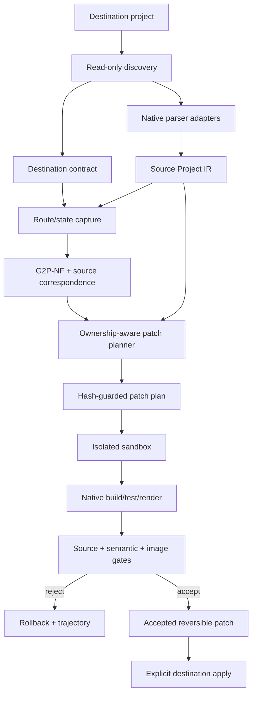

# Framework/CMS source-ingestion and project-patching implementation plan

Status: Proposed implementation plan  
Date: 2026-07-20  
Scope owner: Gen2Prod project-adapter layer  
Related contracts: [Gen2Prod plan](Gen2Prod_plan_v2_3_4_revised.md), [Karpathy loop](karpathyloop.md), [native output adapters](framework-adapters.md), [styling contract](styling-contract.md), [implementation matrix](implementation-matrix.md)

## Implementation progress, decisions, and lessons

This is a living execution ledger. A checked task means executable code and proportionate tests exist; prose or a schema placeholder alone is not sufficient.

### Progress log

| Date | Slice | Result | Evidence |
| --- | --- | --- | --- |
| 2026-07-20 | P0.1 and P0.2 contract foundation | Added strict project artifact/authority vocabulary, destination/source/ownership/patch/validation schemas, high-risk reversible pass definitions, public schema exports, and negative safety tests | `bun run check`; project schema and schema-export tests pass |
| 2026-07-20 | P1.1 read-only discovery | Added safe-root and symlink rejection, ignored-directory inventory, deterministic source fingerprinting, exact profile/version/lockfile/route/script discovery, explicit profile override, ambiguity failures, and required-action reporting | Repeated discovery is hash-stable; React/Vite, ambiguity, and symlink tests pass |
| 2026-07-20 | P0.4 parser fidelity and P1.2 Source Project IR | Added native TSX/Vue/Svelte/Astro parsers, structural WordPress block and Bricks export readers, exact source anchors, text/comment ordering, immutable dynamic regions, assets/styles/modules/routes, graph-integrity checks, normalized offset-independent identity, a versioned capability matrix, and exact-location dogfood fixtures | Typecheck plus React/Vue/Svelte/Astro/WordPress/Bricks parser tests pass; unsupported or invalid locations fail closed |
| 2026-07-20 | P1.4 hash-guarded text edits | Added full preflight, authority/symlink containment, operation DAG and overlap checks, exact AST-bound unique rebasing, descending in-memory edits, owned-file collision refusal, atomic staged writes, exact snapshot rollback, and second-apply refusal | BOM/CRLF/final-newline, untouched-byte, stale span, ambiguous rebase, overlap, graph tamper, path authority, symlink escape, postimage, collision, apply, rollback, and idempotence tests pass |
| 2026-07-20 | P1.5 imports and owned files | Added native TypeScript import analysis, equivalent alias/type-only detection, symbol collision refusal, directive/import-boundary insertion without printing, proven-unused minimal removal, generated-directory confinement, and owned-file operations | CRLF/directive/import formatting, partial request, collision, unused-proof, generated path, patch apply, and rollback tests pass |
| 2026-07-20 | P1.6 ownership and three-way safety | Added strict sidecar entries with base/current/proposed hashes, source symbol/node/fingerprint/BEM ownership, unique-move rebasing, semantic/duplicate conflict classification, and workspace persistence outside runtime output | Stable, offset-moved, semantically changed, duplicate-anchor, sidecar round-trip, and no-runtime-marker tests pass |
| 2026-07-20 | P1.7 safe runner and copied sandbox (filesystem hardening still open) | Added exact command authorization, shell-free spawn, filtered env, deadlines, bounded/redacted logs, lockfile guards, copied dependencies only when requested, source fingerprint monitoring, retained command/runtime evidence, and sandbox-only patch/build dogfood | Runner/env/redaction/timeout/lock-drift and source-untouched sandbox build tests pass; production acceptance remains false until a pinned container/OS sandbox can prohibit arbitrary absolute-path writes |
| 2026-07-20 | P1.8 declarative state capture | Extended stabilized browser evidence with hash-verified network fixtures, route navigation, safe/authorized action separation, post-action rendered source, per-fixture viewport/theme capture, environment/input equivalence hashes, and explicit branch/interaction coverage actions | Mocked route, safe details interaction, screenshot/DOM coverage, fixture equivalence, and unsafe-click refusal dogfood tests pass |
| 2026-07-20 | P1.9 source/render correspondence | Added a strict correspondence artifact and confidence-scored matching across states using tags, text, attributes, class roles, accessible names, source/render ancestry, and layout visibility; repeated instances aggregate to one template node and low-confidence mappings cannot authorize destructive edits | Repeated React list and unique high-confidence mapping tests pass; sandbox-only DOM IDs are removed from serialized rendered source |
| 2026-07-20 | P1.10 shared ACSS-tokenized SCSS | Added PostCSS/SCSS import/rule inventory, source+render selector reachability, owner-rule replacement/creation, side-effect style imports, proven-dead removal, registered ACSS/project variable checks, Sass compilation, and class-only BEM/nesting/utility gates | Unrendered branch retention, rendered-only retention, dead-rule removal, untouched import/rules, owner replacement, token coverage, compilation, and forbidden-selector tests pass |
| 2026-07-20 | P2 React strangler vertical slice | Added static enumeration/class-role analysis for ternary/logical/template/array/`clsx` forms and a correspondence-gated planner that emits an owned semantic shell, coalesced native imports, canonical ACSS-token SCSS, exact preserved dynamic islands, collision actions, and an empty second plan | Dirty React/Vite dogfood preserves `map`, key, handler, and data expressions byte-for-byte; removes root utilities; sandbox native build passes; second plan is empty |
| 2026-07-20 | P2.1/P2.2 and P3 Next source graph | Added inherited tsconfig/JSX/alias resolution, Next route/layout/special-file discovery, React props/hooks/refs/imported-component inventory, async data/metadata/server-action evidence, server/client classification, and Next-safe global style placement | Dynamic-route layout-chain tests pass; Next dogfood preserves metadata/fetch/server boundaries, emits no accidental `use client`, and does not duplicate the root global-style import |
| 2026-07-20 | P1.3 exact native adapter interface | Expanded the registry to exact profiles with read-only discovery, strict Source Project parsing, route projection, planner dispatch, native sandbox validation, and consumed/ignored evidence reporting | Profile/target mismatch fails closed; route projection and evidence accounting tests pass; profiles without a mutation planner return a typed blocking zero-operation plan |
| 2026-07-20 | P4 Vue SFC graph and strangler planner vertical slice | Added setup/classic script import and binding analysis, typed props/emits/ref/computed/slot/component/style inventories, exact SFC import anchoring, correspondence-gated semantic shell integration, shared ACSS-tokenized nested BEM SCSS, preservation-region obligations, owned-file conflict handling, and Vue/Nuxt registry dispatch | Parser fixtures distinguish recognized Vue semantics from verbatim preservation; dirty SFC dogfood preserves `v-if` and interpolation source, compiles both edited and generated templates, removes root utilities, and produces an empty second plan |
| 2026-07-20 | P5 Svelte/SvelteKit graph and strangler planner vertical slice | Added runes/legacy prop/store/import/module/style inventories, first-class directive and await/snippet/slot evidence, SvelteKit layout/special-module/load/action/SSR-setting discovery, version-aware Svelte 5 snippet/legacy slot shells, exact script import anchoring, correspondence-gated root wrapping, shared SCSS integration, and registry dispatch | Parser/discovery fixtures cover nested dynamic routes and runtime semantics; dirty Svelte dogfood preserves keyed `{#each}`, `{#if}`, action, event-handler, and expression text; edited/generated components compile and the second plan is empty |
| 2026-07-20 | P6 Astro island span hardening | Added a compiler-start-anchored, quote/brace-aware tag-span resolver for Astro constructs whose compiler end offsets truncate self-closing components, and classified hydrated components as immutable islands | A `client:load` component with an expression prop retains its complete exact source/hash and hydration binding; genuinely invalid expression locations still become blocking unresolved evidence |
| 2026-07-20 | P6 Astro strangler planner vertical slice | Added frontmatter-native import insertion, correspondence-gated semantic slot-shell integration, shared tokenized BEM SCSS, immutable-island preservation obligations, owned-file conflict handling, and exact-profile dispatch | Dirty Astro page dogfood preserves existing frontmatter and a complete `client:load` island, compiler-transforms edited/generated components, removes root utilities, and produces an empty second plan |
| 2026-07-20 | P6 Astro source and islands graph | Added balanced expression recovery, frontmatter TypeScript import/symbol/data analysis, layout/slot/embedded-style evidence, dynamic-page/layout/content-collection discovery, and island module plus hydration-mode inventory | Fixtures cover nested-markup expressions, `Astro.params`, content queries, named slots, scoped styles, dynamic routes, layouts, collections, and immutable client islands with exact source spans |
| 2026-07-20 | P7 WordPress structural source graph | Added nested block-stack classification, immutable dynamic core/plugin blocks, balanced shortcode regions, template-part evidence, theme.json fingerprints, stylesheet/enqueue/head evidence, and revision metadata | Fixtures retain complete unknown blocks/attributes and exact shortcode/dynamic block spans while validating stack balance and JSON attributes |
| 2026-07-20 | P7 WordPress offline patch vertical slice | Added revision-gated opening-comment edits for static block roots, semantic tag/BEM attributes, shared tokenized SCSS, offline import/rollback packages, registry dispatch, exact rollback/reapply, round-trip parsing, and empty replanning | Dogfood changes only the root opening comment, retains all inner bytes/query/shortcode source, refuses revision mismatch, and never touches a database or remote site; PHP/runtime staging validation remains open |
| 2026-07-20 | P8 versioned CMS JSON patch engine | Implemented `update-cms-node` preparation with exact export revision/file checks, unique ID lookup, canonical deep node pre/postconditions, unknown envelope/field retention, canonical output, atomic application, and exact original-byte rollback | Bricks-shaped mutation dogfood retains private/vendor fields, rejects stale revisions, applies one node, and restores the original indented export byte-for-byte |
| 2026-07-20 | P8 Bricks versioned export graph | Added envelope/version validation, complete element object hashes, parent/child backlink and ancestry-cycle checks, global class/component ownership evidence, query/condition/interaction hashes, inline-style detection, and unknown-setting inventories | Valid dynamic/component fixtures round-trip with zero unresolved items; missing IDs, references, backlinks, cycles, versions, and malformed envelopes fail closed |
| 2026-07-20 | P8 Bricks offline patch vertical slice | Added 2.x/revision-gated root ownership, complete-object CMS preconditions, semantic container/tag/BEM output, selective owned inline-style removal, shared SCSS, dynamic/private field retention, offline import/rollback packages, exact rollback/reapply, and registry dispatch | Dogfood retains child/envelope/vendor/query/condition/interaction data, removes only known root style payloads, round-trips the tree, rejects stale preimages, and replans empty without remote mutation |
| 2026-07-20 | P2.6 shared project acceptance validator | Added native-command, patch-scope, untouched-file, immutable-region/binding, state/branch/interaction, owned-SCSS, semantic/content/URL/form/interaction/accessibility, baseline/candidate/target image-diff, rollback, replay, idempotence, mutation-recall, and isolation gates in the strict validation-report schema | React dogfood produces retained diff PNGs and passes every deterministic/native/style/visual/rollback gate; copied/direct capture is rejected, while the full pipeline accepts only with runtime-generated hardened build/preview proofs and complete frozen-control evidence |
| 2026-07-20 | P9 preview lifecycle | Added an exact-authority, shell-free preview process with environment allowlisting, bounded output, readiness polling, early-exit/timeout errors, and process-group teardown | A live Bun preview fixture becomes reachable only through its declared command and is unreachable after deterministic shutdown |
| 2026-07-20 | P9 inspect-to-validation project controller | Added isolated baseline/candidate sandboxes, native builds, authorized live preview, declarative full-page Chromium state capture, exact adapter planning/replanning, strict validation, and content-addressed contract/source/plan/sandbox/mutation/report/replay artifacts | End-to-end React dogfood retains baseline/candidate screenshots and diff PNG, accepts with zero failures, writes eight replay-linked artifact refs, and leaves the source project and its `.gen2prod` path untouched |
| 2026-07-20 | P9.2 explicit destination apply and rollback | Added a separately invoked acceptance boundary that re-discovers the destination, verifies framework/version/lockfile/root identity, preflights every authorized hash-bound operation before writes, persists a versioned rollback bundle, applies atomically, verifies postimages, and restores exact originals on demand or post-apply races | End-to-end React dogfood proves no implicit source write, accepted apply, generated-file creation, exact changed-file inventory, stale second-apply refusal, exact rollback including generated-file removal, and rejection of an unaccepted report |
| 2026-07-20 | P9.3 project configuration | Added a strict optional project-adapter config namespace for artifact location, exact profile, frozen-install authority, preview environment names, and explicit copied-audit versus digest-pinned container posture | Existing configuration remains valid; unknown project keys, mutable container tags, missing container digests, and mismatched sandbox/image combinations fail schema validation |
| 2026-07-20 | P9.3 portable run request | Added a strict, exported framework-neutral request that binds source/render correspondence, canonical semantic/BEM/SCSS surface, ACSS variables, policy hash, mode/profile, preview URL, and frozen fixture payloads | Duplicate/invalid variables, hidden safety claims, unknown fields, invalid payload statuses, and malformed canonical trees fail before planning; target-specific planning remains selected from discovered destination facts |
| 2026-07-20 | P9.3 project CLI | Added stable JSON/human `project inspect`, `plan`, `run`, `apply`, and `rollback` commands, portable plan input, explicit profile selection, output paths, retained required actions, and environment-name forwarding | CLI dogfood proves read-only inspect/plan, copied-sandbox artifact production with mandatory isolation/mutation rejection, accepted explicit apply, stale refusal, and exact CLI rollback; all project schemas export with the existing schema bundle |
| 2026-07-20 | P9.3 project doctor | Added installed TypeScript/Vue/Svelte/Astro versions, PHP availability, all ten exact profiles and capability hash, Docker CLI/daemon/image evidence, configured sandbox posture, and acceptance readiness to human/JSON diagnostics | The repository config reports its copied-audit sandbox as useful but not acceptance-ready and emits a precise blocking container action; immutable container configurations additionally prove daemon and local image presence |
| 2026-07-20 | P9.3 operator documentation and conformance audit | Documented the project lifecycle, strict run request, state/network fixtures, baseline/candidate/target image evidence, ACSS/BEM contract, explicit apply/rollback, configuration, doctor, CMS offline/staging boundary, and failure recovery; updated README and the implementation matrix only to demonstrated scope | Documentation distinguishes complete React lifecycle evidence from per-profile vertical slices and explicitly retains container, mutation-corpus, staging, research, and cross-profile acceptance as bounded work |
| 2026-07-20 | P1.7 hardened build-command backend | Added digest verification against local registry digests, Docker-created command containers with no network, read-only root, all capabilities dropped, no-new-privileges, resource bounds, exact writable project/artifact mounts, authorized environment names, lockfile guards, bounded/redacted logs, inspected constraint proof, proof hashing, and exact container cleanup | A pinned Bun 1.3.14 container dogfood writes its authorized project output while failing both an external fetch and an absolute-root write; tampered proof fails verification and no container remains. Preview/capture containment is tracked separately before this proof may authorize full acceptance |
| 2026-07-20 | P1.7 hardened preview/capture boundary | Added a per-preview Docker bridge with outbound masquerading and inter-container communication disabled, a live failed egress probe, read-only/capability-dropped/no-new-privileges runtime, one exact loopback-only published port, inspected proof hashing, and deterministic container/network cleanup; validators now derive isolation only from retained build and preview proofs | Host Chromium captures the contained preview while the preview cannot fetch the Internet; full React pipeline dogfood accepts from runtime-generated proofs, retains both proofs in the sandbox artifact, applies and rolls back through the CLI, and exposes no caller flag capable of claiming hardened isolation |
| 2026-07-20 | P0.3/P10.3 frozen project mutation controls | Added an 18-control one-field mutation registry spanning expressions, handlers, keys, branches, slots, utilities, forbidden selectors/raw values, runtime boundaries, scope/preimages, native build, rendered pixels, state behavior, rollback/idempotence, and CMS parent/revision; reports bind registry, evaluator sources, frozen corpus, framework/parser/lockfile/toolchain, and capture environment fingerprints | Every mutation changes exactly one frozen field, has a named detector, produces a unique mutation hash, and reaches 100% recall; validation runs the suite itself, retains a strict content-addressed report/replay input, and no API/CLI recall override remains |
| 2026-07-20 | P0.3 project-family partitions | Added salt-bound deterministic family assignments, unique project-derivative enforcement, train-only search, validation-only selection, sealed holdout, strict manifests, and fingerprint verification | Thirty shuffled families reproduce byte-equivalent assignments spanning all splits; duplicate project identities and any post-hoc assignment edit fail validation/fingerprint checks |
| 2026-07-20 | P10.1 dynamic React project curriculum | Lifted the ten canonical page archetypes and independent content families into two React/Vite starter families with clean/dirty native-buildable projects, conditional navigation, keyed repetition, async states, controlled forms, dialogs, responsive media, client boundary, children composition, strict contracts/Source IR/states, strategies/briefs/content, lineage, eight corruption operations, family splits, and optional gold/dirty/diff browser captures | Eight-fixture structural dogfood proves two content variants remain in each family split, both dirty and gold projects build, dynamic/key/state/ref evidence parses, clean SCSS is nested/tokenized, and no runtime lineage marker leaks; CLI visual dogfood emits two starter projects with eight real screenshots plus four diff images |
| 2026-07-20 | P2.3 auditable React class migration | Added whole-token semantic BEM replacement over every statically enumerable variant, proof-gated behavior-hook lowering to `data-*`, and fail-closed preservation for framework, unknown, and runtime-generated class surfaces | Unit dogfood covers base/modifier mapping, behavior migration, runtime opacity, and framework-class blockers without substring rewriting or executing destination code |
| 2026-07-20 | P2.4 rendered-state route projection | Connected each declared rendered HTML/CSS state to the existing static canonical compiler, source/render correspondence, immutable dynamic descendants, BEM block ownership decisions, and safe replacement/wrapper/extraction/slot opportunities in a strict hash-bound artifact | Two-state React dogfood produces distinct canonical outputs, retains rendered inputs, maps preserved dynamics and BEM blocks, and project runtime replay now retains the projection artifact when capture evidence exists |
| 2026-07-20 | P3.2 Next-native metadata integration | Extended the portable canonical request with optional title/description intent and added a minimal App Router metadata operation that updates or inserts `export const metadata`, preserves unrelated object fields, and blocks on `generateMetadata` or opaque initializers | Next dogfood updates title, inserts description, retains Open Graph data, emits no document tags or client directive, preserves async fetch/server boundaries, and fails closed for dynamic metadata |
| 2026-07-20 | P10.2 composable project corruption grammar | Added 24 independently selectable source-shaped corruptions spanning semantic/style/component/metadata, import/handler/branch/key/slot/boundary/layout, CMS parent/revision/settings, and scope/preimage/rollback/idempotence failures with exact field and before/after hashes | Full composition changes 24 unique fields with 24 positive detectors; single-corruption dogfood proves unrelated authority stays exact, tampered overlap fails schema validation, and every generated project now retains the suite beside its concrete dirty/gold trace |
| 2026-07-20 | P2.7/P10.1 independent React topology curriculum | Split the generated React families into a local-function topology and an imported-child topology, added `clsx` enum/state matrices and exact JSX comment/formatting evidence, and retained the existing props, conditional, keyed, form, dialog, async, ref, handler, and responsive-state matrix | Both dirty and gold variants native-build; parser evidence distinguishes imported `Card` only in the composed family, enumerates dynamic classes, retains comments, and existing stale-preimage/independent-edit/owned-collision fixtures complete the integration matrix; Next nested metadata and WordPress/Bricks dynamic query/condition fixtures cover the remaining dynamic archetypes |
| 2026-07-20 | P11 project-policy research and promotion loop | Added a strict 13-field mutable policy with 10 literal hard invariants, 12-dimensional lexicographic fitness, one-field/effective-intervention enforcement, frozen four-part fingerprints, retained keep/revert evidence, train/validation family isolation, post-search sealed holdout, 100% control/rollback/replay promotion gates, and configured production-incumbent loading | Dogfood produces one effective keep, one effective revert, one no-op revert, exact repeated holdout output, no pre-search holdout access, successful promotion, immutable-field rejection, and 13 distinct plan validation directives whose impact hashes change with their owning field |
| 2026-07-20 | P11.4 project trajectories and distillation | Added `project-adapter` trajectory provenance with source graph/patch/preservation/state/native/image/replay evidence, project-family group IDs, CLI `distill --project-adapter`, contradiction quarantine through the shared dataset builder, and deterministic-verifier veto labels | Dataset dogfood retains one family across keep/revert examples, emits a preference pair without leakage, reports project-adapter source counts, and prevents a nominal keep with hard failures from becoming accepted evidence |
| 2026-07-20 | P7 WordPress complete offline inventory/PHP gate | Extended discovery and Source IR over patterns, parts, theme files, WXR/JSON content exports, WordPress/theme/plugin versions, content IDs, and declared revision; added native `php -l` validation with a structural-only fallback that remains runtime-unaccepted | WordPress dogfood discovers exact 6.8.2/ACSS inventory and theme/content artifacts, preserves query/shortcode regions, packages exact rollback, and reports the one current-host action—install/authorize PHP CLI—without stopping static work |
| 2026-07-20 | P7.3/P8.2 authenticated CMS staging protocol | Added strict local/staging-only authority and report schemas, connector interface, authenticated HTTP implementation with conditional ETag requests and environment-only credentials, memory staging dogfood, structural preflight, before/candidate/rollback captures, and exact export rollback | WordPress and Bricks fixtures prove two-state captures, dynamic query/condition retention, unique tree/parent/settings validation, stale revision refusal before mutation, exact rollback, secret-free reports, required permissions/versions/content IDs/sanitization/rollback authority, and schema-level production rejection |
| 2026-07-20 | P4.2 Vue-native metadata | Added profile-specific canonical metadata lowering: Vue/Vite updates the document entry and Nuxt emits static `useHead` state, with escaping, duplicate prevention, exact preimages, scriptless-SFC coalescing, and dynamic-head conflict refusal | Vue/Vite dogfood replaces one title/description and replans empty; Nuxt dogfood creates exactly one setup block, compiles, replans empty, and converts an existing computed `useHead` into a blocking required action |
| 2026-07-20 | P4.2/P5.2/P6.2 framework-native validation | Added pinned Vue/Vite, SvelteKit, and Astro+React-island projects that run actual typecheck/check/build/preview commands, capture baseline/candidate/target pixels, execute Vue/Svelte server compilers across conditional states, and feed the shared source/semantic/style/image/rollback/idempotence validator | All three native projects pass their commands, declared state capture, zero pixel diffs, source/binding preservation, 100% frozen controls, exact rollback/replay, and empty replanning; copied-audit runs retain only the previously declared hardened-isolation action rather than claiming promotion readiness |
| 2026-07-20 | P12.1 cross-profile acceptance matrix | Added strict per-profile/per-capability evidence, explicit exception authority, five shared invariants, deterministic aggregation, and exact coverage enforcement across all ten supported profiles and nine scenario classes | The matrix indexes hashed executable tests for every profile/capability, is order-stable, accepts the complete inventory, and rejects a missing scenario, duplicate profile, hidden exception, or inconsistent verdict |
| 2026-07-20 | P12.2 naturalistic benchmark | Added mandatory identity/license/data authority, exact-vs-preference labeling, bounded no-symlink import, secret omission/redaction, executable quarantine, HTML event/script/form/network neutralization, binary hashing/copying, family-isolated splits, coverage/calibration, and separate natural/procedural/combined hashes | Adversarial fixtures prove no secret or executable side effect reaches output and exact targets require pair authority; `userdata/*` dogfood imports 6 families/96 files/48 routes/28 captures as planner evidence with 3 train, 1 validation, 2 sealed holdout families and remains correctly provisional at 1 framework, 1 version, 4 generators, and 1 browser |
| 2026-07-20 | P12.3 performance and scale | Added exact content/toolchain/config keyed caching for parse graphs, source hashes, dependency graphs, builds, and captures; isolated bounded-concurrency route/state scheduling; hash-bound cost/latency telemetry as the final two research dimensions; bounded discovery; and bounded log retention with total bytes/full-stream hashes | Five cache classes prove miss→hit replay and exact invalidation; cached/fresh task outputs match under 1/2/3 workers while every task has a distinct sandbox; corrupt cache data fails; research derives normalized resource fitness from telemetry; inventory-limit actions and log head/tail/full-hash evidence are tested |

### Additional implementation decisions

| ID | Decision | Rationale | Consequence |
| --- | --- | --- | --- |
| D21 | New public project-adapter schemas use strict objects even though older repository schemas are permissive | Project mutation contracts must reject misspelled or smuggled authority fields | Unknown keys fail at the boundary; backward compatibility remains limited to older schema families |
| D22 | Offline CMS contracts do not carry a fake native build command | WordPress/Bricks export validation is an internal structural operation until a real staging runtime is authorized | Framework contracts require `commands.build`; offline CMS contracts may omit it and remain runtime-unaccepted until staging evidence exists |
| D23 | Parser capability claims describe demonstrated safety, not intended future support | A readable export is not automatically safe to rewrite | WordPress and Bricks remain `read`/`preserve` until their versioned patchers and round-trip controls exist; unreliable Astro spans become blocking unresolved evidence |
| D24 | Preserve text and comments as first-class ordered Source Project IR nodes | Element-only trees lose whitespace, mixed content, and source comments even when their parent span survives | Framework parsers retain exact text/comment spans; dynamic and opaque regions remain immutable by default |
| D25 | A copied working directory plus post-run source hashing is an audited sandbox, not a hardened filesystem boundary | This host has Docker but no pinned Gen2Prod runtime image, and unprivileged mount namespaces are disabled | Local dogfood may run and detect source-project changes; promotion/accepted reports must require a digest-pinned network-disabled container backend before claiming escaped-output prevention |
| D26 | Vue integration wraps an existing route root in an owned slot shell instead of printing the template AST | Compiler-generated output would churn whitespace and can normalize directive syntax | Only the root element span and native script import boundary change; every child directive, interpolation, listener, binding, and sibling whitespace span is copied verbatim |
| D27 | Svelte shells use the destination major version's native child-content contract | Svelte 5 passes children as snippets while Svelte 4 and earlier expose slots | Version 5 emits a typed `Snippet` plus `$props()`/`{@render}` shell; older destinations emit `<slot />`, avoiding a framework-upgrade side effect |
| D28 | Astro compiler offsets may anchor a deterministic delimiter-verified span repair, but unanchored or ambiguous positions may not be guessed | The pinned compiler truncates some component ends and reports some expression starts at the immediately preceding `>` | A brace/quote-aware scanner may complete an exact tag or balanced expression only when the expected delimiter is at the reported/adjacent boundary; all other invalid positions fail closed |
| D29 | Astro component imports belong only in frontmatter | Imports outside the fence are markup and whole-file printing would risk data/island churn | The planner minimally inserts into the exact existing fence or creates one leading fence; data declarations and all markup remain byte-preserved outside the authorized root span |
| D30 | WordPress block availability does not imply static ownership | Query, navigation, post-content, site identity, archive, and template-part blocks are server/plugin rendered | These core blocks use the same preserve-verbatim authority as unknown plugin blocks; only demonstrated static core blocks may become owned source surfaces |
| D31 | WordPress offline integration changes the smallest block-comment surface before introducing generated patterns | Existing dynamic inner HTML has no general slot contract across core/plugin blocks | The authorized static root receives semantic `tagName`/BEM `className` attributes; its opening comment is the only template edit and every inner byte remains outside the mutation span |
| D32 | CMS node operations and source text spans cannot target the same export path in one plan | JSON node replacement canonicalizes the document while source spans rely on original byte offsets | The patch engine rejects mixed modes per file, uses canonical deep equality for CMS nodes, and retains the exact original document separately for rollback |
| D33 | Bricks graph metadata stores hashes for dynamic payloads and a full hash of every element while the raw export remains the authoritative opaque source | Query/condition/interaction schemas and private plugin fields are version-dependent | Planners can prove preservation without pretending to understand private semantics; the node patch precondition still compares the complete original object |
| D34 | Bricks owned styling is lowered to shared SCSS and one semantic global-class reference, not retained in element settings | Root style payloads conflict with the project-wide no inline/CMS styling contract | The planner removes only the enumerated visual setting keys on the explicitly owned root; all query, condition, interaction, component, content, vendor, child, and envelope data remains untouched |
| D35 | Project acceptance is a strict report, not the absence of thrown errors | Build success or pixel similarity alone can hide source, state, rollback, policy, or isolation failures | `accepted` is true only when all recorded hard failures are empty; missing frozen-control or hardened-sandbox evidence is an explicit blocking failure even when local dogfood otherwise passes |
| D36 | Preview servers are lifecycle processes, not build commands | Waiting for a server command to exit deadlocks capture, while detaching it without ownership leaks processes | The runtime verifies readiness at an explicit URL, retains bounded logs, and owns deterministic process-group shutdown in success and failure paths |
| D37 | Baseline native builds and previews run from an empty-plan sandbox | Even an ordinary build writes caches/output and cannot remain a read-only inspection if executed in the destination | Original and candidate evidence come from independent copied roots; only the explicit destination-apply phase may later write accepted changes to the destination |
| D38 | The inverse bundle is persisted before destination mutation and is independent of sandbox lifetime | An accepted sandbox may be cleaned up or a process may fail immediately after the first rename | Apply has a durable exact-original recovery authority before any write; postimage verification triggers automatic rollback on an observed apply race |
| D39 | Project adapter configuration names environment variables but never stores their values | Configuration and result artifacts are durable and commonly committed or retained | Preview secrets remain process-local; the runtime may forward only names authorized by both the discovered contract and project configuration |
| D40 | The CLI run request carries one framework-neutral canonical surface plus an explicit target discriminator | All six source planners consume the same semantic tree/SCSS contract even though they lower it differently | The artifact stays portable and strict without creating six parallel semantic schemas; discovery must agree with the discriminator before planning |
| D41 | `doctor.ok` continues to describe the existing general compiler while project acceptance readiness is a separate reported fact | Project adapters are optional and must not make the established static/image compiler appear broken | `projectAdapters.sandbox.acceptanceReady` and blocking required actions expose the stricter boundary without weakening or conflating the legacy readiness signal |
| D42 | Hardened isolation is a runtime-inspected, hash-bound artifact rather than an input boolean | A caller-provided `true` cannot prove Docker image identity or kernel-enforced constraints | Every contained command records its container/image/command identity after verifying network, root filesystem, capability, privilege, mount, timeout, and cleanup conditions; full acceptance additionally requires equivalent preview/capture containment |
| D43 | Preview capture uses an egress-denied bridge rather than Docker's `--network none` | `none` correctly blocks egress but cannot expose the preview to the host browser on this Docker host | The bridge disables IP masquerading and inter-container communication, proves outbound fetch failure live, and publishes only the declared container port to `127.0.0.1`; all other project commands retain `--network none` |
| D44 | Project mutation recall is computed from a versioned frozen specimen and explicit one-field interventions | A numeric input would be as untrustworthy as a caller-provided sandbox boolean | Validation owns execution and fingerprinting; a malformed summary, duplicate control, ineffective mutation, detector miss, evaluator edit, toolchain change, or capture-environment change is visible and promotion requires exact recall 1 |
| D45 | Research partitions are assigned by starter/project family before generating seed/content/corruption derivatives | File-level random splits leak the same template topology into search and holdout | Every derivative project ID belongs to exactly one family assignment; experiments search train, select on validation, and cannot open holdout as another search split |
| D46 | Project curriculum stores static canonical pixels beside, not inside, dynamic source authority | A screenshot can score visual recovery but cannot encode props, branches, keys, handlers, form state, dialog control, or client boundaries | Gold/dirty project source and declared states own behavior; canonical static HTML screenshots own only their captured pixels, and lineage records that distinction explicitly |
| D47 | Behavior classes become `data-*` only when source evidence proves they are selector-only hooks | A class may be consumed by CSS, JavaScript, a plugin, tests, or analytics, and changing it without a complete reference proof can break behavior | Unproven behavior and framework classes remain opaque blockers; a clean-surface claim is available only when every reachable variant is complete and every token is owned or proven migratable |
| D48 | Runtime projection compiles captured HTML/CSS per state and overlays source authority afterward | Static canonical inference is useful for semantic/BEM intent but cannot own the dynamic expressions that produced a materialized DOM | Each state keeps its canonical hash and correspondence hash while ownership decisions retain preserved-region IDs; a missing rendered source fails instead of fabricating a projection |
| D49 | Next metadata intent lowers only through App Router metadata exports | Injecting `<head>` tags or shadowing `generateMetadata` creates duplicate/incorrect server metadata and can silently discard data-driven fields | Static object exports receive a hash-guarded minimal merge; dynamic/opaque metadata requires an explicit source-authorized mapping |
| D50 | Quality corruptions and deliberately invalid gate controls share a grammar but not one dirty build | Import, preimage, rollback, and CMS-revision failures are useful evaluator examples but would make every ordinary dirty project unbuildable | Generated dirty/gold projects retain quality-only concrete source differences, while the adjacent composable suite materializes each hard-failure specimen independently with an expected detector |
| D51 | Starter-family identity requires a different source graph, not a label in otherwise identical source | Family-isolated splits do not prevent topology leakage if two family IDs emit the same component structure | Function-family cards remain local; composed-family cards are separate imported modules, while content variants remain derivatives within their topology family |
| D52 | Project-policy hard invariants are literal schema fields outside the mutation set | A research loop that can propose utilities, inline styling, relaxed hashes, or non-isolated holdout has made its evaluator part of the attack surface | Mutation attempts outside the 13 enumerated strategy/budget fields fail; every mutable value has a generated validation directive and policy-impact hash |
| D53 | Sealed holdout is a terminal audit, never a cadence parameter | Periodic holdout peeking turns the holdout into another optimization split | Research calls only train/validation during the mutation loop, then evaluates baseline/candidate/replay holdout after search and promotes only on exact replay plus non-regression |
| D54 | A configured production incumbent must match the request's policy hash | Silently loading a newer policy would invalidate the signed plan/evaluator identity; silently ignoring the incumbent would make promotion inert | Project plan/run load `projectAdapters.policyPath` only when configured and reject hash mismatch before planning or sandbox work |
| D55 | CMS runtime mutation requires a staging authority artifact separate from the offline import package | An export package proves bytes and revisions but does not prove endpoint identity, credentials, permissions, sanitization, or rollback destination | The connector accepts only `local`/`staging`, all four permissions, exact versions/IDs/revision/ETag, environment variable names, and `allowProduction:false`; reports hash the origin and authority but retain no credential values |
| D56 | Missing PHP CLI downgrades syntax evidence rather than blocking all WordPress work | Templates, exports, block structure, shared SCSS, and rollback remain testable without PHP, but delimiter balance is not equivalent to the PHP parser | The fallback catches malformed structure and emits a precise runtime action; PHP-dependent acceptance becomes true only after actual `php -l` results exist |
| D57 | Vue metadata lowering follows the discovered deployment profile | Vite owns metadata in the document entry while Nuxt owns it through its head composable; treating those as interchangeable would duplicate tags or bypass SSR metadata | `vue-vite` applies one hash-guarded `index.html` edit; `nuxt` adds static `useHead`, and any existing non-identical head computation remains source-owned and blocking |
| D58 | Framework-native completion is measured through the shared validator with real destination commands and captures | Parser-only compilation can miss package graph, SSR adapter, bundler, preview, hydration, pixel, and replay failures | Vue runs `vue-tsc` and Vite, SvelteKit runs sync/check plus its SSR build, Astro emits a hydrated React island, and all three retain the same deterministic validation fields; sandbox isolation remains an orthogonal promotion authority |
| D59 | Cross-profile completeness is an evidence matrix, not a framework-name checklist | A profile can have a parser and planner while still lacking forms, conflict refusal, dynamic states, or rollback proof | Each of ten exact profiles must provide hashed executable evidence for all nine shared scenario classes and all five styling/preservation invariants; exceptions require a rationale, alternate evidence, and proof that shared invariants are unchanged |
| D60 | User-provided mockups without an authority-bound 1:1 source pair are preference/planner evidence | Treating an edited concept, alternate copy, or screenshot as an exact target would train false equivalence and penalize legitimate source behavior | Exact-target imports require a pair-authority hash; current `userdata/*` families are labeled `planner-evidence`, retain identity/license/data authority, and cannot enter exact pixel calibration |
| D61 | Cache identity includes exact categorized inputs, destination profile, route/state scope, toolchain, and configuration | Path- or timestamp-based caches can silently reuse a parse/build/capture across lockfile, browser, parser, policy, or state changes | Every cache record verifies key, value, and record hashes on read; source/config/toolchain changes produce distinct misses and cached/fresh output hashes must match |
| D62 | Wall-clock latency is retained but normalized per sample before entering lexicographic research fitness | Raw elapsed time varies with fixture count and cannot be compared to runs of different size | Evaluation rejects corrupt telemetry or fitness values not derived from `computeCost/sampleCount` and `wallTime/sampleCount`; hard correctness remains ahead of cost and latency in the 13-dimension order |

### Lessons learned

| ID | Lesson | Action |
| --- | --- | --- |
| L01 | Rejecting shell punctuation is insufficient: an executable field containing whitespace and quoted arguments still represents a shell-shaped command | `CommandSpec.executable` now rejects whitespace, quotes, and shell metacharacters; arguments must be separate array entries |
| L02 | Framework dependency signals overlap by construction (`next` includes React, Nuxt includes Vue, SvelteKit includes Svelte) | Detection collapses known parent/child profiles before ambiguity checks and requires an explicit profile for genuinely conflicting stacks |
| L03 | Vue's transformed template AST rewrites `v-if`/`v-for` structure and changes the offset coordinate system | Source ingestion uses the raw `compiler-sfc` descriptor AST; compilation remains a later native-validation concern |
| L04 | Astro compiler locations can extend beyond the original source for nested expressions in the currently pinned compiler | Repair is permitted only from a source-verified tag/expression delimiter using balanced lexical scanning; constructs without that proof remain blocking unresolved regions |
| L05 | React JSX nested inside a callback still has a JSX container ancestor beyond the function boundary | Root detection walks to the source file, preventing callback children from appearing twice in the project graph |
| L06 | `Bun.file().text()` removes a UTF-8 BOM while native compiler offsets and raw file hashes use the original byte-bearing source | All source adapters and patch preflights use a BOM-preserving byte read followed by UTF-8 decode; the edit-engine fixture locks BOM, CRLF, and final-newline preservation |
| L07 | Absence from source is not selector-death evidence, and absence from a default render is not enough either | A legacy rule is removable only when complete source-class analysis and declared rendered-state evidence both miss it; incomplete dynamic class bindings make reachability unknown |
| L08 | Component and style imports commonly share the same zero-width module anchor | React planning coalesces them into one ordered import operation so overlap preflight remains strict and imports are neither duplicated nor applied against different preimages |
| L09 | Vue compiler SFC block offsets point to block content, while template tag insertion needs the preceding opening-tag boundary | Existing scripts use compiler-verified content spans; scriptless SFCs search backward from the compiler's template-content offset for the unique opening tag |
| L10 | A setup binding named `props` is not the useful prop inventory when `defineProps` carries a type literal | Vue graph analysis records the literal type's property names while retaining the call source hash; destructured props retain their local binding names |
| L11 | Svelte's modern AST gives the script element span and a separate exact `content.start` boundary | Imports are inserted inside the existing instance script at that compiler offset, or in a new leading script when no instance script exists; the component AST is never reprinted |
| L12 | Svelte directive names alone do not identify semantics in the modern AST (`click`, `value`, and `fade` omit their source prefixes) | Inventory and binding classification use node types such as `OnDirective`, `BindDirective`, `UseDirective`, and `TransitionDirective`, while retaining each complete directive span verbatim |
| L13 | Astro's self-closing island `position.end` can stop inside the opening tag, and an expression start can point to the preceding `>` | Verify the tag name or adjacent `{` delimiter, scan with quote/brace state, and lock the complete island/expression rather than trusting a partial hash |
| L14 | Astro root wrapping can preserve unreliable nested compiler coordinates by deriving only the owned root's opening/closing boundaries | The planner scans the verified root source with quote/brace state and copies the entire inner substring verbatim into the generated shell boundary |
| L15 | Shortcodes can exist inside otherwise static core-block inner HTML without their own block comments | A balanced token stack attaches exact shortcode nodes to the smallest mutable containing block; shortcodes inside already-opaque blocks are covered by the parent's immutable span and are not double-counted |
| L16 | A revision-aware rollback package must be derived from the original export contract, not the reparsed candidate revision | Candidate rediscovery correctly advances the offline revision and would otherwise make the rollback precondition self-referential | Package creation verifies the original bytes against the original revision and records both candidate hash and exact original contents/hash |
| L17 | A file hash alone does not prove the intended CMS element is still the planned semantic node | Versioned CMS operations also require exactly one matching ID and canonical equality of the complete `before` object before replacing it |
| L18 | Valid Bricks references are bidirectional: a known child ID can still point to a different parent | Parsing verifies both existence and the child's parent backlink, then walks ancestry to reject cycles before mutation is available |
| L19 | Canonical JSON output changes export whitespace even when only one element changes | Exact original bytes are retained as the rollback authority, while semantic preservation is proven through complete object/envelope equality and canonical hashes |
| L20 | Validating an entire legacy stylesheet against owned-surface rules incorrectly charges preserved project debt to the generated component | Styling gates compile and inspect only the planned owned rule/file payload; untouched legacy selectors remain a residual/reachability concern rather than contaminating the ownership claim |
| L21 | Killing only the package-manager child can leave its preview server alive | Preview commands start in their own process group on POSIX and shutdown signals the group, with a bounded SIGKILL fallback |
| L22 | Route-qualified state IDs contain `/` and `:` and are unsafe screenshot filenames | Capture artifacts retain the original state ID in metadata while filenames use a deterministic sanitized representation |
| L23 | An accepted report is not sufficient if the destination has drifted since inspection | Apply re-runs discovery and patch preparation against the real destination and rejects root, framework, lockfile, path, file, span, AST-anchor, revision, and owned-file precondition drift before mutation |
| L24 | A container image tag is not a reproducible sandbox identity | The project config accepts only `name@sha256:<digest>` and refuses a container backend without that immutable identity |
| L25 | A local copied-sandbox run is still useful even when it cannot be promoted | The CLI produces native, preservation, and artifact evidence but deterministically reports the missing hardened isolation and 100% mutation-control recall instead of exposing flags that let an operator assert those proofs |
| L26 | `--read-only` alone is not a sandbox contract | The runner also disables networking, drops all capabilities, enables no-new-privileges, bounds processes/memory/CPU, mounts only the copied project and artifact directory writable, runs as the invoking non-root UID/GID, and verifies Docker's effective HostConfig before execution |
| L27 | Docker's `--internal` bridge and loopback port publishing are not composable on this host | A live dogfood connection was refused despite a healthy server, so preview isolation uses a no-masquerade/no-ICC bridge plus an explicit failed-egress probe instead of weakening to ordinary bridge networking |
| L28 | Mutation controls need intervention-effect evidence in addition to detector results | Every control records a distinct before/mutation hash and exactly one changed field; ineffective or multi-field controls cannot masquerade as useful recall evidence |
| L29 | Content variation and structural variation need separate identities | Each starter/archetype pair is a family, while content variants are derivatives assigned to that family's one split; changing copy does not create fake topology independence |
| L30 | A syntactically BEM-compatible token is not evidence that Gen2Prod owns its runtime meaning | Class migration consumes explicit style/behavior/framework evidence and rewrites complete tokens only; runtime class functions never become guessed variants |
| L31 | One default render cannot establish dynamic ownership | Projection runs every declared state independently and carries immutable source-region IDs into each canonical block decision; unobserved or low-confidence mappings remain evidence requests |
| L32 | Preserving a metadata export is not the same as integrating the destination metadata contract | The canonical request now carries explicit metadata intent, Next gets a native operation, and dynamic generators are surfaced as blockers rather than silently ignored |
| L33 | A corruption name without exact changed-field identity cannot prove independent detector coverage | Grammar reports require one unique field, effective before/after hashes, and a positive named detector per operation; overlap and ineffective mutations are invalid artifacts |
| L34 | Declaring two starter families without changing their module graph creates false independence | Curriculum tests now assert the imported-component graph and filesystem differ by family in addition to checking split identity |
| L35 | Comparing policy JSON hashes alone would treat a renamed/no-op candidate as an intervention | Effectiveness requires a changed policy plus changed generated output or non-cost fitness; the explicit no-op control is retained as a revert |
| L36 | Trajectory fixture IDs are not a safe split boundary for source projects | Project-adapter trajectories use `project-adapter:<familyId>` as their group, so content/state/corruption derivatives cannot leak independently into training and holdout |
| L37 | CMS revision and ETag are distinct concurrency authorities | Staging import verifies both; rollback is conditional on the candidate ETag, then confirms the original export hash, preventing a concurrent editor from being overwritten |
| L38 | Hiding credential values from reports is insufficient if the connector serializes them into its authority | Authority stores only environment variable names; the HTTP connector resolves values at call time, while retained reports contain only hashes and non-secret evidence |
| L39 | A scriptless Nuxt SFC cannot receive metadata and imports as two independent zero-width setup-block edits | The planner coalesces static `useHead` with component/style imports into one `<script setup>` insertion; existing script blocks receive a separate non-overlapping metadata operation |
| L40 | Framework build asset hashes and bootstrap source are not page-content semantics | Semantic recall now derives text from direct node text and URLs from content-bearing anchors/media, excluding generated script/style/link payloads that legitimately change when source modules change |
| L41 | An authorized import inserted into an opaque frontmatter block changes that block's aggregate hash without authorizing its dynamic descendants | Preservation and binding checks exempt only the exact node targeted by an operation; hydrated islands and other nested preserved regions remain independently required byte-for-byte |
| L42 | A single aggregate "framework passed" bit hides which behavioral archetype is absent | Capability identity is unique and exhaustive inside each profile row, and profile identity is unique and exhaustive inside the matrix; both levels recompute their verdict instead of trusting a caller flag |
| L43 | Sanitizing credential values is insufficient if imported HTML can still execute requests | Naturalistic HTML removes all scripts and inline event handlers, disables form actions, neutralizes external resource URLs/CSS, quarantines code files, and reports every transformation while preserving original hashes as non-executable evidence |
| L44 | A deterministic hash split can place every small corpus family in train by chance | The frozen naturalistic salt was selected before evaluation using family IDs only to ensure train/validation/holdout presence; complete repository families remain indivisible and the selected salt hash is retained in the split manifest |
| L45 | Killing a command when retained logs fill loses the very evidence needed to explain a scale failure | Local and container runners retain bounded head/tail text, total byte counts, a truncation marker, and SHA-256 of each complete stream; execution continues under its independent timeout/resource limits |
| L46 | Parallel state capture is unsafe when workers share one patched tree or framework build cache | The scheduler creates one real sandbox directory and one deterministic sandbox identity per route/state task; only immutable content-addressed cache records are shared |

## 1. Outcome

Implement the remaining boundary between Gen2Prod's accepted canonical output and an existing dynamic React/JSX, Vue, Svelte, Astro, WordPress, or Bricks project.

The finished system must be able to:

1. inspect an existing project without modifying it;
2. discover its framework, versions, routes, layouts, build commands, style entrypoints, aliases, metadata conventions, and CMS revision information;
3. parse its source into a lossless Source Project IR that distinguishes static markup from immutable dynamic expressions and control flow;
4. render declared routes and states to connect source evidence to G2P-NF and visual evidence;
5. plan the smallest authority-safe source patch that introduces clean semantic markup and shared ACSS-tokenized, nested BEM SCSS;
6. apply the patch only inside an isolated sandbox first;
7. native-typecheck, build, test, render, semantically compare, and image-diff every declared state;
8. prove that unowned source and dynamic behavior were preserved;
9. produce a reversible, hash-guarded patch and exact replay record;
10. apply an accepted patch to the destination only through a separate explicit operation;
11. improve patch policy through one-change research with frozen evaluators, project-isolated splits, mutation controls, sealed holdout, and exact replay;
12. continue useful work when destination authority is missing by emitting precise `requiredActions` rather than inventing project semantics.

This plan closes **framework/CMS source ingestion and destination patching**. It does not replace the existing framework output emitters. The output emitters remain the clean reference implementation and provide canonical target components for project integration.

## 2. Definition of the boundary

Today:

```text
static HTML/CSS, strategy, or image evidence
→ G2P-NF
→ canonical HTML/SCSS/CSS
→ clean React/Vue/Svelte/Astro/WordPress/Bricks output bundle
```

This plan adds:

```text
existing dynamic project
→ project discovery
→ lossless Source Project IR
→ rendered route/state evidence
→ G2P-NF correspondence
→ ownership-aware project patch plan
→ sandboxed destination project
→ native build/state/image/semantic/source-preservation validation
→ reversible accepted patch
```

The hard part is not generating framework syntax. That already works. The hard part is preserving information that a static render does not contain:

- expressions and data access;
- branches and repetitions;
- component props, slots, children, snippets, and render callbacks;
- server/client and hydration boundaries;
- loaders, actions, handlers, stores, refs, and framework directives;
- route, layout, metadata, asset, and import conventions;
- existing tests and build tooling;
- CMS IDs, parentage, versions, revisions, and sanitization constraints;
- formatting, comments, and unrelated user edits.

## 3. Non-negotiable implementation principles

1. **G2P-NF remains canonical.** Do not create a framework-specific semantic or style truth parallel to G2P-NF.
2. **Dynamic source is authority, not expendable syntax.** Expressions, handlers, branches, repetitions, keys, loaders, actions, stores, and data access are immutable by default.
3. **Use native parsers and source spans.** Never patch JSX/SFC/Svelte/Astro with regular-expression rewriting.
4. **Use minimal text edits, not whole-file printers.** Unchanged bytes, comments, formatting, line endings, and import order must survive wherever possible.
5. **Sandbox first.** Planning and validation may never mutate the destination project. Applying an accepted patch is a separate explicit command.
6. **Hash every precondition.** A changed target span, file, lockfile, framework version, CMS revision, or contract invalidates the affected operation.
7. **Prefer a strangler migration.** Generate clean owned components around preserved dynamic islands, then shrink those islands only when evidence supports it.
8. **No runtime ownership markers.** Store ownership in sidecar artifacts and AST fingerprints; do not ship `data-g2p-*` solely for compiler bookkeeping.
9. **Shared styling remains shared.** No CSS-in-JS, scoped-style rewrites, style props, utility classes, inline visual styles, or CMS style settings.
10. **ACSS/project variables remain value authority.** Project adapters may not create a framework-specific token system.
11. **Do not infer behavior from pixels.** Source bindings and authorized state fixtures decide behavior. Images decide declared pixels only.
12. **Hard gates dominate.** Pixel improvement cannot excuse source loss, behavior changes, invalid native builds, accessibility regressions, or styling-contract failures.
13. **CMS writes are revisioned and staged.** Offline exports come first. Direct database mutation is prohibited.
14. **Independent work continues when blocked.** Conflicted or unauthorized operations are skipped and recorded; unaffected discovery, planning, evaluation, and research continue.
15. **A second pass must be empty.** Project patching is not complete until exact idempotence is demonstrated.

## 4. Decision record

| ID | Decision | Rationale | Consequence |
| --- | --- | --- | --- |
| D01 | Add a Source Project IR above G2P-NF rather than extending `PlannedNode` with framework syntax | G2P-NF should remain framework-neutral and deterministic | Project syntax and dynamic control flow stay isolated from canonical emission |
| D02 | Preserve expressions as typed, hash-bound holes | Reconstructing expressions from rendered HTML loses behavior | Markup around a hole may change; the expression text may not change without explicit authority |
| D03 | Apply descending source-span edits | This preserves untouched file bytes and avoids full-printer churn | Parsers provide analysis; a shared edit engine performs mutation |
| D04 | Permit unique AST-fingerprint rebasing, but prohibit fuzzy text matching | Exact source offsets can move after unrelated edits; fuzzy matching can silently patch the wrong code | Rebase succeeds only when one structurally identical anchor exists and all semantic hashes match |
| D05 | Keep ownership in `.gen2prod/projects/<project-id>/ownership.json` | Runtime attributes/comments pollute production code and can affect behavior | Ownership survives through normalized AST fingerprints and preimage hashes |
| D06 | Default to generated owned components plus minimal integration edits | Replacing an entire route creates excessive blast radius | Initial patches are understandable, reversible, and incrementally refinable |
| D07 | Treat existing dynamic subtrees as slots/children/render fragments first | It avoids inventing prop/state semantics | Research can later improve the boundary without compromising the initial conversion |
| D08 | Store build commands as argument arrays, never shell strings | Shell interpolation expands authority and creates injection risk | The process runner executes allowlisted binaries with explicit cwd/env |
| D09 | Do not install dependencies automatically during inspection | Read-only discovery should not mutate the project or contact the network | Sandbox validation may run a frozen install only when the destination contract authorizes it |
| D10 | Reuse the destination lockfile and fail on lockfile drift | Dependency resolution changes invalidate build evidence | Framework/compiler version evidence remains replayable |
| D11 | Add a project-validation report instead of inventing Gate K | Gates A–J are already the stable production contract | Project-specific invariants are mirrored into the relevant existing gates and retained in a richer report |
| D12 | Require route/state fixtures for claims about dynamic behavior | A default render does not exercise conditional states | Missing states reduce coverage and create a required action; they cannot be silently treated as passing |
| D13 | Start with React/TSX, then reuse infrastructure for Vue/Svelte/Astro | TypeScript is already installed and React provides the broadest source-pattern test bed | React MVP must not embed assumptions that block template-language adapters |
| D14 | Implement CMS from exports before staged remote mutation | Exports are hashable, replayable, and recoverable | WordPress/Bricks staging drivers are later milestones with revision locks and rollback |
| D15 | Scope initial strict styling gates to converted route surfaces and all generated files | Unrelated legacy/admin code may remain outside an incremental route conversion | The report must distinguish owned hard failures from project-wide residual debt |
| D16 | Remove old CSS only after whole-project reachability proves it dead | Source selectors can affect unrendered branches | Initial success may retain proven-harmless dead CSS; markup on converted surfaces may not retain utility styling |
| D17 | Use existing native output adapters as structural oracles, not text templates | Output bundles are already clean and validated but do not know destination conventions | Project planners compare semantics/components while integration profiles decide file placement/imports |
| D18 | Make destination apply separate from sandbox acceptance | Validation success is not authority to mutate a user project | `project apply` requires an accepted plan and current precondition hashes |
| D19 | Use project-family splits for research | Pages from one starter/template are correlated | All derivatives of a starter, repository, or CMS export remain in one split |
| D20 | Keep live CMS publishing outside automatic promotion | Publishing affects external state and may be irreversible | Gen2Prod can prepare, stage, validate, and report; production promotion remains an explicit authorized action |

## 5. Target architecture



### 5.1 Proposed source layout

```text
src/project-adapters/
  contract.ts
  discovery.ts
  registry.ts
  ir.ts
  ownership.ts
  correspondence.ts
  plan.ts
  pipeline.ts
  sandbox.ts
  apply.ts
  validate.ts
  state-fixtures.ts
  process.ts
  styles.ts
  types.ts
  rewrite/
    anchors.ts
    text-edits.ts
    imports.ts
    files.ts
  react/
    discover.ts
    parse.ts
    classes.ts
    project.ts
    plan.ts
    profiles/
      react-vite.ts
      next-app.ts
  vue/
  svelte/
  astro/
  wordpress/
  bricks/
  research/
    policy.ts
    mutate.ts
    evaluate.ts
    loop.ts
```

Tests and fixtures:

```text
tests/unit/project-adapters/
tests/integration/project-adapters/
fixtures/projects/
  react-vite/
  next-app/
  vue-vite/
  sveltekit/
  astro/
  wordpress/
  bricks/
```

### 5.2 Reuse versus new implementation

| Existing subsystem | Reuse | Required extension |
| --- | --- | --- |
| `src/compiler/*` and G2P-NF | Continue producing semantic/component/BEM/token/style/interaction truth from rendered/static evidence | Add correspondence to Source Project IR; do not put framework expressions into canonical nodes |
| `src/adapters/*` | Use clean native components, metadata, interactions, SCSS, and manifests as structural oracles | Add project integration planners that place or adapt those components without rewriting dynamic source |
| `src/evidence/*` | Reuse stabilized browser capture, state evidence, screenshots, accessibility/DOM/style/box facts | Add destination preview-server lifecycle and route/state fixture coverage |
| `src/validation/*` | Reuse Gates A–J, source/DOM metrics, BEM/token analyzers, accessibility, visual diff, and mutation patterns | Add source-preservation, patch-scope, native-project, rollback, and idempotence assertions |
| `src/core/artifact-store.ts` and replay | Reuse content addressing, manifests, pass events, rollback references, and provenance | Register project artifacts and source authority |
| `src/runtime/passes.ts` | Reuse pass registry and gate scheduling | Add high-risk reversible project passes |
| `src/adapters/research.ts` and distillation | Reuse frozen one-change keep/revert, sealed holdout, replay, trajectories, and isolation rules | Add project-patch policy/fitness and project-family grouping |
| `src/cli.ts` | Reuse config loading, JSON envelopes, errors, doctor, and workspace conventions | Add `project` command tree and explicit destination apply |

### 5.3 Parser and rewrite technology choices

| Surface | Parser/analyzer | Mutation method | Dependency decision |
| --- | --- | --- | --- |
| JavaScript/TypeScript/JSX/TSX | TypeScript compiler API | Exact source-span edits from AST positions | Already installed; avoid a second JS AST until a measured gap requires it |
| Vue SFC | `@vue/compiler-sfc` plus explicit template compiler APIs | Template/script/style span edits | Compiler is installed; promote transitive template packages to direct pinned dependencies if imported directly |
| Svelte/SvelteKit | `svelte/compiler` AST | Exact node/block spans | Already installed; pin fixture compiler major with project profile evidence |
| Astro | `@astrojs/compiler` parse/transform/location APIs | Exact frontmatter/template spans | Already installed; complete a location-fidelity spike before implementation; no regex fallback |
| SCSS/CSS | PostCSS plus `postcss-scss` | Owner-rule span edits and new owned file writes | Already installed and shared with current styling validation |
| WordPress blocks | WordPress block serialization parser or a compatible vendored contract | Block/export operations plus exact opaque inner-content preservation | Add as a direct pinned dependency only after export round-trip fixtures prove suitability |
| Bricks | Versioned Zod schemas over export JSON | ID-aware JSON operations with opaque unknown-field preservation | No generic parser dependency; schema support is explicitly version-gated |

Dependency rules:

- parser/compiler dependencies used in production must be direct dependencies, lockfile-pinned, and recorded in manifests;
- destination framework packages are not silently upgraded to match Gen2Prod's validator versions;
- validators must distinguish “Gen2Prod can parse this source version” from “the sandbox native project builds with its own version”;
- a parser lacking reliable node locations blocks source mutation for that syntax; it may still support read-only inventory;
- formatting tools may run only if already declared and authorized by the destination contract, and their changed spans become part of the patch rather than invisible cleanup.

## 6. Core contracts

### 6.1 Destination contract

Add `ProjectContractSchema` with these concerns:

```ts
type ProjectContract = {
  schemaVersion: "0.1.0";
  projectId: string;
  rootHash: string;
  framework: {
    target: "react" | "vue" | "svelte" | "astro" | "wordpress" | "bricks";
    profile: string;
    version: string;
    router?: string;
    rendering: ("ssr" | "ssg" | "csr" | "islands")[];
  };
  packageManager?: {
    name: "bun" | "pnpm" | "npm" | "yarn";
    lockfile: string;
    lockfileHash: string;
  };
  commands: {
    install?: CommandSpec;
    typecheck?: CommandSpec;
    test?: CommandSpec;
    build: CommandSpec;
    preview: CommandSpec;
  };
  integration: {
    routeEntries: RouteEntry[];
    rootLayouts: string[];
    metadataMode: string;
    styleEntrypoints: string[];
    generatedDirectory: string;
    aliases: Record<string, string>;
  };
  authority: {
    allowedPaths: string[];
    deniedPaths: string[];
    preserveExpressions: true;
    preserveHandlers: true;
    preserveDataAccess: true;
    permitFrozenInstall: boolean;
    permittedEnvironmentKeys: string[];
  };
  states: StateFixture[];
  cms?: CmsDestinationContract;
};
```

`CommandSpec` must be `{ executable, args, cwd, envKeys, timeoutMs }`; it must not accept a shell command string.

### 6.2 Source Project IR

Add a recursive `SourceProjectSchema` containing:

- project files and their byte hashes;
- modules, imports, exports, symbols, components, routes, and layouts;
- framework/compiler versions;
- markup tree with source anchors;
- expression, conditional, repetition, slot, directive, and opaque nodes;
- class-binding grammar and all enumerated variants;
- style sources and selector reachability;
- handler/action/store/ref bindings;
- metadata and asset bindings;
- authority and confidence for every proposed ownership boundary.

Required node variants:

```ts
type ProjectMarkupNode =
  | StaticMarkupNode
  | ExpressionHole
  | ConditionalRegion
  | RepetitionRegion
  | SlotRegion
  | FrameworkDirective
  | OpaqueRegion;
```

Every non-static node stores:

- exact source text and SHA-256;
- source file, start/end offsets, line/column, and normalized AST fingerprint;
- referenced symbols and binding kinds;
- rendered-state observations;
- whether the region may move, be wrapped, or be split;
- explicit rewrite authority, defaulting to `preserve-verbatim`.

### 6.3 Ownership map

The sidecar ownership artifact maps stable G2P component/block IDs to destination source:

```ts
type OwnershipEntry = {
  ownerId: string;
  bemBlock: string;
  file: string;
  symbol?: string;
  astFingerprint: string;
  preimageHash: string;
  generated: boolean;
  dynamicRegions: string[];
  styleRuleFingerprints: string[];
};
```

Ownership must be reconstructible after harmless offset movement. It must become unresolved when multiple equivalent anchors exist.

### 6.4 Patch plan

Add `ProjectPatchPlanSchema` and a discriminated operation union:

- `write-owned-file`;
- `replace-node-span`;
- `insert-import`;
- `remove-proven-unused-import`;
- `replace-class-binding`;
- `move-preserved-binding`;
- `replace-owned-style-rule`;
- `insert-style-import`;
- `remove-proven-dead-style-rule`;
- `update-framework-metadata`;
- `update-cms-node`;
- `update-cms-template`.

Every operation includes:

- operation ID and dependency IDs;
- target file and allowed-path proof;
- file and target-span preimage hashes;
- AST fingerprint and expected node kind;
- before/after source;
- authorities consumed;
- preserved dynamic-region hashes;
- predicted blast radius;
- inverse operation or snapshot reference;
- expected postimage hash;
- validation obligations;
- `blocking` versus `independently-skippable` semantics.

### 6.5 Project validation report

Add `ProjectValidationReportSchema` with:

- discovery/contract validity;
- patch-precondition and patch-scope results;
- untouched-file and untouched-span byte preservation;
- dynamic-region/handler/data-binding preservation;
- native typecheck/build/test results;
- route/state coverage;
- semantic, content, URL, form, interaction, accessibility, BEM, token, and selector metrics;
- baseline/candidate/target visual metrics per route/state/viewport;
- generated-source bytes and source churn;
- rollback verification;
- exact second-plan idempotence;
- hard failures, warnings, required actions, and accepted status.

### 6.6 Acceptance profiles and visual objectives

Project patching must retain the existing mode/profile distinction:

| Profile | Baseline authority | Visual objective | Source objective |
| --- | --- | --- | --- |
| `refactor` | Existing destination route/state render | Candidate must preserve locked baseline pixels within the strict threshold; exact fixtures require zero diff | Preserve content, behavior, data, routes, and dynamic code while cleaning semantics/styles |
| `migration` | Existing destination plus approved framework migration contract | Preserve declared behavior/content and remain within migration-calibrated visual bounds | Framework/integration changes are authorized only by the migration contract |
| `redesign` | Approved visual target plus source authority for content/behavior | Improve candidate-to-target while preventing locked-region regression | Preserve source-authoritative behavior/content not explicitly changed by the redesign |
| `mockup-convergence` | Approved image regions/viewports/states | Optimize discrete target loss after every hard source gate passes | Pixels cannot authorize dynamic source changes |
| `optimization` | Existing destination | No unexpected visual/behavior movement | Limit edits to the declared optimization scope |

For every captured condition, retain:

- baseline screenshot when the destination exists;
- approved target screenshot when supplied;
- candidate screenshot;
- baseline-to-candidate diff;
- candidate-to-target diff when applicable;
- locked/ignored masks and authority;
- route, state, viewport, theme, font, environment, and fixture-data hashes.

## 7. CLI contract

Proposed commands:

```bash
# Read-only; writes evidence only under the Gen2Prod workspace.
gen2prod project inspect <project-root> [--profile auto|PROFILE] [--output PATH]

# Capture states, construct G2P-NF correspondence, and emit a patch plan.
gen2prod project plan <project-root> \
  --contract <project-contract.json> \
  --route / \
  [--canonical-run RUN] [--image-target TARGET]

# Apply only to a generated sandbox, validate, and emit an accepted/rejected patch.
gen2prod project sandbox <patch-plan.json> [--output PATH]

# Re-run validation against an existing sandbox.
gen2prod project validate <sandbox-or-report>

# Explicitly apply a previously accepted patch to the current destination preimage.
gen2prod project apply <accepted-patch.json> --project <project-root>

# Run frozen one-change project-adapter research.
gen2prod project research --fixtures fixtures/projects/manifest.json --budget N
```

Safety behavior:

- `inspect`, `plan`, `sandbox`, `validate`, and `research` never modify the destination project.
- `apply` refuses any changed precondition and does not attempt a fuzzy merge.
- `apply --partial` is not supported. Independently skippable operations are resolved during sandbox planning, not during destination application.
- all commands support `--json` and noninteractive operation;
- destination writes and rollback are reported explicitly;
- CMS production publication is not an `apply` behavior in the initial implementation.

## 8. Task plan

### Phase P0 — Freeze contracts and evaluator boundaries

#### P0.1 Add artifact and authority vocabulary

Dependencies: none.

Tasks:

- [x] Add artifact types: `project-contract`, `source-project-ir`, `dynamic-region-map`, `project-ownership-map`, `project-patch-plan`, `project-patch`, `project-sandbox`, and `project-validation-report`.
- [x] Add authority concerns: `framework-source`, `destination-build-contract`, `runtime-state-fixtures`, `destination-path-ownership`, `cms-export`, and `cms-revision`.
- [x] Add pass definitions for discovery, source parsing, state capture, correspondence, patch planning, sandbox application, project validation, rollback, idempotence, and explicit apply.
- [x] Mark destination mutation passes high risk, reversible, and site blast radius.
- [x] Extend schema export tests.

Decision/rationale comments:

- Keep the existing A–J gate identifiers stable.
- Project-specific preservation results live in `project-validation-report` and are mirrored into A, B, C, D, E, H, I, and J as applicable.
- `source-input` is insufficient because it does not distinguish a file from a project graph or record editable ownership.

Acceptance criteria:

- Every new schema rejects unknown keys and unsafe defaults.
- A pass cannot declare destination files editable without `destination-path-ownership` authority.
- Schema export contains every new public contract.
- Existing manifests and tests remain backward compatible.

#### P0.2 Implement destination-contract schema and discovery result

Dependencies: P0.1.

Tasks:

- [x] Implement `ProjectContractSchema`, `CommandSpecSchema`, route entry, state fixture, package-manager, integration, and CMS contract schemas.
- [x] Separate discovered facts, inferred defaults, explicit overrides, and unresolved fields.
- [x] Add contract hashing and versioning.
- [x] Define strict merge precedence: explicit CLI/contract → project artifacts → framework defaults → unresolved.
- [x] Export JSON Schema.

Acceptance criteria:

- Shell strings, `..` traversal, broad root writes, unresolved environment expansion, and unbounded timeouts fail validation.
- Unknown framework profiles remain explicit instead of falling back to a similar framework.
- A contract can be fully round-tripped through JSON without losing provenance.

#### P0.3 Freeze project evaluator inputs

Dependencies: P0.1–P0.2.

Tasks:

- [x] Define evaluator source files and corpus files included in `evaluatorHash` and `corpusFingerprint`.
- [x] Include framework/compiler/lockfile versions and capture environment in fingerprints.
- [x] Define mutation-control registry before research begins.
- [x] Define search, validation, and sealed-holdout partition rules by project family.

Acceptance criteria:

- Modifying parser, patcher, preservation validator, visual evaluator, fixture gold, or state definitions changes the appropriate fingerprint.
- A research candidate cannot edit any frozen input.

#### P0.4 Verify parser location fidelity

Dependencies: P0.1–P0.2.

Tasks:

- [x] Build read-only parser spikes for TSX, Vue template/script, Svelte template/script, Astro frontmatter/template, WordPress block export, and Bricks JSON.
- [x] Record support for exact offsets, comments/trivia, mixed text ordering, expression boundaries, control-flow blocks, imports, styles, and parse-error recovery.
- [x] Build an explicit syntax capability matrix with `read`, `preserve`, `rewrite`, or `unsupported` per construct.
- [x] Promote any transitive compiler API used by Gen2Prod to a direct pinned dependency.
- [x] Refuse mutation support for constructs without exact location and round-trip evidence.

Decision/rationale comments:

- This spike prevents the common failure where a parser is excellent for compilation but does not expose stable source locations for a lossless rewriter.
- A framework may enter read-only discovery before it enters mutation support.

Acceptance criteria:

- Every claimed rewrite-capable construct has an exact-source extraction test.
- Parsing and extracting all preserved spans, without edits, reproduces the original source bytes.
- The capability matrix is versioned and included in framework-profile manifests.

### Phase P1 — Shared project infrastructure

#### P1.1 Read-only project discovery

Dependencies: P0.2.

Tasks:

- [x] Resolve and validate the project root without following escaping symlinks.
- [x] Inventory package manifests, lockfiles, framework configs, TS configs, aliases, source roots, route roots, style entrypoints, and scripts.
- [x] Detect React/Vite, Next App Router, Vue/Vite, Nuxt boundary, SvelteKit, Astro, WordPress export/theme, and Bricks export profiles.
- [x] Record exact dependency versions from lockfile/package metadata.
- [x] Identify candidate build/typecheck/test/preview commands without executing them.
- [x] Detect generated/vendor/cache/secret directories and add them to denied paths.
- [x] Produce required actions for ambiguity while continuing safe inventory work.

Acceptance criteria:

- Discovery performs no project writes, package installation, build, network request, or CMS call.
- Symlink and path-traversal fixtures cannot escape the project root.
- Multiple conflicting framework signals produce an unresolved profile, not an arbitrary choice.
- Repeated discovery on identical bytes yields the same contract hash.

#### P1.2 Source Project IR schemas and common graph

Dependencies: P0.1.

Tasks:

- [x] Implement common module, component, route, markup, binding, style, asset, and metadata graph schemas.
- [x] Implement dynamic node variants and preservation permissions.
- [x] Store exact source text, offsets, syntax kind, symbol references, and fingerprints.
- [x] Add recursive graph integrity validation and unique IDs.
- [x] Add normalized hashing that ignores offsets but not semantics.

Acceptance criteria:

- Mixed text/child order is lossless.
- Expressions containing braces, template literals, comments, JSX fragments, and nested branches round-trip byte-identically.
- Duplicate or dangling dynamic-region references fail validation.
- Offset-only changes preserve normalized identity; semantic changes do not.

#### P1.3 Native parser adapter interface

Dependencies: P1.2.

Interface responsibilities:

```ts
interface ProjectSourceAdapter {
  discover(root: string): Promise<DiscoveryEvidence>;
  parse(contract: ProjectContract): Promise<SourceProject>;
  projectRoute(source: SourceProject, route: RouteEntry): ProjectedRoute;
  planIntegration(context: ProjectPlanningContext): Promise<ProjectPatchPlan>;
  validateNative(context: ProjectValidationContext): Promise<NativeProjectResult>;
}
```

Tasks:

- [x] Implement registry and exact profile selection.
- [x] Require adapters to report consumed and ignored evidence.
- [x] Require parser version and source hash in every parse result.
- [x] Prohibit adapter-specific direct file writes.

Acceptance criteria:

- An unregistered profile fails closed.
- Every adapter output validates through the shared Source Project IR.
- Adapter code cannot bypass the shared patch/apply engine.

#### P1.4 Hash-guarded text-edit engine

Dependencies: P1.2.

Tasks:

- [x] Validate root, allowlist, file preimage, span preimage, node kind, and AST fingerprint.
- [x] Detect overlapping/conflicting operations before applying any operation.
- [x] Sort same-file operations from highest to lowest offset.
- [x] Preserve BOM, newline convention, final newline, and untouched bytes.
- [x] Support new owned files with collision refusal.
- [x] Produce postimage hashes and inverse operations.
- [x] Implement unique-anchor rebasing with a full audit record.
- [x] Refuse fuzzy matching and ambiguous anchors.

Acceptance criteria:

- Property tests prove edits outside target spans are byte-identical.
- Overlap, stale preimage, path escape, symlink escape, collision, ambiguous rebase, and postimage mismatch all fail before destination mutation.
- Applying inverse operations restores exact original file hashes.
- Applying the same accepted plan twice refuses or produces no changes, never duplicates imports/components/styles.

#### P1.5 Import and owned-file rewrite helpers

Dependencies: P1.3–P1.4.

Tasks:

- [x] Detect equivalent imports, aliases, type-only imports, default/named collisions, and local naming conflicts.
- [x] Insert imports at native module boundaries without reprinting unrelated imports.
- [x] Create profile-specific owned component paths beneath the contract's generated directory.
- [x] Track generated file ownership and refuse overwrite of unowned files.
- [x] Remove an import only when native symbol analysis proves it unused after the planned edits.

Acceptance criteria:

- Existing import formatting and comments remain unchanged.
- Duplicate imports and name collisions are prevented.
- No operation can overwrite a same-named user file.

#### P1.6 Ownership sidecar and three-way safety

Dependencies: P1.2, P1.4.

Tasks:

- [x] Implement ownership artifact generation and lookup.
- [x] Match ownership by file, symbol, normalized AST fingerprint, BEM block, and preimage hash.
- [x] Record base, current, and proposed hashes for targeted regions.
- [x] Distinguish harmless offset drift from semantic conflicts.
- [x] Emit localized conflict actions while keeping unrelated plan work available.

Acceptance criteria:

- No runtime-only ownership attribute or marker is emitted.
- A unique moved node can be safely rebased.
- A changed expression, duplicate candidate, or changed owned component produces a conflict requiring replanning.

#### P1.7 Safe process runner and sandbox

Dependencies: P0.2, P1.4.

Tasks:

- [x] Create isolated sandbox directories with explicit source and output roots.
- [x] Copy/hardlink project inputs without writing the source project; materialize mutable files before edits.
- [x] Execute argument-array commands without a shell.
- [x] Filter environment variables to contract-approved keys.
- [x] Enforce per-command and total deadlines; capture stdout/stderr and exit codes.
- [x] Support existing dependencies or an explicitly authorized frozen install.
- [x] Verify lockfile hash before and after all commands.
- [x] Record tool/runtime versions and sandbox hashes.
- [x] Always retain validation artifacts; clean ephemeral processes reliably.

Acceptance criteria:

- Inspection and planning never execute project code.
- Sandbox commands cannot change the source project.
- Lockfile drift, unauthorized environment access, command mismatch, timeout, or escaped output fails validation.
- Build logs redact configured secret values.

#### P1.8 State-fixture and route-capture contract

Dependencies: P0.2, P1.7.

Tasks:

- [x] Define state setup as declarative navigation, viewport, theme, fixture data, safe clicks/keys, and expected assertions.
- [x] Reuse stabilized capture controls for fonts, clock, randomness, animation, caret, lazy media, and browser environment.
- [x] Capture default plus every declared conditional/interactive state.
- [x] Record state coverage against discovered branches and interaction contracts.
- [x] Separate safe nonactivating probes from authorized side-effecting actions.

Acceptance criteria:

- A claimed branch or interaction with no state evidence is reported as uncovered.
- Missing data/network fixtures cannot be silently treated as successful preservation.
- Equivalent baseline/candidate states use identical capture settings and fixture inputs.

#### P1.9 Source-to-rendered correspondence

Dependencies: P1.2, P1.8.

Tasks:

- [x] Match static source nodes to rendered DOM across states using tag, text, accessible role/name, attributes, class roles, component ancestry, and layout.
- [x] Record one-to-one, repeated-template, wrapper, conditional, slot, and unresolved mappings.
- [x] Keep runtime instrumentation optional and sandbox-only; strip it before validation output.
- [x] Aggregate repeated template instances without confusing instances with source nodes.
- [x] Feed confidence and unresolved ambiguity into patch planning.

Acceptance criteria:

- Repeated lists map multiple DOM instances to one template node without unstable positional identity.
- Conditional states map to their source branches.
- Low-confidence or conflicting mappings cannot authorize destructive edits.

#### P1.10 Shared SCSS integration and reachability

Dependencies: P1.4, existing styling analyzers.

Tasks:

- [x] Parse destination SCSS/CSS with PostCSS/SCSS and inventory imports/layers.
- [x] Select or create one shared generated SCSS entrypoint per destination contract.
- [x] Insert/replace BEM owner rules using existing canonical SCSS.
- [x] Import compiled/runtime ACSS variables without emitting ACSS utilities.
- [x] Analyze selector/class reachability across all project source and declared states.
- [x] Delete old rules only when source and render reachability both prove them dead.
- [x] Record project-wide residual styling debt separately from owned-surface hard gates.

Acceptance criteria:

- Generated SCSS passes the existing nested, class-only BEM analyzer.
- Generated CSS preserves registered-token coverage and contains no utility/element/inline styling.
- Unrelated style rules remain byte-identical.
- A selector used only in an unrendered branch is not incorrectly deleted.

### Phase P2 — React/TSX minimum viable project patcher

#### P2.1 React/Vite and generic TSX discovery

Dependencies: P1.1, P1.3.

Tasks:

- [x] Resolve tsconfig inheritance, JSX mode, aliases, entrypoints, route library signals, style imports, and build scripts.
- [x] Inventory React component symbols and render roots.
- [x] Distinguish generic React/Vite from Next and other React metaframeworks.

Acceptance criteria:

- Discovery produces deterministic contracts for frozen Vite fixtures.
- Unsupported metaframework signals do not route into the generic profile.

#### P2.2 TypeScript/JSX lossless parser

Dependencies: P1.2–P1.3.

Tasks:

- [x] Parse `.jsx`/`.tsx` with the TypeScript compiler API.
- [x] Extract components, props, JSX trees, fragments, expressions, spreads, conditionals, maps, event bindings, refs, keys, and imports.
- [x] Preserve exact expression and comment spans.
- [x] Resolve local symbols and classify imported/opaque components.
- [x] Represent unsupported syntax as opaque rather than dropping it.

Acceptance criteria:

- Parser fixtures cover nested ternaries, logical conditions, `map`, fragments, spreads, template literals, optional chaining, callbacks, hooks, and imported children.
- Serializing preserved spans yields exact original bytes.

#### P2.3 React class-binding classifier

Dependencies: P2.2.

Supported first-class forms:

- string literals;
- complete-string ternaries/logical branches;
- template literals whose complete class tokens can be enumerated;
- `clsx`/`classnames` arrays, objects, literals, and boolean/enum variants;
- simple arrays filtered/joined from enumerable class values.

Tasks:

- [x] Enumerate reachable class sets without executing project code.
- [x] classify style, behavior, framework, unknown, and non-style roles with existing CSS/source evidence;
- [x] plan semantic BEM base/element/modifier replacements;
- [x] migrate behavior hooks to `data-*` where source use proves equivalence;
- [x] preserve unknown runtime class generators as opaque and block a clean-surface claim.

Acceptance criteria:

- Every supported variant produces complete BEM class strings.
- No substring replacement can corrupt arbitrary values or behavior classes.
- Unsupported concatenation generates a precise required action.

#### P2.4 React route projection and G2P-NF correspondence

Dependencies: P2.2, P1.8–P1.9.

Tasks:

- [x] Render declared route/state fixtures.
- [x] Compile rendered static evidence through the existing canonical pipeline.
- [x] Overlay Source Project IR dynamic regions and authorities onto correspondence.
- [x] Map canonical BEM block roots to existing/new React component boundaries.
- [x] Identify safe wrapper, replacement, extraction, and preserved-slot opportunities.

Acceptance criteria:

- Source expressions remain linked to all state renders in which they appear.
- Canonical planning cannot overwrite a dynamic region it did not observe or own.
- One G2P block maps to one stable React ownership decision.

#### P2.5 React strangler patch planner

Dependencies: P2.3–P2.4, P1.5–P1.6, P1.10.

Tasks:

- [x] Generate owned BEM components from canonical output adapters.
- [x] Convert dynamic subtrees into preserved `children`, props, render fragments, or untouched imported components.
- [x] Generate minimal route integration edits and imports.
- [x] Preserve handler expression text and move bindings only with one-to-one element correspondence.
- [x] Preserve keys, refs, aria/data bindings, and component props.
- [x] Insert shared SCSS import and owned rules.
- [x] Emit inverse operations and source-preservation obligations.

Acceptance criteria:

- The planner never changes handler bodies, data expressions, keys, hooks, loaders, or unrelated components.
- New client boundaries are emitted only when an explicit interaction contract requires one and existing behavior cannot be preserved directly.
- Patch plan passes all shared structural validation before sandboxing.

#### P2.6 React native validation

Dependencies: P2.5, P1.7–P1.8.

Tasks:

- [x] Run configured typecheck/build/test commands.
- [x] Start preview server and capture all route/state/viewports.
- [x] Compare dynamic-region, handler, import, and untouched-file hashes.
- [x] Run semantic/content/URL/form/interaction/accessibility checks.
- [x] Run BEM/SCSS/token/selector gates on owned surfaces.
- [x] Compare baseline/candidate and candidate/approved-target images as profile requires.
- [x] Apply inverse patch and verify exact rollback.
- [x] Replan the accepted sandbox and require an empty operation list.

Acceptance criteria:

- Frozen React fixtures pass with zero hard failures.
- Strict-refactor fixtures have zero unexpected pixel difference across declared states.
- Mockup/redesign fixtures meet the approved target without regressing locked regions.
- Untouched files and preserved dynamic spans remain byte-identical.
- Rollback and second-plan idempotence are exact.

#### P2.7 React integration fixtures

Dependencies: P2.1–P2.6.

Minimum fixture families:

- [x] static Vite route with utilities and inline styling;
- [x] props and imported child components;
- [x] conditional rendering and enum variants;
- [x] keyed list rendering;
- [x] form state with validation/error/success states;
- [x] dialog with focus/keyboard behavior;
- [x] async loading/empty/error/success states;
- [x] `clsx`/`classnames` variant matrix;
- [x] refs and event callbacks;
- [x] source comments and unusual formatting;
- [x] stale-plan conflict and independent unrelated edit;
- [x] unowned same-name generated-file collision.

Acceptance criteria:

- All fixture families include dirty source, clean gold project, route/state contract, screenshots, and exact source-preservation expectations.
- Project families—not individual pages—are assigned to splits.

### Phase P3 — Next App Router profile

#### P3.1 Next discovery and server/client graph

Dependencies: React MVP.

Tasks:

- [x] Discover `app/` routes, layouts, templates, loading/error/not-found files, route groups, dynamic segments, metadata exports, fonts, and global styles.
- [x] Classify server and client components from directives and dependency graph.
- [x] Inventory route params, search params, server actions, and fetch/data boundaries.

Acceptance criteria:

- The project graph preserves every server/client boundary and special route file.
- A server component is never silently converted into a client component.

#### P3.2 Next integration planner

Dependencies: P3.1.

Tasks:

- [x] Insert generated components into the correct route/layout boundary.
- [x] Emit metadata through Next-native surfaces without duplicating document tags.
- [x] Keep server actions, async components, route params, and data access verbatim.
- [x] Keep client components as the smallest existing or required interaction islands.
- [x] Integrate shared SCSS according to Next import constraints.

Acceptance criteria:

- Native Next build succeeds for static and dynamic fixtures.
- Hydration warnings and server/client boundary changes are zero.
- Metadata, fonts, assets, and route links match the destination contract.

### Phase P4 — Vue source adapter

#### P4.1 Vue SFC parser and graph

Dependencies: P1 shared infrastructure.

Tasks:

- [x] Parse SFC blocks with `@vue/compiler-sfc`.
- [x] Parse template AST, `<script>`/`<script setup>`, imports/bindings, props/emits, slots, refs, and styles.
- [x] Preserve `v-if`/`v-else`, `v-for`, `:key`, `v-bind`, `v-on`, dynamic components, slots, directives, and expressions.
- [x] Treat scoped/module styles as source evidence but emit new styling into shared SCSS.

Acceptance criteria:

- Exact expression/directive text is preserved.
- Branch chains and `v-for` template identity remain intact.

#### P4.2 Vue planner and validator

Dependencies: P4.1, React-proven shared planner interfaces.

Tasks:

- [x] Map dynamic regions to props/slots and BEM components.
- [x] Preserve emits/listeners and native form bindings.
- [x] Use framework-native metadata contract/profile.
- [x] Compile SFCs, typecheck/build, SSR/render states, compare images and source preservation.

Acceptance criteria:

- Vue fixture matrix matches React coverage for branches, repetitions, forms, dialogs, async states, classes, conflicts, rollback, and idempotence.
- Structural sibling whitespace remains pixel-identical.

### Phase P5 — Svelte/SvelteKit source adapter

#### P5.1 Svelte parser and graph

Dependencies: P1 shared infrastructure.

Tasks:

- [x] Parse component/module scripts, runes/legacy bindings, template AST, styles, imports, props, snippets, and slots.
- [x] Preserve `{#if}`, `{:else}`, `{#each}`, keys, `{#await}`, actions, transitions, event bindings, and bind directives.
- [x] Discover SvelteKit routes, layouts, load functions, form actions, error/loading boundaries, and SSR settings.

Acceptance criteria:

- Load functions, form actions, stores/runes, and action directives remain byte-identical unless explicitly owned.
- Await block states have declared capture coverage.

#### P5.2 Svelte planner and validator

Dependencies: P5.1.

Tasks:

- [x] Integrate generated BEM components through snippets/slots/props without changing state logic.
- [x] Preserve native event/bind/action semantics.
- [x] Run Svelte compiler, SvelteKit checks/build, SSR state capture, source-preservation and image gates.

Acceptance criteria:

- The complete Svelte fixture matrix passes native, semantic, dynamic, style, visual, rollback, and idempotence gates.

### Phase P6 — Astro source adapter

#### P6.1 Astro parser and islands graph

Dependencies: P1 shared infrastructure.

Tasks:

- [x] Parse frontmatter, templates, expressions, slots, components, content/data access, layouts, and style blocks.
- [x] Discover pages, dynamic routes, layouts, collections, framework islands, and client directives.
- [x] Preserve `client:*` hydration directives and imported island boundaries exactly.

Acceptance criteria:

- Static/server template nodes and hydrated islands are distinguishable in Source Project IR.
- An island's framework and hydration mode cannot change as a side effect of markup cleanup.

#### P6.2 Astro planner and validator

Dependencies: P6.1.

Tasks:

- [x] Integrate BEM components without moving data/frontmatter logic.
- [x] Preserve slots, props, route params, and island directives.
- [x] Run an actual Astro build and state captures, then source, semantic, style, image, rollback, and idempotence checks.

Acceptance criteria:

- Static output and hydrated state fixtures both pass.
- Client JavaScript and hydration boundaries do not increase without an authorized interaction need.

### Phase P7 — WordPress source/export adapter

#### P7.1 Offline WordPress project model

Dependencies: P1 shared infrastructure.

Tasks:

- [x] Ingest block-theme templates/patterns, theme files, content exports, relevant plugin/version inventory, and revision metadata.
- [x] Parse core block comments, attributes, inner HTML, shortcodes, dynamic blocks, and template parts.
- [x] Represent shortcodes/dynamic blocks as opaque dynamic regions.
- [x] Map theme stylesheet/enqueue/head integration and ACSS authority.

Acceptance criteria:

- Unknown/plugin blocks and shortcodes are preserved byte-for-byte.
- Core block stack, IDs, template-part references, and JSON attributes validate.

#### P7.2 WordPress offline patch and validation

Dependencies: P7.1.

Tasks:

- [x] Patch versioned exports/theme files only in sandbox.
- [x] Emit block-theme templates/patterns and shared BEM styles.
- [x] Validate PHP syntax where PHP fragments are involved.
- [x] Render through an authorized local/staging fixture when available; otherwise complete static validations and record the missing runtime action.
- [x] Produce a revision-aware import package and rollback export.

Acceptance criteria:

- No direct database mutation occurs.
- Import package records required WordPress/core/plugin/theme versions and source revision.
- Static work continues when a staging runtime is unavailable, but production acceptance remains false for runtime-dependent claims.

#### P7.3 Staging connector

Dependencies: P7.2 and explicit external authority.

Tasks:

- [x] Add a connector abstraction for authenticated staging import/export.
- [x] Require exact site URL, versions, content IDs, revision/ETag, permissions, sanitization policy, and rollback destination.
- [x] Capture staging before/after states and verify revision preconditions.
- [x] Never publish to production automatically.

Acceptance criteria:

- Stale revisions fail before mutation.
- Rollback restores the prior export/revision in staging.
- Credentials are never stored in artifacts or logs.

### Phase P8 — Bricks source/export adapter

#### P8.1 Versioned Bricks export model

Dependencies: P1 shared infrastructure.

Tasks:

- [x] Ingest page/template exports, element trees, settings, global classes, conditions, query loops, interactions, and version metadata.
- [x] Preserve unknown/vendor settings as opaque fields.
- [x] Map parent/child IDs and component/BEM ownership.
- [x] Reject inline/CMS style settings in newly owned elements.

Acceptance criteria:

- Round-trip parsing retains every unknown setting and element relationship.
- Generated elements contain semantic BEM classes and no style payload.

#### P8.2 Bricks offline patch and staging validation

Dependencies: P8.1.

Tasks:

- [x] Produce version-locked import payloads with preimage export/revision hashes.
- [x] Preserve queries, conditions, dynamic data, interactions, and component references.
- [x] Validate tree integrity, unique IDs, parentage, settings policy, CMS tree round-trip, and rendered staging states.
- [x] Produce rollback export.

Acceptance criteria:

- No direct database mutation occurs.
- Unsupported Bricks versions or private payload fields fail closed.
- Staging application follows the same authority, credential, revision, screenshot, and rollback rules as WordPress.

### Phase P9 — Production runtime integration

#### P9.1 Project pipeline orchestration

Dependencies: at least React MVP and P1 infrastructure.

Tasks:

- [x] Implement inspect → plan → sandbox → validate orchestration.
- [x] Store all artifacts in the content-addressed artifact graph.
- [x] Record pass events, policy hashes, authorities, deltas, decisions, rollback, and required actions.
- [x] Mirror project validation into the existing product reports and Gate A–J summaries.
- [x] Ensure existing static/native-output pipelines remain unchanged unless project mode is selected.

Acceptance criteria:

- Every project run is replayable from manifest inputs.
- A failed project patch cannot alter the canonical compiler, native output bundle, evaluator, or destination.

#### P9.2 Explicit destination apply and rollback

Dependencies: P9.1, accepted sandbox patch.

Tasks:

- [x] Revalidate project root, contract, versions, lockfile, allowed paths, and operation preimages.
- [x] Apply the complete accepted patch atomically where possible.
- [x] If any precondition fails, write nothing.
- [x] Record exact changed files, postimages, and rollback bundle.
- [x] Provide an explicit rollback operation using the accepted inverse plan (CLI exposure is tracked in P9.3).

Acceptance criteria:

- Destination application never occurs implicitly after sandbox success.
- Partial destination mutation is prevented or automatically rolled back.
- Rollback returns every changed file to its original hash.

#### P9.3 CLI, doctor, configuration, and docs

Dependencies: P9.1–P9.2.

Tasks:

- [x] Add `project` command tree and stable JSON envelopes.
- [x] Add project-adapter configuration without weakening existing config validation.
- [x] Extend `doctor` with parser/compiler/browser/sandbox readiness and supported profiles.
- [x] Export all schemas.
- [x] Document project contract examples, state fixtures, generated artifacts, safety model, CMS staging, and troubleshooting.
- [x] Update implementation matrix only after executable evidence exists.

Acceptance criteria:

- CLI help, JSON, config precedence, error codes, and no-input behavior are tested.
- Documentation distinguishes implemented profiles from planned profiles.

### Phase P10 — Synthetic curriculum and mutation controls

#### P10.1 Project fixture generator

Dependencies: shared contracts and at least React parser.

Tasks:

- [x] Lift existing page archetypes into dynamic project templates.
- [x] Generate content variation independently from structural variation.
- [x] Emit dirty project, clean gold project, project contract, states, screenshots, source lineage, corruption trace, and split metadata.
- [x] Create independent framework/starter families and seed families.
- [x] Keep all derivatives of one starter/project in one split.

Required dynamic archetypes:

- [x] conditional CTA/navigation;
- [x] keyed cards/pricing/features;
- [x] async loading/empty/error/success;
- [x] controlled forms (server-handled form variants remain with the Next/CMS curriculum extension);
- [x] dialog/menu/tab disclosure behavior;
- [x] responsive media and conditional assets;
- [x] metadata and nested layouts;
- [x] server/client or island boundary;
- [x] slot/snippet/template-part composition;
- [x] CMS query/dynamic block/condition.

Acceptance criteria:

- A fixture cannot derive gold answers from runtime lineage markers.
- Dirty and gold projects both native-build where the corruption is intended to be quality-only; deliberately broken fixtures fail the expected gate.

#### P10.2 Project corruption grammar

Dependencies: P10.1.

Corruptions:

- [x] semantic tag erasure and wrapper noise;
- [x] utility/inline/raw-value styling;
- [x] class-expression degradation;
- [x] component boundary collapse and overfragmentation;
- [x] style ownership and token drift;
- [x] metadata integration mistakes;
- [x] import/path mistakes;
- [x] handler binding loss or movement;
- [x] conditional branch loss;
- [x] repetition key/template loss;
- [x] slot/children/snippet loss;
- [x] server/client/hydration boundary changes;
- [x] route/layout misintegration;
- [x] CMS parent/revision/style-setting defects;
- [x] patch-scope, stale-preimage, rollback, and idempotence defects.

Acceptance criteria:

- Each corruption has exact lineage and an expected detecting assertion.
- Corruptions compose without silently invalidating unrelated gold authority.

#### P10.3 Frozen mutation-control suite

Dependencies: P10.2 and project validator.

Minimum controls:

- [x] alter one preserved expression;
- [x] alter one event handler binding;
- [x] remove a repetition key;
- [x] remove one conditional branch;
- [x] change a slot/children relationship;
- [x] introduce a utility class;
- [x] introduce element/scoped/inline styling;
- [x] introduce an unregistered raw value;
- [x] change server/client or hydration boundary;
- [x] touch an unowned file;
- [x] bypass file/span preimage;
- [x] create a build-only failure;
- [x] create a rendered-only visual failure;
- [x] create a state-specific behavior failure;
- [x] break rollback;
- [x] break second-plan idempotence;
- [x] break CMS parentage/revision.

Acceptance criteria:

- Frozen evaluation has 100% control recall before policy research can promote.

### Phase P11 — Self-improvement and distillation

#### P11.1 Project-adapter policy schema

Dependencies: working project evaluator.

Candidate policy fields:

- ownership strategy;
- dynamic-hole granularity;
- wrapper-versus-extraction choice;
- component extraction threshold;
- prop/slot/children/render-fragment preference;
- import placement;
- metadata integration profile;
- stylesheet entry/merge strategy;
- dynamic class lowering strategy;
- server/client/hydration boundary strategy;
- old-style deletion threshold;
- CMS element/block mapping;
- evidence/state acquisition budget.

Immutable policy fields:

- preserve expressions/handlers/data access;
- BEM-only class mode;
- shared token CSS/SCSS;
- no utility/element/inline styling;
- sandbox-first apply;
- hash preconditions;
- frozen hard gates and holdout rules.

Acceptance criteria:

- Policy schema cannot propose relaxing a hard invariant.
- Every requested mutation maps to measurable generated patch or evaluation behavior.

#### P11.2 Project-adapter fitness

Dependencies: P11.1.

Lexicographic fitness order:

1. patch/precondition/rollback hard failures;
2. native compile/build/test failures;
3. dynamic source/behavior preservation error;
4. route/state coverage error;
5. semantic/content/URL/form/accessibility error;
6. styling/BEM/token error;
7. locked visual regression;
8. target visual loss;
9. ownership/componentization/integration error;
10. review burden;
11. source churn and generated size;
12. normalized compute/latency cost.

Comments:

- Candidate/target pixel gain is not evaluated until preservation and hard gates pass.
- Source size can break ties only after higher-order quality dimensions are equal.
- Fewer changed bytes are preferred when outputs and coverage are equivalent.

#### P11.3 One-change research loop

Dependencies: P10, P11.1–P11.2.

Tasks:

- [x] Start from an intentionally conservative strangler baseline.
- [x] Change exactly one policy field per experiment.
- [x] Verify that the intervention changed patch output or a non-cost fitness dimension.
- [x] Freeze evaluator/corpus/toolchain/capture fingerprints.
- [x] Retain all accepted and rejected experiments.
- [x] Search train/validation project families only.
- [x] Open sealed holdout only after search.
- [x] Require non-regression, 100% mutation-control recall, rollback, and exact source replay before promotion.
- [x] Load the promoted incumbent in production project runs.

Acceptance criteria:

- Integration test demonstrates at least one effective keep, one effective revert, one no-op revert, sealed holdout, exact replay, and promotion/nonpromotion behavior.
- A search improvement cannot promote if any project family or state regresses on a higher-priority dimension.

#### P11.4 Project-adapter trajectories and distillation

Dependencies: P11.3.

Tasks:

- [x] Add `project-adapter` trajectory source kind.
- [x] Record source graph fingerprints, patch operations, preservation labels, state coverage, build/image metrics, and keep/revert result.
- [x] Preserve project-family grouping in distillation.
- [x] Add `distill --project-adapter` input.
- [x] Train/evaluate selector/verifier/planner artifacts without allowing learned output to bypass deterministic gates.

Acceptance criteria:

- Evidence duplicates and contradictory keep/revert labels are quarantined.
- Train/holdout project-family leakage is zero.
- Active verifier may veto but never approve a deterministic hard failure.

### Phase P12 — Cross-profile hardening and completion

#### P12.1 Cross-framework acceptance matrix

Dependencies: all target adapters.

For every target/profile:

- [x] at least one static route;
- [x] at least one conditional route;
- [x] at least one repeated template;
- [x] at least one form/error/success flow;
- [x] at least one dialog or comparable keyboard interaction;
- [x] at least one async/dynamic data state;
- [x] at least one metadata/layout case;
- [x] at least one stale/conflicting plan;
- [x] at least one exact rollback/idempotence proof.

Acceptance criteria:

- All supported profiles pass the same shared preservation and styling invariants.
- Framework-specific exceptions are explicit schema fields, not hidden conditionals.

#### P12.2 Naturalistic project benchmark

Dependencies: profile acceptance.

Tasks:

- [x] Import real projects only with project identity and data/license authority.
- [x] Strip secrets and external side effects from fixtures.
- [x] Preserve imperfect and non-1:1 examples as preference/planner evidence rather than false exact targets.
- [x] Hold out entire repositories/starter families.
- [x] Report framework, version, generator family, route/state, and capture coverage.

Acceptance criteria:

- Calibration remains provisional until independent framework/version/starter/browser coverage thresholds pass.
- Procedural and naturalistic results are reported separately and together.

#### P12.3 Performance and scale

Dependencies: correctness complete.

Tasks:

- [x] Cache parse graphs, source hashes, dependency graphs, builds, and unchanged captures.
- [x] Invalidate caches by exact inputs and toolchain fingerprints.
- [x] Parallelize independent routes/states without sharing mutable sandboxes.
- [x] Add cost/latency telemetry to research fitness.
- [x] Bound source inventory and build logs without dropping validation evidence.

Acceptance criteria:

- Caching never changes patch or validation hashes.
- Cached replay and fresh replay are identical.

## 9. Required test layers

### Unit tests

- schema strictness and versioning;
- project discovery and ambiguity;
- path/symlink safety;
- AST extraction for every dynamic construct;
- exact expression hashing;
- class-binding enumeration;
- anchor/fingerprint identity;
- nonoverlapping text edits;
- import insertion/collision;
- owned-file collision;
- SCSS owner replacement and reachability;
- patch inversion and exact rollback;
- stale preimages and ambiguous rebase;
- state coverage accounting;
- fitness ordering and mutation effectiveness.

### Integration tests

- read-only inspect;
- plan without destination writes;
- sandbox build/test/render;
- default and dynamic state captures;
- source-to-render correspondence;
- complete project patch acceptance;
- native compiler/framework build;
- source preservation;
- BEM/ACSS styling;
- canonical/baseline/target image diff;
- explicit destination apply;
- apply refusal on drift;
- rollback;
- exact second-plan idempotence;
- research keep/revert/holdout/replay;
- trajectory distillation isolation.

### Mutation tests

Every hard invariant must have at least one static/source mutation and, where meaningful, one rendered-state mutation. Research is disabled if recall is below 100%.

### Acceptance tests

The full repository acceptance command must cover:

- existing static HTML/image/native-output behavior without regression;
- one complete React/Vite project conversion;
- one complete Next project conversion;
- one project per Vue/Svelte/Astro profile;
- offline WordPress and Bricks export conversions;
- native build and multi-state capture;
- exact rollback and idempotence;
- project-adapter research and distillation proof.

## 10. Acceptance criteria for the complete boundary

The boundary is implemented only when all of the following are true:

### Source preservation

- 100% of unowned files are byte-identical.
- 100% of untouched spans in edited files are byte-identical.
- 100% of immutable expressions, handlers, keys, loaders/actions, data access, state/store/ref bindings, slots, and hydration boundaries retain their expected hashes.
- Every changed dynamic binding has explicit authority and a dedicated validation obligation.

### Native correctness

- Every supported target/profile parses, typechecks where applicable, native-builds, and renders.
- Configured destination tests pass.
- No new runtime console error, hydration warning, missing import, or unhandled route/state error exists.

### Semantic and behavior correctness

- Content, URLs, forms, semantic structure, accessible names, keyboard behavior, focus management, and declared interactions have full recall for locked refactor cases.
- Every discovered material branch/interaction is covered or explicitly unresolved.
- Images alone never create a behavior claim.

### Styling correctness

- Generated and converted surfaces contain semantic BEM classes only.
- Generated SCSS is nested under BEM owners.
- Compiled selectors are class-only BEM selectors.
- Governed values use registered ACSS/project variables directly.
- No emitted utilities, element selectors, inline visual styles, CSS-in-JS, scoped styles, framework style props, or CMS style settings exist on owned surfaces.
- Old rules are deleted only with complete reachability evidence.

### Visual correctness

- Strict refactor routes/states have no unexpected baseline-to-candidate difference beyond the profile threshold; exact fixtures require zero difference.
- Mockup/redesign routes improve candidate-to-target fitness without locked-region regression.
- Dirty, candidate, and target screenshots plus diff PNGs are retained per state/viewport.

### Safety and replay

- Planning and sandboxing do not modify the destination.
- Accepted patches contain file/span preconditions and inverse operations.
- Destination apply is explicit and atomic/rollback-safe.
- Exact rollback restores all original hashes.
- A second project plan over accepted output contains zero operations.
- A fresh replay produces identical patch and source hashes.

### Research integrity

- Evaluator/corpus/toolchain/capture hashes remain frozen during experiments.
- Mutation-control recall is 100%.
- Requested interventions actually execute.
- Project families do not cross splits.
- Promotion requires search improvement, sealed-holdout non-regression, rollback, and exact replay.
- Accepted and rejected trajectories enter group-isolated distillation.

## 11. Human and external authority that may still be required

Gen2Prod should discover or infer safe defaults first, then record only genuinely unresolved items.

Potential required actions:

- authorize exact route/state fixture data and safe interaction actions;
- supply environment fixtures without secrets;
- confirm ambiguous router/layout/head integration;
- approve destination path ownership when existing components conflict;
- provide real form endpoint/privacy authority;
- approve intentional source behavior or visual changes;
- provide WordPress/Bricks export, exact versions, staging URL, content IDs, revision/ETag, permissions, sanitization rules, and rollback destination;
- authorize frozen dependency installation if the sandbox cannot use existing dependencies;
- approve production CMS publication separately from Gen2Prod validation.

Missing authority must not stop:

- source inventory;
- framework/version discovery;
- project graph parsing;
- static route planning;
- offline export transformation;
- synthetic fixture generation;
- unrelated state validation;
- mutation-control testing;
- research on other project families.

## 12. Risk register

| Risk | Failure mode | Mitigation | Blocking acceptance? |
| --- | --- | --- | --- |
| Whole-file printer churn | Huge opaque diffs and lost comments | Native AST analysis plus minimal source-span edits | Yes |
| Dynamic expression loss | Behavior silently changes | Immutable typed holes and exact hashes | Yes |
| Incomplete state coverage | Unobserved branch regresses | Branch inventory and explicit coverage ledger | Yes for claims about that branch |
| Class-expression ambiguity | Runtime utility or behavior class is corrupted | Enumerate supported grammar; fail closed on unknown generators | Yes for clean-surface claim |
| Stale plan | User edits are overwritten | File/span/AST preconditions and atomic refusal | Yes |
| Misidentified ownership | Wrong component is replaced | Sidecar fingerprints, correspondences, confidence and unique-match requirement | Yes |
| Build command authority | Arbitrary code execution | Explicit argument-array commands, sandbox, env allowlist, timeouts | Yes |
| Dependency drift | Validation not replayable | Frozen lockfile and version fingerprints | Yes |
| CSS dead-code false positive | Unrendered branch loses styling | Source plus rendered reachability; conservative deletion | Yes |
| Server/client boundary change | Hydration/runtime failure | Framework graph invariant and mutation control | Yes |
| CMS schema/version drift | Invalid imports or data loss | Version-locked exports, staging, revisions and rollback | Yes |
| Research overfits starters | Policy fails natural projects | Project-family splits and naturalistic holdouts | Yes for promotion |
| Pixel score hides source regression | Visually close but wrong code | Lexicographic hard preservation gates before visual fitness | Yes |
| Existing project-wide debt | Unrelated legacy code blocks incremental conversion | Hard owned-surface gates plus explicit residual ledger | No for unrelated surfaces; yes for claimed converted scope |

## 13. Granular commit strategy

Each numbered task should land in a focused commit or short commit series. Suggested boundaries:

```text
feat(project-schema): add project artifacts and authority contracts
feat(project-contract): define destination and state fixture schemas
feat(project-discovery): inspect framework projects without mutation
feat(project-ir): model dynamic source regions and ownership
feat(project-rewrite): add hash-guarded reversible text edits
feat(project-sandbox): isolate native builds and approved environment
feat(project-capture): capture declared project routes and states
feat(project-correspondence): map source templates to rendered states
feat(project-styles): integrate shared ACSS BEM SCSS
feat(project-react): parse lossless React TSX source
feat(project-react): plan strangler component integration
feat(project-react): validate native multi-state project patches
feat(project-next): preserve App Router server-client boundaries
feat(project-vue): ingest and patch Vue SFC projects
feat(project-svelte): ingest and patch SvelteKit projects
feat(project-astro): ingest and patch Astro island projects
feat(project-wordpress): patch revisioned offline block exports
feat(project-bricks): patch versioned Bricks exports
feat(project-runtime): orchestrate and report project patch runs
feat(project-cli): expose inspect plan sandbox validate apply
test(project-curriculum): add dynamic project fixture families
test(project-verifier): freeze project mutation controls
feat(project-research): self-improve source patch policy
feat(distill): blend project-adapter trajectories
docs(project-adapters): document contracts safety and operation
```

Do not combine parser, patcher, evaluator, and research-policy changes in one commit. Evaluator changes must be independently reviewable from candidate-policy changes.

## 14. Recommended execution order

Critical path:

```text
P0 contracts and parser-location fidelity
→ P1.1–P1.7 discovery/IR/patch/sandbox
→ P1.8–P1.10 states/correspondence/styles
→ P2 React/Vite MVP
→ P9 React-capable runtime/CLI/apply path
→ P3 Next profile
→ P10 React-first curriculum and frozen controls
→ P11 React-first research proof
→ P4 Vue
→ P5 Svelte
→ P6 Astro
→ P7 WordPress exports/staging
→ P8 Bricks exports/staging
→ P9 profile/CMS runtime completion
→ P12 cross-profile and naturalistic hardening
```

Important sequencing comments:

- Implement schemas and mutation controls before optimizing policy.
- Do not begin remote CMS mutation before offline export round-trip, revision checks, and rollback pass.
- Do not generalize React-specific syntax into common IR fields; common IR must be proven by Vue/Svelte/Astro parser fixtures.
- Begin synthetic project generation as soon as the React parser contract is stable; do not wait for every target.
- Run React-first research only after static and rendered mutation controls are frozen.
- Re-run the complete static/image/native-output acceptance suite after every shared project-infrastructure change.

## 15. First executable milestone

The first end-to-end milestone is deliberately narrow:

> Convert one dirty React/Vite route containing props, a conditional, a keyed list, a form, a dialog handler, and `clsx` variants into generated semantic BEM components and shared ACSS-tokenized nested SCSS, while preserving every expression/handler/key, passing the destination build/tests, matching all declared browser states, rolling back exactly, and producing an empty second plan.

Milestone exit criteria:

- read-only discovery and strict destination contract;
- lossless TSX Source Project IR;
- hash-guarded minimal edits;
- owned generated components and shared SCSS;
- default, conditional, form-error, and dialog-open captures;
- native typecheck/build/test;
- full source-preservation report;
- exact visual equivalence for strict-refactor fixture;
- rollback and idempotence;
- at least one controlled fault caught for every new hard invariant;
- no regression in `bun run verify`.

Completing this milestone proves the architecture. Subsequent framework work should mostly implement parser/profile-specific projection and native validation rather than duplicate patch, sandbox, ownership, style, research, or reporting infrastructure.
